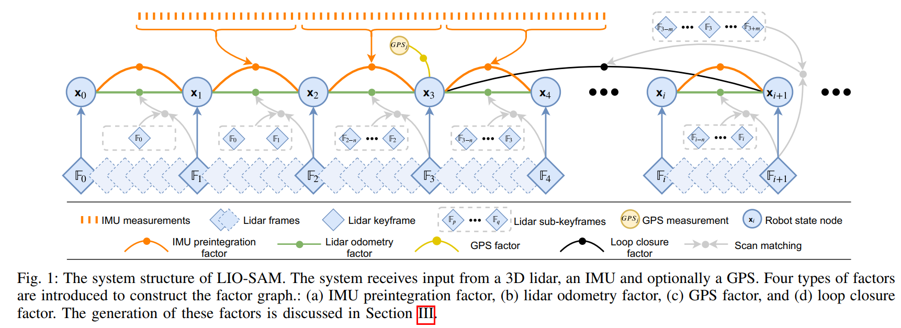

LIO-SAM: Tightly-coupled Lidar Inertial Odometry via Smoothing and Mapping论文阅
读笔记。

## 简介
这是一中基于平滑和建图的**紧耦合**激光雷达惯性里程计框架，对于点云去畸变假设一个非线性运动模
型，使用原始imu测量数据估计一帧激光雷达扫描过程中传感器的运动。除了用于对点云去畸变，该估计的
运动也作为激光雷达里程计优化的初始值。优化完的激光雷达里程计结果接着用于在因子图中估计imu的偏
置。通过在机器人轨迹估计中引入一个全局因子图，能够使用激光雷达和imu测量数据高效地进行传感器融
合，包括机器人位姿间的位置识别，同时当GPS位置或指南针朝向数据可用时，也能够很容易地融入绝对测
量数据。这些从不同数据源采集的因子被用于因子图的联合优化。除此之外，在位姿优化中边缘(舍弃)旧的
激光雷达扫描，以替代类似于LOAM中将扫描与全局地图的匹配。局部尺度扫描匹配代替全局尺度扫描匹配
显著提高了系统的实时性能，关键帧选择性插入以及高效滑动窗口方法同样如此，滑动窗口方法将一个新的
关键帧和一个固定尺寸的先验“子关键帧”集合进行配准。

## 主要贡献和框架
* 一种建立在因子图上的紧耦合激光雷达里程计框架，适用于多传感器融合和全局优化。
* 基于局部滑动窗口的高效帧匹配方法，通过将有选择的新关键帧配准到一组固定大小的先验的子关键帧
集合上，从而实现实时性能。
* 通过对各种规模、车辆和环境的测试，对提出的框架进行了广泛的验证。

## 方法

### 系统概述
定义世界坐标为$\mathbf{W}$，机器人本体坐标系为$\mathbf{B}$。机器人状态$\mathbf{x}$表示为
$$
\mathbf{x=[R^T,p^T,v^T,b^T]^T},
$$
这里$\mathbf{R}\in SO(3)$表示旋转矩阵，$\mathbf{p}\in \mathbb{R}^{3}$表示位姿向量，
$\mathbf{v}$表示速度向量，$\mathbf{b}$表示imu偏置。然后变换矩阵$\mathbf{T}\in SE(3)$
表示从$\mathbf{B}$到$\mathbf{W}$的坐标变换，$\mathbf{T}=[\mathbf{R}|\mathbf{p}]$。

如上图所示，这个系统接受LiDar、IMU、GPS的测量信号来估计位姿和轨迹。状态估计问题一般是一个最大
后验估计，用因子图来建模比贝叶斯网络更适合于这类问题的估计。假设高斯噪声模型，最大后验估计就
等同于求解非线性最小二乘问题。当然这个系统还可以加入其它的传感器测量（如高度计、罗盘）等。

本文有四个因子：1、IMU预积分，2、lidar里程计，3、GPS因子，4、回环检测因子。当机器人的位姿变化
超过阈值，则新的状态因子就被加入图优化中，在插入新节点后，会使用贝叶斯树进行增量优化（主
要使用iSAM2的优化思想和集成iSAM2实现的gtsam库）。

### IMU预积分因子
imu的测量角速度和加速度可以被如下定义
$$
\begin{aligned}
&\hat{\omega}_{t} =\boldsymbol{\omega}_t+\mathbf{b}_t^\omega+\mathbf{n}_t^\omega   \\
&\hat{\mathbf{a}}_{t} =\mathbf{R}_t^{\mathbf{B}\mathbf{W}}(\mathbf{a}_t-\mathbf{g})+\mathbf{b}_t^{\mathbf{a}}+\mathbf{n}_t^{\mathbf{a}}, 
\end{aligned}
$$
$\hat{omega}_{t}$和$\hat{a}_t$是imu的测量值在$t$时刻在imu坐标系$\mathbf{B}$下，它们受
到缓慢的漂移（零偏）$b_t$和白噪声的影响$\mathbf{n}_t$，$\mathbf{R}_t^{\mathbf{B}\mathbf{W}}$
表示从世界坐标系$\mathbf{W}$到imu坐标系（机体坐标系）$\mathbf{B}$的旋转变换矩阵，$\mathbf{g}$
表示在世界坐标系下的重力向量。

计算机器人在$t+\Delta t$时刻的旋转、位置和速度（也叫欧拉积分）：
$$
\begin{aligned}
&\mathbf{V}_{t+\Delta t} =\mathbf{v}_t+\mathbf{g}\Delta t+\mathbf{R}_t(\hat{\mathbf{a}}_t-\mathbf{b}_t^\mathbf{a}-\mathbf{n}_t^\mathbf{a})\Delta t  \\
&\mathbf{p}_{t+\Delta t} =\mathbf{p}_t+\mathbf{v}_t\Delta t+\frac{1}{2}\mathbf{g}\Delta t^2 
+\frac12\mathbf{R}_t(\hat{\mathbf{a}}_t-\mathbf{b}_t^\mathbf{a}-\mathbf{n}_t^\mathbf{a})\Delta t^2 \\
&\mathbf{R}_{t+\Delta t} =\mathbf{R}_t\exp((\hat{\boldsymbol{\omega}}_t-\mathbf{b}_t^{\boldsymbol{\omega}}-\mathbf{n}_t^{\boldsymbol{\omega}})\Delta t), 
\end{aligned}
$$
这里$\mathbf{R}_{t}=\mathbf{R}_{t}^{\mathbf{WB}}=\mathbf{R}_{t}^{\mathbf{BW}^{\mathsf{T}}}$
然后利用相关文献提出的方法得到预计分测量$\Delta\mathbf{v}_{ij}$、$\Delta\mathbf{p}_{ij}$
和$\Delta\mathbf{R}_{ij}$：
$$
\begin{aligned}
&\Delta\mathbf{v}_{ij} =\mathbf{R}_{i}^{\mathsf{T}}(\mathbf{v}_{j}-\mathbf{v}_{i}-\mathbf{g}\Delta t_{ij})  \\
&\Delta\mathbf{p}_{ij} =\mathbf{R}_{i}^{\mathsf{T}}(\mathbf{p}_{j}-\mathbf{p}_{i}-\mathbf{v}_{i}\Delta t_{ij}-\frac{1}{2}\mathbf{g}\Delta t_{ij}^{2})  \\
&\Delta\mathbf{R}_{ij} =\mathbf{R}_{i}^{\mathsf{T}}\mathbf{R}_{j}.  \\
\end{aligned}
$$
（上面的式子只是理想的预计分模型，没有考虑噪声分离，零偏的变化等等，作者也让读者自己去看）

还有就是IMU的偏置在雷达里程计因子中优化，对应文章开头的“imu预计分的运动用于点云去畸变并且给
激光里程计提供初始估计值，同时获取的激光里程计结果用于估计imu的偏置”这句话。

### Lidar里程计因子
当一个新的雷达帧到来的时候，首先提取特征。通过计算点在局部区域的曲率来提取边缘和平面特征，大曲
率被归为边缘特征，小曲率被归为平面特征。$i$时刻提取的边缘和平面特征分别为$\mathbf{F}_{i}^{e}
$，$\mathbf{F}_{i}^{p}$。在$i$时刻提取的所有特征组成了一个激光雷达帧$\mathbb{F}_{i}=\{\mathbf{F}_{i}^{e},\mathbf{F}_{i}^{p}\}$。$\mathbb{F}$坐标系为$\mathbf{B}$。

