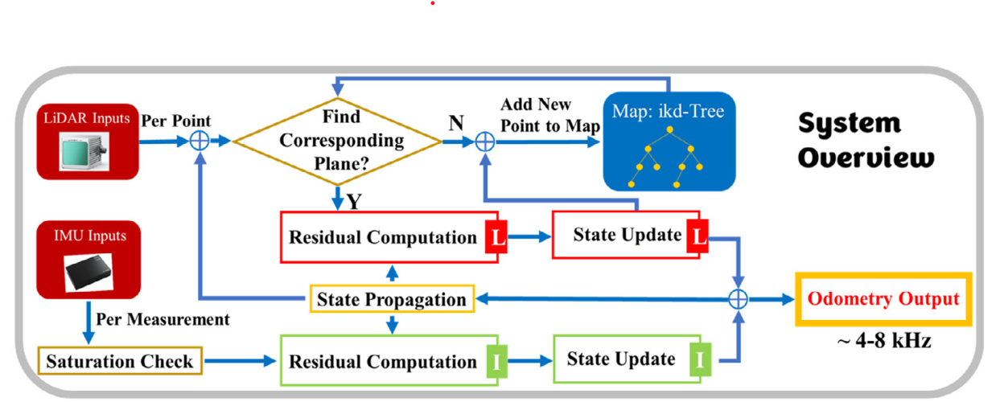
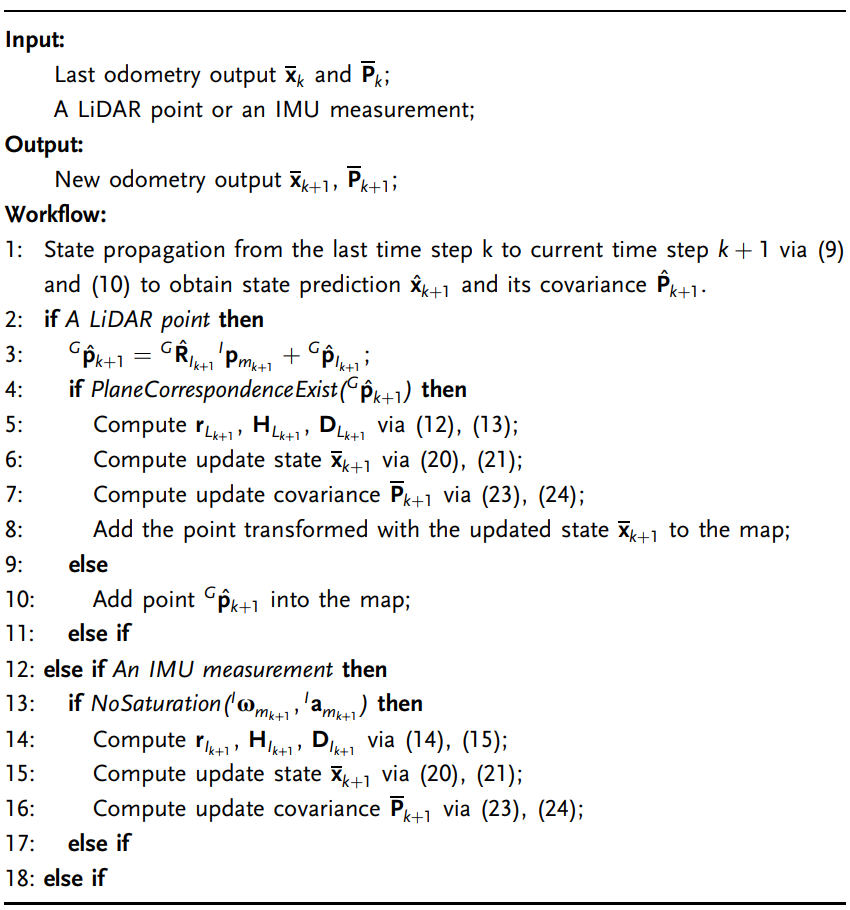

关于Point-LIO: Robust High-Bandwidth Light Detection and Ranging Inertial 
Odometry的阅读随笔

## 介绍
这篇文章介绍了一种名为Point-LIO的鲁棒高带宽激光雷达惯性测距（LiDAR）系统。该系统通过使用一种
点云式的LiDAR惯性测距框架，在实际采样时间上融合LiDAR点云，而不是将它们累积到帧中。这消除了
运动畸变，实现了高速率的测距输出和地图更新。此外，该系统使用了一种随机过程增强的运动模型来建模
IMU测量，即使IMU饱和也能平滑估计系统状态。文章还讨论了Point-LIO的状态估计和地图结果。简单点
来说处理点云过程中不以帧为单位，而是以雷达点顺序为单位，因为在一帧过程中雷达本体是在运动的，
会产生运动畸变，并且限制里程计的带宽，降低系统增益。

### 贡献
1. 点对点的LIO框架：Point-LIO在每个LiDAR点测量时更新状态，而不是将点累积到帧中。这种方法消
除了帧内运动畸变的影响，使得输出的里程计具有高频率，增加了里程计的带宽，并能够跟踪快速运动。

2. 随机过程增强的运动模型：Point-LIO使用随机过程模型来建模IMU测量，并将其融合到系统的运动模
型中。这种增强的运动模型允许平滑估计系统状态，包括角速度和线性加速度，即使IMU饱和也能保持较好
的估计精度。

3. 高精度的地图生成：Point-LIO通过对墙面上的点进行一致性分析，比较了FAST-LIO2、
Point-LIO-input和Point-LIO的地图生成精度。结果显示，Point-LIO能够产生比FAST-LIO2更精细
的墙面地图，消除了帧内运动畸变的影响。

4. 抗振动能力：Point-LIO在实验中面临强烈的振动挑战，但通过点对点的更新方式和随机过程增强的运
动模型，能够有效减轻振动对传感器的影响，提高系统的稳定性和鲁棒性。

总之，Point-LIO通过创新的点对点更新方式和随机过程增强的运动模型，实现了高精度、高带宽的LiDAR
惯性里程计，具有较好的抗振动能力和地图生成精度。

## 框架
系统设计的两个策略：

1. 激光雷达点是在各自的时间顺序采样，不是在帧内等间隔采样。

2. IMU数据是系统的测量值，不是输入值，一旦接受到测量值(雷达点或者IMU数据)，就在流形EKF上融合
这两个测量值。

对于运动失真的补偿一般是假设帧内是匀速运动来补偿，但在剧烈运动或变化剧烈的运动场景下会带来非常
大的漂移甚至是里程计的失效。另外一种比较流行的运动补偿方式是基于连续的时间轨迹优化，例如B样条
和高斯过程模型，然后这些方法非常耗时，很难在线运行，除此之外，这类方法还需要为轨迹估计积累足够
的点，这样增加了里程计的等待时间。

一种有效运动失真补偿方法就是利用IMU的高频率测量来补偿激光点的运动失真。(采用预积分的方式)。本文
采用对单个激光点序列进行运动估计的方法，这样避免了运动失真补偿这一过程。

松耦合是将IMU数据预积分后用这个估计作为初始位姿作为后续序列的配准。紧耦合是将IMU数据和激光雷达
数据作为联合优化输入。两种耦合方式都有基于EKF和优化的方法。但是在紧耦合框架中，IMU数据都被用
作运动学模型的输入，在机器人运动超出IMU测量范围的情况下，这种EKF传播或者预积分过程会遇到饱和
问题。将IMU数据作为模型输出的测量值可以很自然的解决这种由剧烈运动产生的饱和问题。

如下框架图中顺序采样的LiDAR点和IMU数据都用于更新各自时间戳的状态，从而产生极高的里程计输出。
对于每个接收到的点从地图中搜索相应平面，一个残差用流形KF计算用来更新系统状态，最终优化的位姿
用于将雷达点匹配到地图中。如果这个点没有匹配的平面，直接通过KF后加入地图。为了在匹配新的点过程
中快速实现平面的搜索采用了增量kd树。

## 状态估计
Point-LIO是一个在流形卡尔曼滤波上的紧耦合框架。流形卡尔曼滤波就是在一个特殊流形上的卡尔曼滤波，
本文指的是在由欧式空间和李群这两个子流形构成的流形上进行的卡尔曼滤波，至于这个流形卡尔曼滤波
可不可以用于其它流形就要看原文了。

首先引入了两个流形$\mathscr{M}$上的封装运算$\boxplus$和其逆运算$\boxminus$，它们的在$\mathrm{SO}(3)$和$\mathbf{R}$上的运算法则如下：

$\boxplus: \quad \mathscr{M} \times \mathbb{R}^n \rightarrow \mathscr{M} ; \quad \boxminus: \mathscr{M} \times \mathscr{M} \rightarrow \mathbb{R}^n$

$\mathrm{SO}(3): \quad \mathbf{R} \boxplus \mathbf{r}=\mathbf{R} \cdot \operatorname{Exp}(\mathbf{r}) ; \quad \mathbf{R}_1 \boxminus \mathbf{R}_2=\log \left(\mathbf{R}_2^T \cdot \mathbf{R}_1\right)$

$\mathbb{R}^n: \quad \mathbf{a} \boxplus \mathbf{b}=\mathbf{a}+\mathbf{b} ; \quad \mathbf{a} \boxminus \mathbf{b}=\mathbf{a}-\mathbf{b}$

### 状态转移模型
$\begin{array}{l}{ }^G \dot{\mathbf{R}}_I={ }^G \mathbf{R}_I\left\lfloor{ }^I \omega\right\rfloor,{ }^G \dot{\mathbf{p}}_I={ }^G \mathbf{v}_I,{ }^G \dot{\mathbf{v}}_I={ }^G \mathbf{R}_I{ }^I \mathbf{a}+{ }^G \mathbf{g},{ }^G \dot{\mathbf{g}}=\mathbf{0} \\ \dot{\mathbf{b}}_g=\mathbf{n}_{\mathrm{b}_g}, \dot{\mathbf{b}}_a=\mathbf{n}_{\mathrm{b}_a},{ }^I \dot{\boldsymbol{\omega}}=\mathbf{w}_g,{ }^I \dot{\mathbf{a}}=\mathbf{w}_a\end{array}$

其中${ }^G\mathbf{R}_{I}$，${ }^G\mathbf{P}_{I}$，${ }^G\mathbf{V}_{I}$表示IMU的位姿、
位置和速度在全局坐标中。$\mathbf{b}_{g}$和$\mathbf{b}_{a}$是IMU的随机偏差，分别服从
$\mathbf{n}_{b_{g}}\approx \mathcal{N}(0,\varrho_{b_{g}})$和
$\mathbf{n}_{b_{a}}\approx \mathcal{N}(0,\varrho_{b_{a}})$的高斯分布。符号$\lfloor
a\rfloor$表示反对称叉积矩阵。$\mathbf{I}_{w}$和$\mathbf{I}_{a}$表示在IMU坐标系(即机体
坐标系)下的角速度和加速度。

将上面的运动学模型离散化处理，将$\Delta t_{k}$表示测量间隔，并且假设在输入的测量间隔保持不变。
于是将上面连续运动学模型离散化为：
$$\begin{equation}
\mathbf{x}_{k+1}=\mathbf{x}_{k}\boxplus(\Delta t_{k}\mathbf{f}(\mathbf{x}_{k},  \mathbf{w}_{k}))   \notag
\end{equation}$$
其中，流形$\mathscr{M}$、函数$\mathbf{f}$、状态$\mathbf{x}$和过程噪声$\mathbf{w}$的
定义如下：
$$\begin{array}{l}
    \mathscr{M}\overset{\triangle}{=}SO(3)\times \mathbb{R}^{21},dim(\mathscr{M})
    =24 \\
    \mathbf{x}\overset{\triangle}{=}[{}^{G}\mathbf{R}_{I}\quad{}^{G}\mathbf{p}_{I}
    \quad{}^{G}\mathbf{v}_{I}\quad \mathbf{b}_{g}\quad \mathbf{b}_{a}\quad {}^{G}
    \mathbf{g}\quad{}^{I}\mathbf{w}\quad{}^{I}\mathbf{a}] \\
    \mathbf{w}\overset{\triangle}{=}[\mathbf{n}_{b_{g}}\quad \mathbf{n}_{b_{a}}
    \quad\mathbf{w}_g\quad\mathbf{w}_{a}]\approx\mathcal{N}(\mathbf{0},\varrho) \\
    \mathbf{f}(\mathbf{x},\mathbf{w})\overset{\triangle}{=}[{}^{I}w \quad{}^{G}
    \mathbf{v}_{I}\quad{}^{G}\mathbf{R}_{I}{}^{I}\mathbf{a}+{}^{G}\mathbf{g}\quad
    \mathbf{n}_{b_{g}}\quad \mathbf{n}_{b_{a}}\quad\mathbf{0}_{3\times 1}\quad
    \mathbf{w}_{g}\quad \mathbf{w}_{a}]
\end{array}$$
这里的$\varrho=diag(\varrho_{b_{g}},\varrho_{b_{a}},\varrho_{g},\varrho_{a})$表示过
程噪声$\mathbf{w}$的协方差矩阵。

### 测量模型
该系统有两个测量，一个是LiDAR点和IMU数据。这两个测量值通常在不同的时间被系统采样和接收，因此
将它们分别建模，假设LiDAR坐标系和机体(IMU坐标系)重合或者具有预校准的外参，于是LiDAR点${}^{I}
p_{m_{k}}$等于在本地IMU坐标系这样红的真实位置${}^{I}p_{k}^{gt}$，该位置是未知的，收到加
性高斯噪声的影响，于是有：
$$\begin{equation}
{}^{I}\mathbf{p}_{m_k}={}^{I}\mathbf{p}_k^{gt}+\mathbf{n}_{L_k}    \notag
\end{equation}$$
真实点使用未知的IMU位姿变换${}^{G}\mathbf{T}_{I_k}=({}^{G}\mathbf{R}_{I_k},{}^{G}
\mathbf{p}_{I_k})$来判断此点是否属于地图中平面的一个点：
$$
0=\underbrace{ { }^G \mathbf{u}_k^T\left({ }^G \mathbf{T}_{I_k}\left({ }^I \mathbf{p}_{\mathrm{m}_k}-\mathbf{n}_{\mathrm{L}_k}\right)-{ }^G \mathbf{q}_k\right)}_{\mathbf{h}_{\mathrm{L}}\left(\mathbf{x}_k,{ }^1 \mathbf{p}_{\mathbf{m}_k}, \mathbf{n}_{\mathrm{L}_k}\right)}
$$
其中${}^{G}\mathbf{u}_k$表示这个平面的法向量，${}^{G}\mathbf{q}_{k}$表示平面中的任意一点，
其中${ }^G \mathbf{T}_{I_k}$被包含在状态向量$\mathbf{x}_{k}$中。

下面给出IMU的测量模型
$$
\left[\begin{array}{c}
{ }^I \boldsymbol{\omega}_{\mathbf{m}_k} \\
{ }^I \mathbf{a}_{\mathrm{m}_k}
\end{array}\right]=\underbrace{\left[\begin{array}{c}
{ }^I \boldsymbol{\omega}_k+\mathbf{b}_{\mathbf{g}_k}+\mathbf{n}_{\mathrm{g}_k} \\
{ }^I \mathbf{a}_k+\mathbf{b}_{\mathbf{a}_k}+\mathbf{n}_{\mathbf{a}_k}
\end{array}\right]}_{\mathbf{h}_I\left(\mathbf{x}_k, \mathbf{n}_{I_k}\right)}
$$
那么整个的测量模型就可以写为如下的紧凑模式
$$
\begin{array}{l}
0=\mathbf{h}_{\mathrm{L}}\left(\mathbf{x}_k,{ }^I \mathbf{p}_{\mathrm{m}_k}, \mathbf{n}_{L_k}\right) \\
{\left[\begin{array}{c}
{ }^I \omega_{\mathrm{m}_k} \\
{ }^I \mathbf{a}_{\mathrm{m}_k}
\end{array}\right]=\mathbf{h}_I\left(\mathbf{x}_k, \mathbf{n}_{I_k}\right)}
\end{array}
$$

## 扩展卡尔曼滤波
一个紧耦合框架的扩展卡尔曼滤波

### 状态传播
状态从$k$传播到下一个状态$k+1$并设置$\mathbf{w}=\mathbf{0}$
$$\begin{equation}
\hat{\mathbf{x}}_{k+1}=\overline{x}_{k}\boxplus(\Delta t_{k}\mathbf{f}(\overline{\mathbf{x}}_{k},\mathbf{0}))    \notag
\end{equation}$$
然后协方差传播方程为：
$$\begin{equation}
\hat{\mathbf{P}_{k+1}}=\mathbf{F}_{\mathbf{x}_{k}}\overline{\mathbf{P}}_{k}
\mathbf{F}_{\mathbf{x}_{k}}^{T}+\mathbf{F}_{\mathbf{w}_{k}}\varrho_{k}\mathbf{F}_{\mathbf{w}_{k}}^{T}    \notag
\end{equation}$$
这里$\varrho_{k}$是过程噪声$\mathbf{w}_{k}$的协方差矩阵，然后矩阵$\mathbf{F}_{\mathbf{x}_{k}}$和$\mathbf{F}_{\mathbf{w}_{k}}$计算如下：
$$
\begin{aligned}
\mathbf{F}_{\mathbf{x}_k} & =\left.\frac{\partial\left(\mathbf{x}_{k+1} \boxminus \hat{\mathbf{x}}_{k+1}\right)}{\partial \delta \mathbf{x}_k}\right|_{\delta \mathbf{x}_k=\mathbf{0}, \mathbf{w}_k=\mathbf{0}} \\
& =\frac{\partial\left(\left(\left(\overline{\mathbf{x}}_k \boxplus \delta \mathbf{x}_k\right) \boxplus\left(\Delta t_k \mathbf{f}\left(\overline{\mathbf{x}}_k \boxplus \delta \mathbf{x}_k, \mathbf{0}\right)\right)\right) \boxminus\left(\overline{\mathbf{x}}_k \boxplus\left(\Delta t_k \mathbf{f}\left(\overline{\mathbf{x}}_k, \mathbf{0}\right)\right)\right)\right)}{\partial \delta \mathbf{x}_k} \\
& =\left[\begin{array}{cccccccc}
\mathbf{F}_{11} & \mathbf{0} & \mathbf{0} & \mathbf{0} & \mathbf{0} & \mathbf{0} & \mathbf{I} \Delta t_k & \mathbf{0} \\
\mathbf{0} & \mathbf{I} & \mathbf{I} \Delta t_k & \mathbf{0} & \mathbf{0} & \mathbf{0} & \mathbf{0} & \mathbf{0} \\
\mathbf{F}_{31} & \mathbf{0} & \mathbf{I} & \mathbf{0} & \mathbf{0} & \mathbf{I} \Delta t_k & \mathbf{0} & \mathbf{F}_{38} \\
\mathbf{0} & \mathbf{0} & \mathbf{0} & \mathbf{I} & \mathbf{0} & \mathbf{0} & \mathbf{0} & \mathbf{0} \\
\mathbf{0} & \mathbf{0} & \mathbf{0} & \mathbf{0} & \mathbf{I} & \mathbf{0} & \mathbf{0} & \mathbf{0} \\
\mathbf{0} & \mathbf{0} & \mathbf{0} & \mathbf{0} & \mathbf{0} & \mathbf{I} & \mathbf{0} & \mathbf{0} \\
\mathbf{0} & \mathbf{0} & \mathbf{0} & \mathbf{0} & \mathbf{0} & \mathbf{0} & \mathbf{I} & \mathbf{0} \\
\mathbf{0} & \mathbf{0} & \mathbf{0} & \mathbf{0} & \mathbf{0} & \mathbf{0} & \mathbf{0} & \mathbf{I}
\end{array}\right]
\end{aligned}
$$
$$
\begin{aligned}
\mathbf{F}_{\mathbf{w}_k} & =\left.\frac{\partial\left(\mathbf{x}_{k+1} \boxminus \hat{\mathbf{x}}_{k+1}\right)}{\partial \mathbf{w}_k}\right|_{\delta \mathbf{x}_k=\mathbf{0}, \mathbf{w}_k=\mathbf{0}} \\
& =\frac{\partial\left(\left(\overline{\mathbf{x}}_k \boxplus\left(\Delta t_k \mathbf{f}\left(\overline{\mathbf{x}}_k, \mathbf{w}_k\right)\right)\right) \boxminus\left(\overline{\mathbf{x}}_k \boxplus\left(\Delta t_k \mathbf{f}\left(\overline{\mathbf{x}}_k, \mathbf{0}\right)\right)\right)\right.}{\partial \mathbf{w}_k} \\
& =\left[\begin{array}{llll}
\mathbf{0} & \mathbf{0} & \mathbf{0} & \mathbf{0} \\
\mathbf{0} & \mathbf{0} & \mathbf{0} & \mathbf{0} \\
\mathbf{0} & \mathbf{0} & \mathbf{0} & \mathbf{0} \\
\mathbf{I} & \mathbf{0} & \mathbf{0} & \mathbf{0} \\
\mathbf{0} & \mathbf{I} & \mathbf{0} & \mathbf{0} \\
\mathbf{0} & \mathbf{0} & \mathbf{0} & \mathbf{0} \\
\mathbf{0} & \mathbf{0} & \mathbf{I} & \mathbf{0} \\
\mathbf{0} & \mathbf{0} & \mathbf{0} & \mathbf{I}
\end{array}\right]
\end{aligned}
$$
这里$\mathbf{F}_{11}=Exp(-{}^{I}\overline{\mathbf{w}}_{k}\Delta t_{k})，\mathbf{F}
_{38}={}^{G}\overline{\mathbf{R}}_{I_{k}}\Delta t_{k}$

### 残差计算

#### LiDAR测量的残差计算  

根据卡尔曼滤波状态传播步骤预测得到的位姿${}^{G}\hat{\mathbf{T}}_{I_{k+1}}=({}^{G}\hat{
    \mathbf{R}}_{I_{k+1}},{}^{G}\hat{\mathbf{p}}_{I_{k+1}})$，将测量雷达点${}^{I}
\mathbf{p}_{m_{k+1}}$映射到全局坐标${}^{G}\hat{\mathbf{p}}_{k+1}={}^{G}\hat{\mathbf{
R}}_{I_{k+1}}{}^{I}\mathbf{p}_{m_{k+1}}+{}^{G}\hat{\mathbf{p}}_{I_{k+1}}$并且在地
图中寻找前后最邻近的五个点通过ikd-Tree。然后使用找到的最邻近点来拟合局部最小平面，其法向量为
${}^G\mathbf{u}_{k+1}$，重心为${}^{G}\mathbf{q}_{k+1}$，如果最近的五个点不在拟合的平面
路径上(即任何点到平面的距离大于0.1m)，则当前点直接合并到地图中，无需进行残差计算或者状态更新。
否则，则根据测量模型方程计算残差：
$$
\begin{aligned}
\mathbf{r}_{\mathrm{L}_{k+1}} & =0-\mathbf{h}_{\mathrm{L}}\left(\hat{\mathbf{x}}_{k+1},{ }^I \mathbf{p}_{\mathrm{m}_{k+1}}, \mathbf{0}\right) \\
& =\mathbf{h}_{\mathrm{L}}\left(\mathbf{x}_{k+1},{ }^I \mathbf{p}_{\mathrm{m}_{k+1}}, \mathbf{n}_{\mathrm{L}_{k+1}}\right)-\mathbf{h}_{\mathrm{L}}\left(\hat{\mathbf{x}}_{k+1},{ }^I \mathbf{p}_{\mathrm{m}_{k+1}}, \mathbf{0}\right) \\
& \approx \mathbf{H}_{\mathrm{L}_{k+1}} \delta \mathbf{x}_{k+1}+\mathbf{D}_{\mathrm{L}_{k+1}} \mathbf{n}_{\mathrm{L}_{k+1}}
\end{aligned}
$$
这里的$\delta\mathbf{x}_{k+1}=\mathbf{x}_{k+1}\boxminus\hat{\mathbf{x}}_{k+1}$，
$\mathbf{x}_{k+1}$表示真实状态值在$k+1$步。并且：
$$
\begin{aligned}
\mathbf{H}_{L_{k+1}}&=\left.\frac{\partial\mathbf{h}_{L}(\hat{\mathbf{x}}_{k+1})
\boxminus\delta\mathbf{x},{}^{I}\mathbf{p}_{m_{k+1}},\mathbf{0}}{\partial\delta
\mathbf{x}}\right|_{\delta\mathbf{x}=\mathbf{0}} \\
&=\left[-{}^{G}\mathbf{u}_{k+1}^{T}{}^{G}\hat{\mathbf{R}}_{I_{k+1}}\lfloor {}^{I}
\mathbf{p}_{m_{k+1}}\rfloor \quad {}^{G}\mathbf{u}_{k+1}^{T} \quad \mathbf{0}_{
1\times 18} \right]
\end{aligned}
$$
$$
\begin{aligned}
& \mathbf{D}_{L_{k+1}}=\left.\frac{\partial \mathbf{h}_L\left(\hat{\mathbf{x}}_{k+1},{ }^I \mathbf{p}_{m_{k+1}}, \mathbf{n}\right)}{\partial \mathbf{n}}\right|_{\mathbf{n}=\mathbf{0}}=-{ }^G \mathbf{u}_{k+1}^T{ }^G \hat{\mathbf{R}}_{I_{k+1}} \\
&
\end{aligned}
$$

#### IMU测量残差计算  

通过检查当前测量值与额定测量值范围之间的差距来判断IMU测量通道是否被丢弃，如果差距太小，则该IMU
测量会被丢弃不会用于更新状态。然后收集未饱和IMU的加速度和角速度测量值，根据IMU的状态方程计算
残差。
$$
\begin{aligned}
\mathbf{r}_{I_{k+1}} & =\left[\begin{array}{c}
{ }^I \boldsymbol{\omega}_{\mathrm{m}_{k+1}} \\
{ }^I \mathbf{a}_{\mathrm{m}_{k+1}}
\end{array}\right]^T-\mathbf{h}_I\left(\hat{\mathbf{x}}_{k+1}, \mathbf{0}\right) \\
& =\mathbf{h}_I\left(\mathbf{x}_{k+1}, \mathbf{n}_{I_{k+1}}\right)-\mathbf{h}_I\left(\hat{\mathbf{x}}_{k+1}, \mathbf{0}\right) \\
& =\mathbf{H}_{I_{k+1}} \delta \mathbf{x}_{k+1}+\mathbf{D}_{I_{k+1}} \mathbf{n}_{I_{k+1}}
\end{aligned}
$$
这里的$\delta\mathbf{x}_{k+1}=\mathbf{x}_{k+1}\boxminus\hat{\mathbf{x}}_{k+1}$，
$\mathbf{x}_{k+1}$表示步骤$k+1$的状态真实值，并且：
$$
\begin{aligned}
& \mathbf{H}_{I_{k+1}}=\left.\frac{\partial \mathbf{h}_I\left(\hat{\mathbf{x}}_{k+1} \boxplus \delta \mathbf{x}, \mathbf{0}\right)}{\partial \delta \mathbf{x}}\right|_{\delta \mathbf{x}=\mathbf{0}}=\left[\begin{array}{llll}
\mathbf{0}_{6 \times 9} & \mathbf{I}_{6 \times 6} & \mathbf{0}_{6 \times 3} & \mathbf{I}_{6 \times 6}
\end{array}\right] \\
& \mathbf{D}_{I_{k+1}}=\left.\frac{\partial \mathbf{h}_2\left(\hat{\mathbf{x}}_{k+1}, \mathbf{n}\right)}{\partial \mathbf{n}}\right|_{\mathbf{n}=\mathbf{0}}=\mathbf{I}_{6 \times 6}
\end{aligned}
$$
总之来自LiDAR或者IMU测量的残差$\mathbf{r}_{k+1}与状态$\mathbf{x}_{k+1}$的关系有：
$$
\mathbf{r}_{k+1}\approx\mathbf{H}_{k+1}\delta\mathbf{x}_{k+1}+\mathbf{D}_{k+1}
\mathbf{n}_{k+1} \qquad \mathbf{n}_{k+1}\approx\mathscr{N}(\mathbf{0},\mathscr{R}
_{k+1})
$$
这里的$\mathbf{r}_{k+1}$在后面指代LiDAR或者IMU。

### 状态更新

在传播方程中的状态$\hat{\mathbf{x}}_{k+1}$和协方差$\hat{\mathbf{P}}_{k+1}$对未知状态
 $\mathbf{x}_{k+1}$为高斯分布：
 $$
 \delta \mathbf{x}_{k+1}=\mathbf{x}_{k+1}\boxminus\hat{\mathbf{x}}_{k+1}\approx
 \mathscr{N}(\mathbf{0},\hat{\mathbf{P}}_{k+1})
 $$
 测量模型对$\delta\mathbf{x}$给出了另外一个高斯分布：
 $$
 \mathbf{D}_{k+1}\mathbf{n}_{k+1}=\mathbf{r}_{k+1}-\mathbf{H}_{k+1}\delta\mathbf
 {x}_{k+1}\approx\mathscr{N}(\mathbf{0},\overline{\mathscr{R}}_{k+1})
 $$
 $$
 \overline{\mathscr{R}}_{k+1}=\mathbf{D}_{k+1}\mathscr{R}_{k+1}\mathbf{D}_{k+1}^T
 $$
 然后将前面的先验分布和测量模型相结合得到状态的后验分布：
 $$
 argmin_{\delta\mathbf{x}_{k+1}}(||\mathbf{r}_{k+1}-\mathbf{H}_{k+1}\delta
 \mathbf{x}_{k+1}||_{\overline{\mathscr{R}}_{k+1}^{2}}+||\delta\mathbf{x}_{k+1}
 ||_{\hat{\mathbf{P}}_{k+1}}^{2})
 $$
 这里的$||\mathbf{x}_{\mathbf{A}}^{2}=\mathbf{x}^{T}\mathbf{A}^{-1}\mathbf{x}$，
 上面式子优化问题是一个标准的二次分配问题，这个优化解$\delta\mathbf{x}_{k+1}^{o}$很容易
 获得，本质上是卡尔曼滤波更新过程：
$$
\begin{aligned}
& \delta \mathbf{x}_{k+1}^o=\mathbf{K}_{k+1} \mathbf{r}_{k+1} \\
& \mathbf{K}_{k+1}=\mathbf{P}_{k+1 \mid k} \mathbf{H}_{k+1}^T \mathbf{S}_{k+1}^{-1} \\
& \mathbf{S}_{k+1}=\mathbf{H}_{k+1} \mathbf{P}_{k+1 \mid k} \mathbf{H}_{k+1}^T+\overline{\mathscr{R}}_{k+1} \\
& \mathbf{P}_{k+1}=\left(\mathbf{I}-\mathbf{K}_{k+1} \mathbf{H}_{k+1}\right) \hat{\mathbf{P}}_{k+1}
\end{aligned}
$$
然后跟新$\mathbf{x}_{k+1}$：
$$\overline{\mathbf{x}}_{k+1}=\hat{\mathbf{x}}_{k+1}\boxplus\delta\mathbf{x}_{k+1}
^{o}
$$
然后更新的状态用于下一步骤的传播。同样我们也需要估计误差的协方差$\overline{\mathbf{P}}
_{k+1}$，估计状态$\overline{\mathbf{X}}_{k+1}$和真实状态$\mathbf{x}_{k+1}$的误差表示
为$\mathbf{x}_{k+1}\boxminus\overline{\mathbf{x}}_{k+1}$
$$
\begin{aligned}
& \mathbf{x}_{k+1} \boxminus \overline{\mathbf{x}}_{k+1}=\left(\hat{\mathbf{x}}_{k+1} \boxplus \delta \mathbf{x}_{k+1}\right) \boxminus \overline{\mathbf{x}}_{k+1} \\
& \quad \approx \underbrace{\left(\hat{\mathbf{x}}_{k+1} \boxplus \delta \mathbf{x}_{k+1}^o\right) \boxminus \overline{\mathbf{x}}_{k+1}}_{=\mathbf{0}}+\mathbf{J}_{k+1}\left(\delta \mathbf{x}_{k+1}-\delta \mathbf{x}_{k+1}^o\right)
\end{aligned}
$$
这里的$\mathbf{J}_{k+1}$是投影矩阵
$$
\begin{aligned}
& \mathbf{J}_{k+1}=\left.\frac{\partial\left(\left(\hat{\mathbf{x}}_{k+1} \boxplus \delta \mathbf{x}\right) \boxminus \overline{\mathbf{x}}_{k+1}\right)}{\partial \delta \mathbf{x}}\right|_{\delta \mathbf{x}=\delta \mathbf{x}_{k+1}^0}=\left[\begin{array}{ll}
\mathbf{A}\left(\theta_{k+1}\right)^{-T} & \mathbf{0}_{3 \times 21} \\
\mathbf{0}_{3 \times 21} & \mathbf{I}_{21 \times 21}
\end{array}\right] \\
& \mathbf{A}(\mathbf{u})^{-1}=\mathbf{I}-\frac{\lfloor\mathbf{u}\rfloor}{2}+\left(1-\frac{\|\mathbf{u}\|}{2} \cot \left(\frac{\|\mathbf{u}\|}{2}\right)\right) \frac{\lfloor\mathbf{u}\rfloor}{\|\mathbf{u}\|}, \theta_{k+1}={ }^G \overline{\mathbf{R}}_{I_{k+1}} \boxminus{ }^G \hat{\mathbf{R}}_{I_{k+1}}
\end{aligned}
$$
$\delta\mathbf{x}_{k+1}-\delta\mathbf{x}_{k+1}^{0}$的协方差是优化问题方程的协方差的逆，
也是矩阵$\mathbf{P}_{k+1}$，因此根据前面的式子$\mathbf{x}_{k+1} \boxminus
\overline{\mathbf{x}}_{k+1}$的协方差为：
$$
\overline{\mathbf{P}}_{k+1}=\mathbf{J}_{k+1}\mathbf{P}_{k+1}\mathbf{J}_{k+1}^{T}
$$
整个状态估计的总体过程为：

