# 基础知识

**动态系统**：状态随时间变换的系统，即系统的状态变量是时间的函数。

**线性时不变系统**：指系统的输入和输出之间是线性映射，符合**叠加原理**，即一个线性系统在输入$u_1(t)$的作用下输出是$x_1(t)$，在输入$u_2(t)$的作用下，输出是$x_2(t)$，那么当输入为$au_1(t)+bu_2(t)$时，系统输出等于$ax_1(t)+bx_2(t)$。时不变性是如果输入信号延迟了时间$T$，那么系统的输出也会延迟时间$T$。即输入为$u_1(t-T)$时，输出是$x_1(t-T)$。

**开环控制系统**：
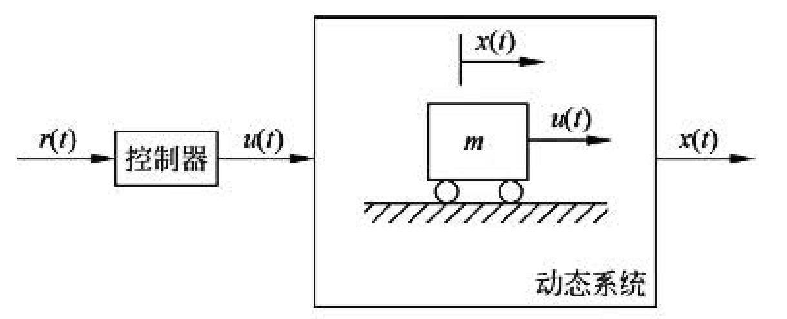

控制器会根据参考值$r(t)$来决定控制量$u(t)$

**闭环控制系统**：
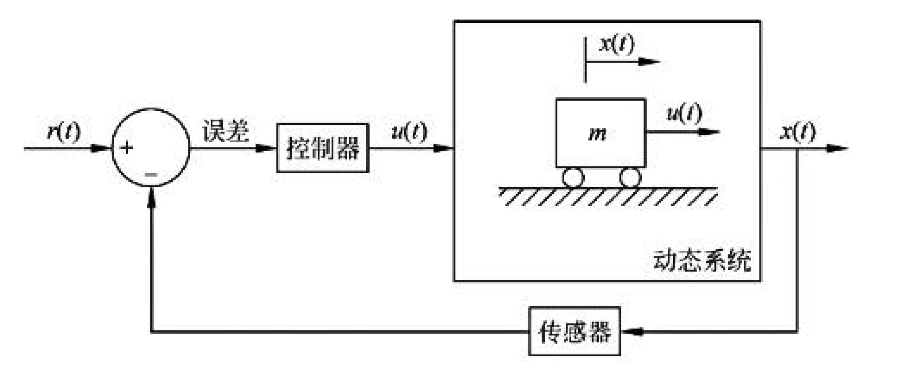

在闭环控制中会测量系统的输出，将其反馈到输入端与参考值进行比较，参考值与实际系统输出的差称为误差，控制器将根据误差调整控制量。

# 传递函数
动态系统的分析和数学建模是设计控制器的基础，因此需要考虑如何对动态系统进行建模。

**卷积**：对于线性时不变系统来说，系统的输入会对未来一段时间内的输出都产生影响，这种关系称为**卷积**关系。

**单位冲激函数**：描述的是一个宽度为0，面积为1的函数，这是一个纯数学函数，无法现实实现。 
$$\begin{cases}\delta(t)=0,&t\neq0\\\int_{-\infty}^{\infty}\delta(t)\mathrm{d}t=1&\end{cases}$$

**卷积的离散表达式**：这是由n个单位冲激信号叠加得来的，具体推导过程略
$$
x(t)=\sum_{i=0}^{n}u(i\Delta T)\Delta Th_{\Delta}(t-i\Delta T)
$$

**卷积的连续表达式**：
$$
\begin{aligned}x\left(t\right)&=\lim_{\Delta T\to0}\sum_{i=0}^{n}u\left(i\Delta T\right)\Delta Th_{\Delta}\left(t-i\Delta T\right)\\&=\int_{0}^{t}u\left(\tau\right)h\left(t-\tau\right)\mathrm{d}\tau=u\left(t\right)*h\left(t\right)\end{aligned}
$$
其中$h(t)$是对冲激函数$\delta(t)$的冲激响应。
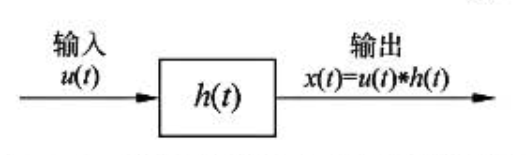

使用微分方程可以直接描述动态系统输入与输出之间的卷积关系。建立系统的微分方程，首先要分析系统的物理特性并列出方程组，之后消去中间的变量并将其写成标准形式。

## 拉普拉斯变换
这是控制理论中常用的一个工具，用来将时域上的函数$f(x)$转换为复数域上的函数$F(s)$，用来简化系统分析的难度。它的定义为：
$$
\mathcal{L}[f(t)]=F(s)=\int_{0}^{\infty}f\left(t\right)\mathrm{e}^{-st}\mathrm{d}t
$$
其中$s=\sigma+\mathrm{j}\omega$，表示一个复数。

上式的积分从0开始，是因为从工程的角度来说不存在时间0点以前的事情。并且当$\sigma=0$的时候，拉普拉斯变换公式就变成了傅里叶变换公式。

**通过拉普拉斯变换可以将复杂的卷积运算（积分运算）变成简单的乘法运算**

常见的拉普拉斯变换公式：
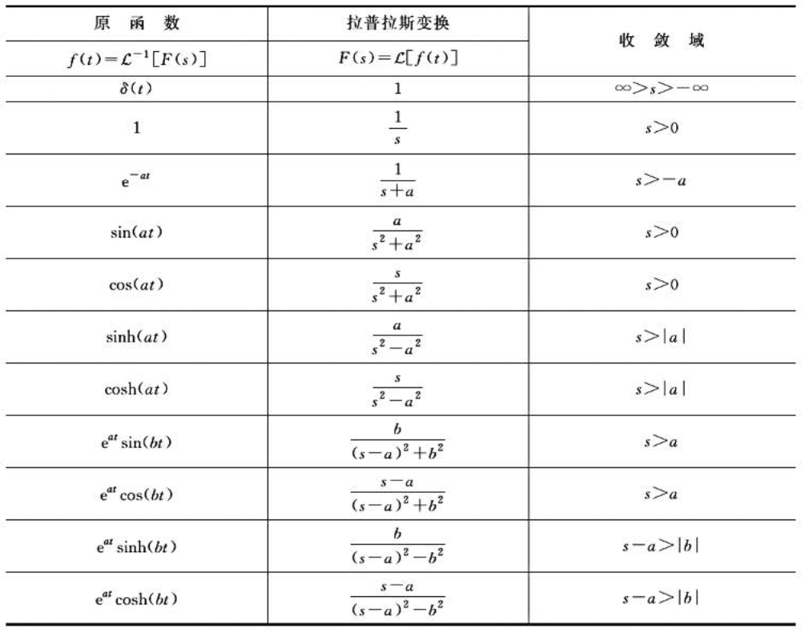

**收敛域**：比如做这样一个拉普拉斯变换时候$\mathcal{L}[\mathrm{e}^{-at}]=\int_{0}^{\infty}\mathrm{e}^{-at}\mathrm{e}^{-st}\mathrm{d}t=\frac{1}{s+a}$，需要假设这个积分是收敛的。

若$s=-2a$，且$a>0$的时候，积分可以写为
$$
F(s)=\mathcal{L}\left[\mathrm{e}^{-at}\right]=\int_{0}^{+\infty}\mathrm{e}^{-at}\mathrm{e}^{-(-2a)t}\mathrm{d}t=\int_{0}^{\infty}\mathrm{e}^{at}\mathrm{d}t
$$
当$a>0$的时候，随着时间的增加会趋于无穷，但上面的积分显然不会存在无穷大，因此在做拉普拉斯变换的时候需要对复数变量$s$加上一个限制，这个限制条件就称为**收敛域**。

### 拉普拉斯的逆变换
就是将$F(s)$变回时域函数$f(x)$。

## 传递函数
系统的传递函数$G(s)$的定义就是，在零初始条件下，系统输出的拉普拉斯变换与系统输入的拉普拉斯变换之间的比值。
$$
\mathrm{G}(s)=\frac{\mathrm{X}(s)}{\mathrm{U}(s)}
$$

举一个电路系统的例子$e(t)=L\frac{di(t)}{d(t)}+Ri(t)$，$e(t)$表示电压，$i(t)$表示电流，$L$表示电感，$R$表示电阻。
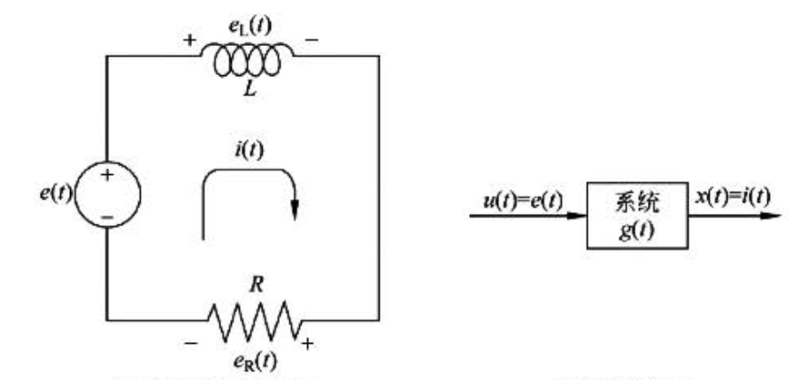

经过拉普拉斯变换，系统输入与输出$x(t)=u(t)*h(t)$的卷积关系被简化为乘积关系$X(s)=U(s)G(s)$，很大程度上简化了系统分析的复杂程度。对上面例子两边进行拉普拉斯变换有：
$$
\mathcal{L}[u\left(t\right)]=\mathcal{L}\left[L\frac{\mathrm{d}x\left(t\right)}{\mathrm{d}t}+Rx\left(t\right)\right]\Rightarrow U\left(s\right)=L\left(sX\left(s\right)-x\left(0\right)\right)+RX\left(s\right)
$$
考虑零初始状态，即$x(t)$的初始状态$x(0)=0$，那么上式可以写成：
$$
U(s)=LsX(s)+RX(s)=(Ls+R)X(s)
$$
传递函数为：
$$
G(s)=\frac{X(s)}{U(s)}=\frac{1}{Ls+R}
$$
当一个常数输入$u(t)=C$作用在系统上时，其拉普拉斯变换为：
$$
U(s)=\mathcal{L}\left[u(t)\right]=\mathcal{L}(C)=\mathcal{L}[Ce^{-0t}]=C\frac{1}{s+0}=C\frac{1}{s}
$$
由此可以得到系统输出的拉普拉斯变换为：
$$
X(s)=U(s)G(s)=C\left(\frac{1}{s}\right)\left(\frac{1}{Ls+R}\right)=\frac{C}{L}\frac{1}{s\left(s+\frac{R}{L}\right)}
$$
若要分析这个系统输出的时间函数$x(t)$的表现，可以运用逆拉普拉斯变换。具体变换过程略，直接给出结果：
$$
x(t)=\mathcal{L}^{-1}\left[X(s)\right]=\frac{C}{R}(\mathrm{e}^{0t}-\mathrm{e}^{-\frac{R}{L^{t}}})=\frac{C}{R}-\frac{C}{R}\mathrm{e}^{-\frac{R}{L^{t}}}
$$
从下图可以看出输出$x(t)$随着时间的增加无限接近于一个定值$\frac{C}{R}$。
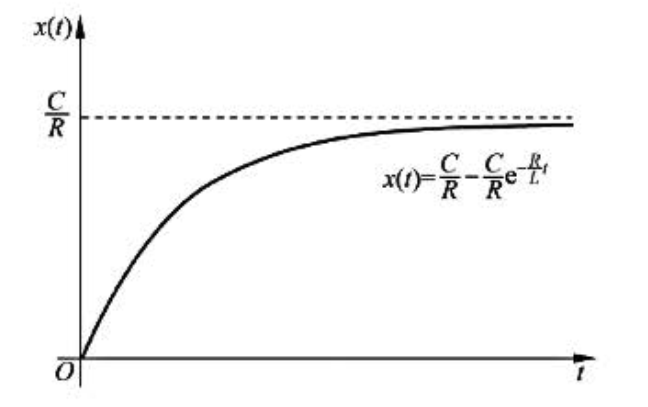

**根据传递函数的极点分析可以快速判断系统的表现，求解极点可以令$G(s)$的分母部分为0得到。**

在知道动态系统的传递函数$G(s)$之后，就可以设计控制器来调节动态系统的输出响应。定义开环系统，$R(s)$是参考值或目标值，$C(s)$是控制器，动态系统的传递函数$G(s)$称为控制系统的开环传递函数，控制量$U(s)$就是动态系统的输入。
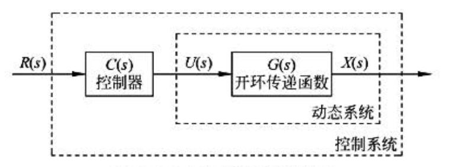

同理闭环控制系统有：
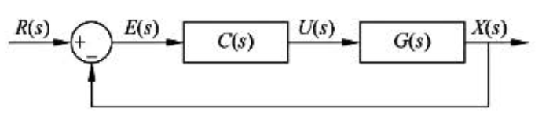

根据传递函数的代数性质有：
$$
X(s)=U(s)G(s)=E(s)C(s)G(s)
$$
将$E(s)=R(s)-X(s)$代入有：
$$\begin{aligned}&X(s)=(R(s)-X(s))C(s)G(s)\\&\Rightarrow(1+C(s)G(s))X(s)=C(s)G(s)R(s)\\&\Rightarrow X(s)=\frac{C(s)G(s)R(s)}{1+C(s)G(s)}\end{aligned}$$

定义整个控制系统的闭环传递函数有：
$$G_{\mathrm{cl}}(s)=\frac{X(s)}{R(s)}=\frac{C(s)G(s)}{1+C(s)G(s)}$$

## 非零初始状态下的传递函数
在初始条件不为零的情况下，对于一个一阶微分系统而言，可以看作非零初始条件系统的输入比零初始条件系统多了一个输入，如图：
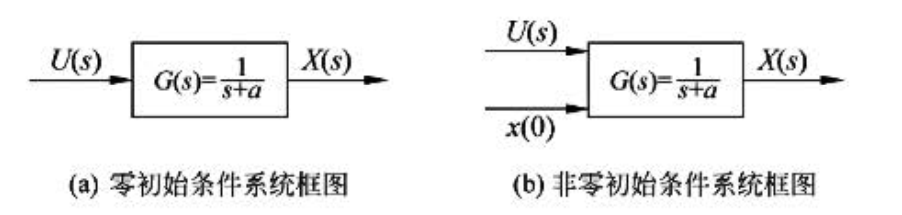

# 状态空间方程
状态空间方程是现代控制理论的基础，以矩阵的形式表达系统状态变量，输入与输出之间的关系，可以处理多输入多输出系统。

对于一个弹簧质量阻尼系统，其动态微分方程为：
$$
m\frac{d^{2}x(t)}{dt^{2}}+b\frac{dx(t)}{dt}+kx(t)=f(x)
$$
其中，$x(t)$是位移，$m$是质量，$b$是阻尼系数，$k$是弹簧系数，$f(t)$是外力。

此系统对应的传递函数为：
$$
G(s)=\frac{Y(s)}{U(s)}=\frac{1}{ms^{2}+bs+k}
$$

状态空间方程是一个集合，包含了系统的输入、输出及状态变量，并把它们用一系列的一阶微分方程表达出来，对于上面那个二阶系统，为了将其写成状态空间方程，需要取合适的状态变量，将二阶系统转换为一阶系统，如下：
$$
\begin{aligned}&z_{1}\left(t\right)=x\left(t\right)\\&z_{2}\left(t\right)=\frac{\mathrm{d}z_{1}\left(t\right)}{\mathrm{d}t}=\frac{\mathrm{d}x\left(t\right)}{\mathrm{d}t}\end{aligned}
$$
根据一系列推导，就可以得到上述弹簧质量阻尼系统的状态方程（略），从而推广得到状态空间方程的一般形式：
$$
\begin{align}
\frac{d\mathbf{z}(t)}{dt}=\mathbf{A}\mathbf{z}(t)+\mathbf{B}\mathbf{u}(t) \notag\\
\mathbf{y}(t)=\mathbf{C}\mathbf{z}(t)+\mathbf{D}\mathbf{u}(t) \notag
\end{align}
$$
其中：

$\mathbf{z}(t)$是状态变量，是一个$n$维向量，$\mathbf{z}(t)=[z_1(t),z_2(t),\cdots,z_n(t)]^{T}$

$\mathbf{y}(t)$是系统输出，是一个$m$维向量，$\mathbf{y}(t)=[y_1(t),y_2(t),\cdots,y_n(t)]^{T}$

$\mathbf{u}(t)$是系统输入，是一个$p$维向量，$\mathbf{u}(t)=[u_1(t),u_2(t),\cdots,u_n(t)]^{T}$

其中矩阵$\mathbf{A}$是$n\times n$，表示系统状态变量之间的关系，称为状态矩阵或系统矩阵，矩阵$\mathbf{B}$是$n\times p$矩阵，表示输入对状态变量的影响，称为输入矩阵或控制矩阵，矩阵$\mathbf{C}$是$m\times n$矩阵，表示系统的输出与系统状态变量之间的关系，称为输出矩阵，矩阵$\mathbf{D}$是$m\times p$矩阵，表示系统的输入直接作用在系统输出的部分，称为直接传递矩阵。
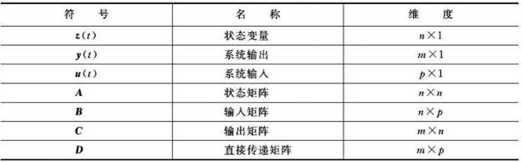

**根据一系列推导可知，状态矩阵$\mathbf{A}$的特征值即为其相对应的传递函数$G(s)$的极点，因此通过分析矩阵$\mathbf{A}$的特征值可以判断系统的表现。**

## 相平面数学基础
前面的公式是状态空间方程的一般表达式，求解矩阵形式的微分方程可以掌握系统状态变量随时间的变化，可以求解出为：
$$
z(t)=\mathrm{e}^{A(t-t_{0})}z(t_{0})+\int_{t_{0}}^{t}\mathrm{e}^{A(t-\tau)}Bu\left(\tau\right)\mathrm{d}\tau
$$
但是上式里面不仅有卷积运算，而且还是矩阵形式的，因此对其分析出现了一定的难度，在前面的传递函数中可以通过拉普拉斯变换来绕开求解微分方程和卷积，对于状态空间方程，使用相平面和相轨迹来简化分析系统。

**相平面和相轨迹使用直接的图形来分析微分方程，特别是二阶微分方程，相轨迹描述了系统的状态变量随着时间在相平面上的变化轨迹。**

考虑一个一阶微分方程：
$$
\frac{dz(t)}{dt}=z^2(t)-1
$$
将其在相平面绘制出来，其中横轴为状态变量$z(t)$，纵轴为$\frac{dz(t)}{dt}$。
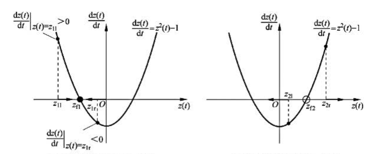

分析过程：当状态变量$z(t)$在$t=0$时位于$z_{f1}$左边，即$z(0)=z_{11}$，此时$\frac{dz(t)}{dt}|_{z(t)=z_{11}}>0$，说明随着时间的增加，状态变量$z(t)$也会增加，此时沿着横轴向右移动，直到$z(t)=z_{f1}$时会停下来，同理，$t=0$时$z(0)$在$z_{f1}$的右边，此时会随着时间向左移动，直到走到平衡点为止。但如果初始点在$z_{f2}$右边不会向$z_{f1}$走，因此$z_{f1}$被称为局部稳定平衡点。

**对于一个二阶系统，其对应二维相平面和相轨迹分析就会复杂一点**，不赘述了，具体用再分析。

# 一阶系统的时域响应分析
学习如何使用传递函数和状态空间方程来分析一阶系统的时域响应和性能特征。

典型一阶系统的微分方程为：
$$
\frac{dx(t)}{dt}+ax(t)=au(t)
$$
考虑零初始条件$x(0)=u(0)=0$，因此对上式进行拉普拉斯变换有：
$$
s\mathbf{X}(s)+a\mathbf{X}(s)=a\mathbf{U}(s)
$$
进而得到系统的传递函数为：
$$
G(s)=\frac{X(s)}{U(s)}=\frac{a}{s+a}
$$
$G(s)$的极点是$s_p=-a$。
单位冲激函数定义为：
$$
\begin{cases}
\delta(t) = 0, & t \neq 0 \\
\displaystyle \int_{-\infty}^{\infty} \delta(t) \, dt = 1
\end{cases}
$$
其拉普拉斯变换为：
$$
\mathcal{L}[\delta(t)]=\int_{0}^{\infty} \delta(t)e^{-st}dt=e^{-s0}=1
$$
单位阶跃函数定义为：
$$
u(t) =
\begin{cases}
1, & t \ge 0 \\
0, & t < 0
\end{cases}
$$
对应的拉普拉斯变换为：
$$
\mathcal{L}[1]=\mathcal{L}[e^{-0t}]=\frac{1}{s+0}=\frac{1}{s}
$$

当输入为单位冲激函数时候，$u(t)=\delta(t)$，$U(s)=1$，可得对应上面那个一阶系统的输出为：
$$
X(s)=U(s)G(s)=1\times\frac{a}{s+a}=\frac{a}{s+a}
$$
对上式等号两边进行拉普拉斯逆变换可得：
$$
x(t)=\mathcal{L}^{-1}[X(s)]=\mathcal{L}^{-1}\left[\frac{a}{s+a}\right]=ae^{-at}
$$
在不同$a$的条件下对应的一阶系统的单位冲激响应有
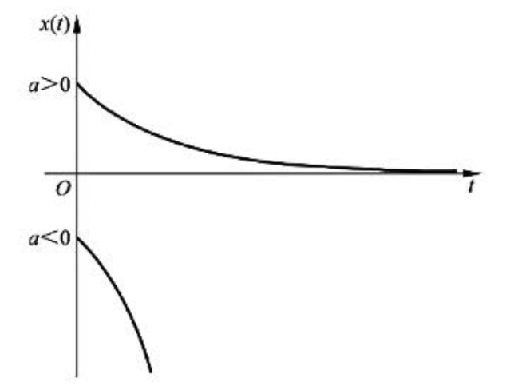

同理可以分析非零初始条件下的一阶系统单位冲激响应和一阶系统的阶跃响应，此处略。

对于使用状态空间的思想来分析可以有，即用相轨迹方法来进行分析。考虑零输入$u(t)=0$的情况，定义系统的状态变量为系统的输出，即$z(t)=x(t)$，此时一阶微分方程可以写为：
$$
\frac{dz(t)}{dt}=-az(t)
$$
令$\frac{dz(t)}{dt}=0$，可以得到它的平衡点$z_f=0$，由此可以画出对应的相轨迹图（冲激响应）
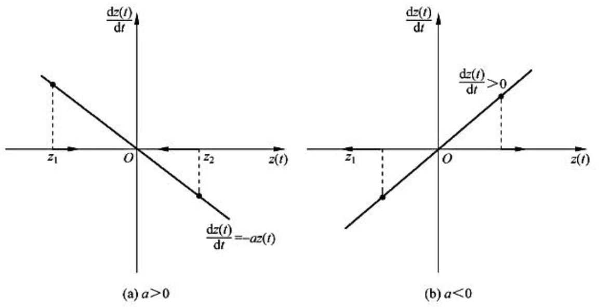

# 二阶系统的时域响应分析
从一个典型的二阶系统入手，一个弹簧质量阻尼系统：
$$
m \frac{\mathrm{d}^2 x(t)}{\mathrm{d}t^2}
+ b \frac{\mathrm{d}x(t)}{\mathrm{d}t}
+ k x(t) = f(t)
$$
调整后有：
$$
\frac{\mathrm{d}^2 x(t)}{\mathrm{d}t^2}
+ \frac{b}{m} \frac{\mathrm{d}x(t)}{\mathrm{d}t}
+ \frac{k}{m} x(t)
= \frac{1}{m} f(t)
$$
**定义**：

固有频率或自然频率：$\omega_n = \sqrt{\frac{k}{m}}$

阻尼比：$\zeta = \frac{b}{2\sqrt{km}}$

为了简化计算，使系统单位化，定义系统的输入$u(t)=\frac{f(t)}{m\omega_{n}^{2}}$，即把原始输入做了一个缩放。然后带入上面的固有频率和阻尼比有：
$$
\frac{\mathrm{d}^2 x(t)}{\mathrm{d}t^2}
+ 2\zeta\omega_n \frac{\mathrm{d}x(t)}{\mathrm{d}t}
+ \omega_n^2 x(t)
= \omega_n^2 u(t)
$$
这是标准的二阶系统微分方程，且下面只讨论$m>0,k>0,b>0$的情况。

对上面那个二阶系统的标准微分方程两边进行拉普拉斯变换，然后整理有：
$$
G(s) = \frac{X(s)}{U(s)} = \frac{\omega_n^2}{s^2 + 2\zeta\omega_n s + \omega_n^2}
$$
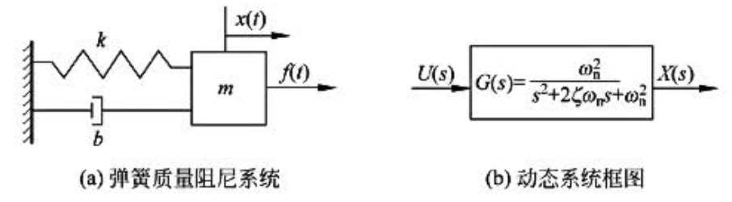

如果使用状态空间方程的表达形式，设系统的状态变量$z(t)=[z_1(t),z_2(t)]^{T}=\left[x(t),\frac{dx(t)}{dt}\right]^{T}$，得到：
$$
\begin{aligned}
\frac{\mathrm{d}z_1(t)}{\mathrm{d}t} &= z_2(t) \\
\frac{\mathrm{d}z_2(t)}{\mathrm{d}t} &= \frac{\mathrm{d}^2 z_1(t)}{\mathrm{d}t^2} = -2\zeta\omega_n z_2(t) - \omega_n^2 z_1(t) + \omega_n^2 u(t)
\end{aligned}
$$
写成紧凑的矩阵形式有：
$$
\frac{dz(t)}{dt}=\mathbf{A}\mathbf{z}(t)+\mathbf{B}u(t)
$$
其中：
$$
\mathbf{A}=\left[\begin{matrix}0 & 1 \\ -\omega_{n}^{2} & 2\zeta\omega_n \end{matrix}\right], \mathbf{B}=\left[\begin{matrix}0 \\ \omega_{n}^{2}\end{matrix}\right]
$$

## 二阶系统对初始状态的响应
先分析二阶系统对初始状态的响应，即考虑无输入的情况$u(t)=0$，此时这个二阶系统可以写为：
$$
\frac{dz(t)}{dt}=\mathbf{A}\mathbf{z}(t)，其中\mathbf{A}=\left[\begin{matrix}0 & 1 \\ -\omega_{n}^{2} & -2\zeta\omega_n\end{matrix}\right]
$$
求这个系统的平衡点，令$\frac{dz(t)}{dt}=0$，可得：
$$
\begin{cases}
0 = z_{2f} \\
0 = -\omega_n^2 z_{1f} - 2\zeta\omega_n z_{2f}
\end{cases}
\Rightarrow
\begin{cases}
z_{1f} = 0 \\
z_{2f} = 0
\end{cases}
$$
分析平衡点的性质，首先要得到状态矩阵$\mathbf{A}$的特征值，令$|\mathbf{A}-\lambda\mathbf{I}|=0$得到：
$$
\begin{cases}
\lambda_1 = -\zeta\omega_n + \omega_n\sqrt{\zeta^2 - 1} \\
\lambda_2 = -\zeta\omega_n - \omega_n\sqrt{\zeta^2 - 1}
\end{cases}
$$
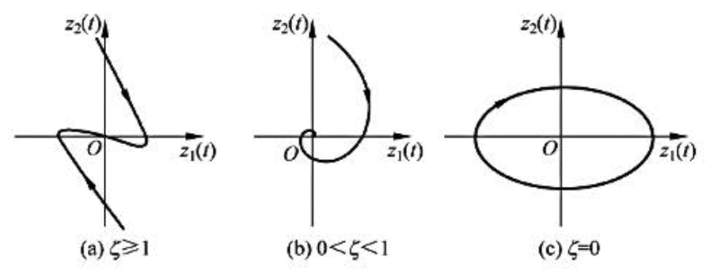

当$\zeta >1$称为过阻尼系统

当$\zeta =1$称为临界阻尼系统

当$0<\zeta<1$称为欠阻尼系统

当$\zeta=0$称为无阻尼系统

每个系统有不同的性质和特性，具体用具体分析。

## 二阶系统的单位阶跃响应
略
## 二阶系统性能指标分析
直接给出结论：

**上升时间**$T_r$：指系统第一次到达稳定点的时间，有的系统达不到稳定状态，就取稳定值的90%，这一参数体现了系统的反应速度。

**最大超调量**$M_p$：系统输出的最大值（峰值）减去稳态值，再乘以100%

**稳定时间**$T_s$：指系统进入稳态的误差范围内的时间，一般是最终状态的2%以内

**如果已知传递函数，可以通过公式直接计算这三个指标，具体过程略**

# 稳定性
这一节后面再回顾，暂略

# 基于传递函数的控制器设计-比例积分控制
首先以体重变化和热量输入的关系建立一个动态微分方程：
$$
7000 \frac{\mathrm{d}m}{\mathrm{d}t} + 10 \alpha m = E_i - E_a - \alpha(6.25 h - 5a + S)
$$
其中$m(t)$是体重，$\alpha$是劳动强度系数，始终大于零，$\mathrm(E)_i$是热量摄入，$\mathrm{E}_a$是额外的运动消耗，$h$是身高， $a$是年龄，$S$是一个和性别相关的调整系数，其中男性$S=5$，女性$S=-161$，为了进一步简化，令$6.25h-5a+S=C$，由此简化：
$$
7000 \frac{\mathrm{d}m}{\mathrm{d}t} + 10 \alpha m = E_i - E_a - \alpha C
$$
人体体重变化考虑为一个动态系统，定义其输入为$u(t)=E_i-E_a$，代表了每日净热量输入，系统输出是体重$x(t)=m(t)$，此外引入$d(t)=-aC$代表系统的扰动量：
$$
7000 \frac{\mathrm{d}x(t)}{\mathrm{d}t} + 10\alpha x(t) = u(t) + d(t)
$$
对等号两边进行拉普拉斯变换有：
$$
7000\left(sX(s) - x_0\right) + 10\alpha X(s) = U(s) + D(s) \\
\Rightarrow \left(7000s + 10\alpha\right)X(s) = U(s) + D(s) + 7000x_0
$$
其中$x_0=x(0)$就是输出$x(t)$初始状态的值，也就是初始体重，调整后得到动态系统的传递函数：
$$
G(s) = \frac{X(s)}{U(s) + D(s) + 7000x_0} = \frac{1}{7000s + 10\alpha}
$$
这是一个典型的一阶系统，根据前面分析，$U(s)$和$D(s)$是以阶跃形式作用在系统上，初始状态$7000x_0$则以冲激方式作用在系统上：
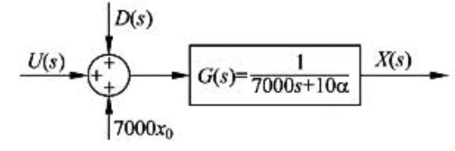

先分析下此系统的稳定性，通过传递函数的极点$s_p=-\frac{a}{700}<0$，说明传递函数的极点在复平面的左半部分，系统是渐近稳定的，同时满足BIBO稳定，所以当输入$U(s)+D(s)+7000x_0$有界时，输出也一定有界。

给定三个案例
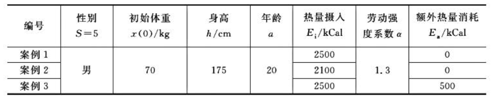
他们体重随时间变化图为：
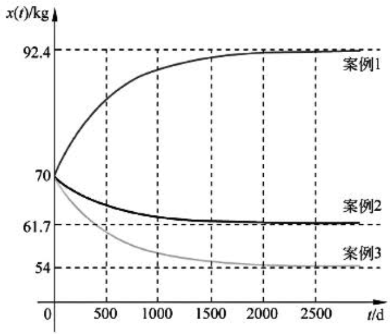

考虑当案例1想要减肥，将体重重90kg降到65kg，应该如何调整饮食和运动，如何构建一个闭环控制系统来解决这个问题。

首先需要构建一个闭环控制系统：
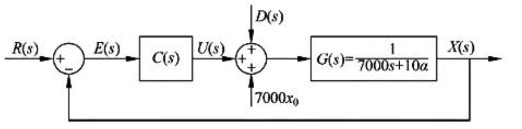
其中参考值$r(t)$即为目标值，为65kg，对应拉普拉斯变换为$R(s)=\frac{r}{s}$，参考值与输出之间的差距定义为误差$e(t)=r(t)-x(t)$，其对应的拉普拉斯变换为$E(s)=R(s)-X(s)$，$C(s)$是控制器，包含了我们需要设计的控制算法，误差信号通过控制器后形成控制量，即原系统的输入$U(s)=E(s)C(s)$。

在这个例子中很容易想到体重大于目标值时候就多运动少吃饭，这种简单的策略被称为**比例控制**，即系统的控制量与误差成正比：
$$
u(t)=K_p e(t)
$$
其中$K_p>0$，称为比例增益，其拉普拉斯变换为：
$$
U(s)=K_p E(s)
$$
使用比例控制的系统框图为：
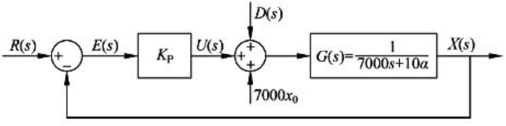

此时系统的输出可以表示为：
$$
\begin{aligned}
X(s) &= \frac{U(s) + D(s) + 7000x_0}{7000s + 10\alpha}
= \frac{E(s)K_\text{P} + D(s) + 7000x_0}{7000s + 10\alpha} \\
&= \frac{(R(s) - X(s))K_\text{P} + D(s) + 7000x_0}{7000s + 10\alpha} \\
\Rightarrow X(s) &= \frac{K_\text{P}R(s) + D(s) + 7000x_0}{7000s + 10\alpha + K_\text{P}}
\end{aligned}
$$
根据前面的定义，$d(t)=-\alpha C$，可得$D(s)=-\frac{\alpha C}{s}$，又已知$R(s)=\frac{r}{s}$，上式变为
$$
X(s) = \frac{K_\text{P} \frac{r}{s} - \frac{\alpha C}{s} + 7000x_0}{7000s + 10\alpha + K_\text{P}}
= \frac{K_\text{P} r - \alpha C + 7000x_0 s}{s(7000s + 10\alpha + K_\text{P})}
$$
根据上式可以分析$X(s)$有两个极点，分别为$s_{p1}=0$和$s_{p2}=-\frac{K_p+10\alpha}{7000}$，其中$s_{p1}$是输入$U(s)$和扰动$D(s)$的极点，$s_{p2}$是闭环传递函数的极点。对上式进行因式分解有：
$$
X(s) = \left( \frac{K_\text{P} r - \alpha C}{K_\text{P} + 10\alpha} \right) \frac{1}{s}
+ \left( x_0 - \frac{K_\text{P} r - \alpha C}{K_\text{P} + 10\alpha} \right) \frac{1}{s + \dfrac{K_\text{P} + 10\alpha}{7000}}
$$
再对上式进行拉普拉斯逆变换有：
$$
\begin{aligned}
x(t) &= \mathcal{L}^{-1}\left[X(s)\right]
= \frac{K_\text{P} r - \alpha C}{K_\text{P} + 10\alpha} e^{0t}
+ \left(x_0 - \frac{K_\text{P} r - \alpha C}{K_\text{P} + 10\alpha}\right) e^{-\frac{K_\text{P} + 10\alpha}{7000} t} \\
&= \frac{K_\text{P} r - \alpha C}{K_\text{P} + 10\alpha}
+ \left(x_0 - \frac{K_\text{P} r - \alpha C}{K_\text{P} + 10\alpha}\right) e^{-\frac{K_\text{P} + 10\alpha}{7000} t}
\end{aligned}
$$
在上面式中可以分析输出$x(t)$的稳定性与传递函数的极点$s_{p2}=-\frac{K_p+10\alpha}{7000}$相关，在本例中$K_p>0$，因此$s_{p2}<0$，说明随着时间的增加，$e^{-\frac{K_\text{P} + 10\alpha}{7000} t}$项趋近与0，因此可以得到系统输出的终值。
$$
\begin{aligned}
x(\infty) &= \lim_{t \to \infty} x(t)
= \lim_{t \to \infty} \left(
\frac{K_\text{P} r - \alpha C}{K_\text{P} + 10\alpha}
+ \left(x_0 - \frac{K_\text{P} r - \alpha C}{K_\text{P} + 10\alpha}\right)
e^{-\frac{K_\text{P} + 10\alpha}{7000} t}
\right) \\
&= \frac{K_\text{P} r - \alpha C}{K_\text{P} + 10\alpha}
\end{aligned}
$$
由此就可以分析在不同$K_p$值下，系统输出$x(t)$随时间的变化：
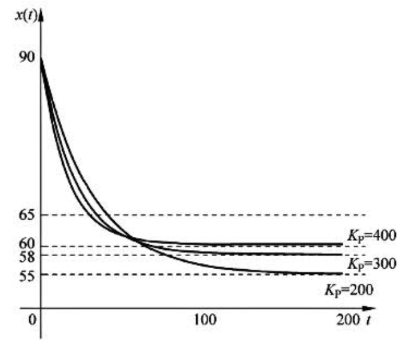

同理也可以得到系统控制量$u(t)=K_p e(t)$随时间的变化
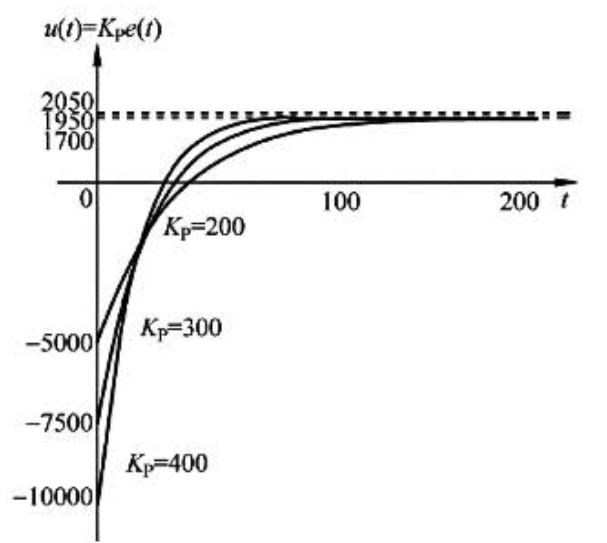

**系统误差的终值称为稳态误差**
$$
e_{ss}=e(\infty)=r-x(\infty)=r - \frac{K_\text{P} r - \alpha C}{K_\text{P} + 10\alpha}
= \frac{10\alpha r + \alpha C}{K_\text{P} + 10\alpha}
$$
所以$K_p$越大，稳态误差就越小，但在现实中$K_p$不可能无限增大，比如本例中热量摄入和运动量都是有限制的。**由此决定了比例控制的局限性，无法消除稳态误差**。

## 终值定理
在计算系统输出的终值过程中，为了得到稳态误差，用到了因式分解和拉普拉斯逆变换，在系统比较复杂时候难以求解，为了快速得到系统的稳态值，由此引入了终值定理
$$
\lim_{t \to \infty} x(t) = \lim_{s \to 0} sX(s)
$$
但这有个前提就是$\lim_{t \to \infty} x(t)$要存在。

## 积分控制
为了消除稳态误差，引入积分控制来解决这个问题。

为了引出积分控制，举一个零初始条件且不含扰动的一阶系统，其中$a>0$，控制的目标是令系统输出$x(t)$等于参考值$r(t)=r$。系统输出$X(s)$可以表达为：
$$
\begin{align*}
X(s) &= U(s)\frac{a}{s+a} = E(s)C(s)\frac{a}{s+a} = \left(R(s)-X(s)\right)C(s)\frac{a}{s+a} \\
\Rightarrow X(s) &= \frac{aR(s)C(s)}{s+a+aC(s)} = \frac{a\,\frac{r}{s}C(s)}{s+a+aC(s)}
\end{align*}
$$
这是一个一阶闭环控制系统的输出表达式，其中$R(s)=\frac{r}{s}$，是常数参考值$r$的拉普拉斯变换，当使用比例控制器$C(s)=K_p$时，上式可得：
$$
X(s) = \frac{a\,\dfrac{r}{s}K_\text{P}}{s+a+aC(s)} = \frac{arK_\text{P}}{s\left(s+a+aK_\text{P}\right)}
$$
使用终值定理可得：
$$
\begin{align*}
\lim_{t\to\infty} x(t) &= \lim_{s\to 0} sX(s)
= \lim_{s\to 0} s\,\frac{arK_\text{P}}{s\left(s+a+aK_\text{P}\right)} \\
&= \lim_{s\to 0} \frac{arK_\text{P}}{s+a+aK_\text{P}}
= \frac{arK_\text{P}}{a+aK_\text{P}}
= \frac{rK_\text{P}}{1+K_\text{P}}
\end{align*}
$$
其稳态误差为：
$$
e_{\text{ss}} = r - \lim_{t\to\infty} x(t)
= r - \frac{rK_\text{P}}{1+K_\text{P}}
= \frac{1}{1+K_\text{P}} r
$$
也可以得到稳态误差的拉普拉斯变换：
$$
\begin{align*}
E(s) &= R(s) - E(s)C(s)\frac{a}{s+a} \\
\Rightarrow E(s) &= \frac{(s+a)R(s)}{s+a+aC(s)}
\end{align*}
$$
将$R(s)=\frac{r}{s}$代入上式并使用终值定理可得：
$$
\begin{align*}
e_{\text{ss}} &= \lim_{t\to\infty} e(t) = \lim_{s\to 0} sE(s)
= \lim_{s\to 0} s\,\frac{(s+a)R(s)}{s+a+aC(s)} \\
&= \lim_{s\to 0} s\,\frac{(s+a)\,\dfrac{r}{s}}{s+a+aK_\text{P}}
= \lim_{s\to 0} \frac{(s+a)r}{s+a+aC(s)}
= \frac{ar}{a+a\lim\limits_{s\to 0}C(s)} \\
&= \frac{r}{1+\lim\limits_{s\to 0}C(s)}
\end{align*}
$$
为了消除稳态误差（令$e_{ss}=0$)，则需要上式的分母无限大，即$\lim_{s\to 0}=\infty$，比较自然的一个作法就是让$C(s)=\frac{1}{s}$，在使用过程中一般令$C(s)=\frac{K_i}{s}$，其中$K_i$为积分增益，此时系统控制量的拉普拉斯变换为：
$$
U(s) = \frac{K_i}{s}E(s)=C(s)E(s)
$$
对应时域表达式为：
$$
u(t)=K_i \int_{0}^{t}e(t)dt
$$
这就是积分控制。

但是引入积分控制会出现一个问题，就是随着$K_i$的增大，超调量$M_p$也会增大，具体证明过程略
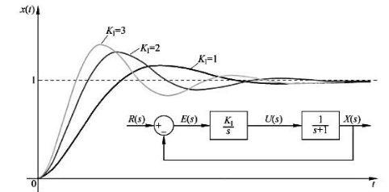

**比例控制无法消除稳态误差，积分控制又会带来振动和超调量问题，且积分控制相对而言响应慢，由此引入PI控制**
$$
U(s)=K_pE(s)+\frac{K_i}{s}E(s)
$$
对应的时域表达式为：
$$
u(t)=K_p e(t) + K_i \int_{0}^{t}e(t)dt 
$$

对应的控制系统框图为：

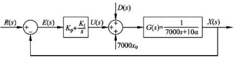

## 含有限制条件的控制器设计
在现实应用中，上面设置的比例积分控制器无法满足要求，因为控制量很可能过大或过小失去了实际意义。往往控制量在应用情况下都会存在限制条件（约束）。最简单的就是在控制系统中引入一个饱和函数：

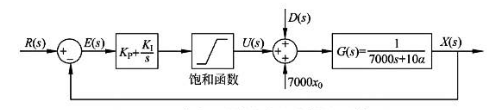

就是在输入控制量上加入了一个限制大小的函数，将输入量控制在一定范围内。

当然这是最简单的，还有其它方法来引入限制条件。

# 基于传递函数的控制器设计-根轨迹法
这是一种图解方法的控制器设计，这里的根指的是闭环控制系统特征方程的根，即闭环传递函数的极点，”轨迹“则指的是极点在复平面上位置变换的规律。

这里主要是为了引出微分控制，当然里面包含了一些补偿器相关知识，后面再细读。

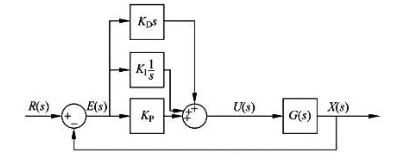

PID控制对应的输入方程为：
$$
u(t) = u_\text{P}(t) + u_\text{I}(t) + u_\text{D}(t)
= K_\text{P} e(t) + K_\text{I} \int e(t) dt + K_\text{D} \frac{de(t)}{dt}
$$
对应的拉普拉斯变换为：
$$
U(s)=(K_p+K_I\frac{1}{s}+K_D s)E(s)
$$

# 频率响应与分析
频率响应，即通过线性时不变系统对正弦输入的稳态响应来分析系统。

**暂略**

# 基于状态空间方程的控制器和观测器设计

