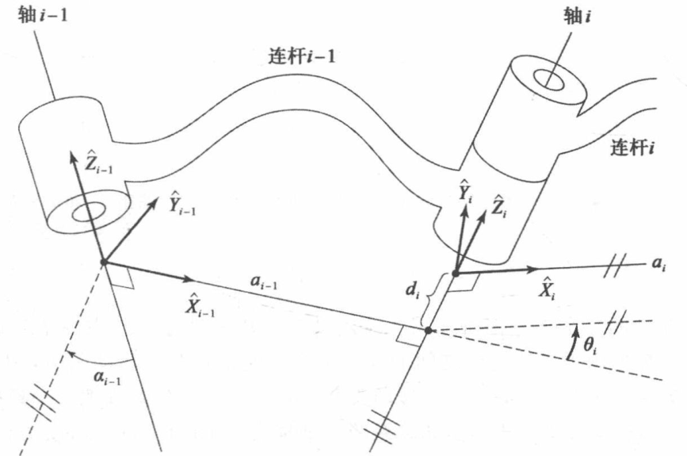
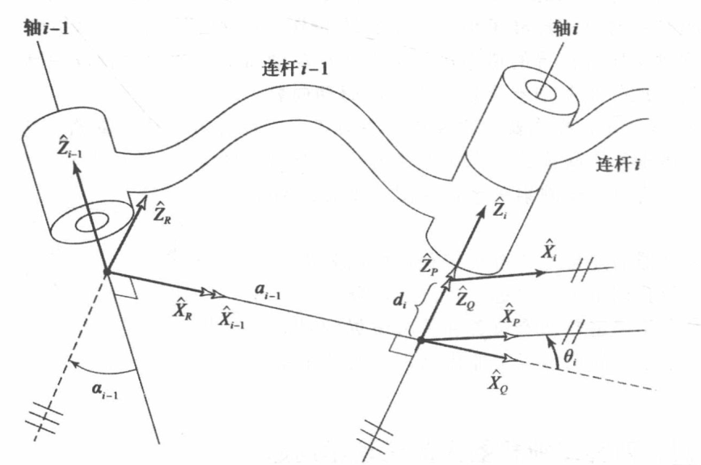
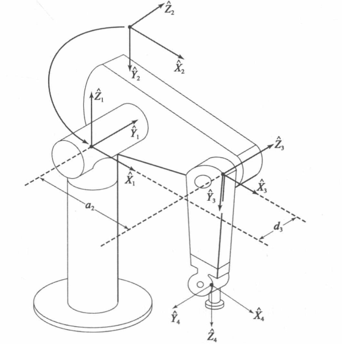
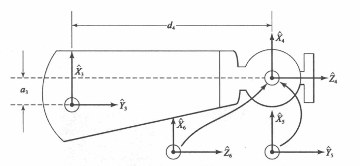

防止遗忘自己学过的知识，一些能记住的或不太重要的东西则不放在这里。

# 机械臂基础知识

**正运动学**：计算机械臂末端执行器位置和姿态的静态几何问题，也称为从关节空间到笛卡尔空间的机械臂表示。

**逆运动学**：给定机械臂末端执行器位置和姿态，计算可到达给定位置和姿态的关节角。

**奇异点**：在机械臂控制中，奇异点现象表现为，当运动到某个状态时，造成局部退化，就像某些自由度失效一样。

**轨迹生成**：平稳操作机械臂从一个点到另外一个点的通用方法是使每个关节按照指定的时间函数来运动，并同时开始和同时结束。轨迹生成就是如何准确的计算出这些运动函数。

**标准正交矩阵**：行列式恒为+1的矩阵（旋转矩阵），非标准正交阵，行列式值为-1。

**运动学**：研究的是机械臂的运动特征，不考虑使得机械臂运动时产生的力。研究的是机械臂的位置、速度、加速度以及位置变量的所有高阶导数（对时间或其它变量的导数）。

**动力学**：研究的是机械臂运动和使之运动而施加的李和力矩之间的关系。

# 机械臂运动学

**连杆长度**：两关节轴之间公垂线的长度。

**连杆扭转角度**：将两个关节轴投影到垂直公垂线的平面上，此时按照右手法则，两个投影轴间夹角为连杆扭转角度。

# 机械臂运动学

## 运动链中位置连杆坐标系的定义

将固定在连杆$i$上的坐标系称为坐标系$\{i\}$。

坐标系$\{i\}$的原点位于公垂线$a_i$与关节轴$i$的交点处，$\hat{X}_i$轴方向沿$a_i$方向由关节$i$指向关节$i+1$。**当公垂线为零，即两个关节轴相交时，$\hat{X}_i$轴方向为垂直于两个关节轴线所在的平面，因此会有两个方向**

参考坐标系${0}$可以任意设置，但一般$z$轴设置为和关节1一样的方向，而$x$轴设置为和关节1角度为0时候的$\hat{X}_1$重合，即当坐标系$\{1\}$在关节1为初始位置时，参考坐标系$\{0\}$与坐标系$\{1\}$完全重合。

**连杆参数在连杆坐标系中的表示方法**：
$$
\begin{align}
连杆长度：a_i &= 沿 \hat{X}_i轴，从\hat{Z}_i移动到\hat{Z}_{i+1}的距离 \notag \\
连杆扭转角：\alpha_i &= 绕\hat{X}_i轴，从\hat{Z}_i旋转到\hat{Z}_{i+1}的角度 \notag \\
连杆偏距：d_i &= 沿\hat{Z}_i轴，从\hat{X}_{i-1}移动到\hat{X}_i的距离 \notag \\
关节角：\theta_i &= 绕\hat{Z}_i轴，从\hat{X}_{i-1}旋转到\hat{X}_i的角度 \notag
\end{align}
$$

## 运动学
根据相邻连杆间坐标系变换的一般形式，就可以根据这些独立的变换求出连杆n相对与连杆0的位置和姿态。

当建立坐标系$\{i\}$相对与坐标系$\{i-1\}$的变换，这个变换一般是由4个连杆参数构成的函数。通过对每个连杆逐一建立坐标系，可以把运动学问题分解成n（坐标系数量-1）个子问题，为了解决每个子问题，即$_{i}^{i-1}T$，再将每个子问题分解成4个次子问题，4个变换中的每一个变换都是仅有一个连杆参数，为了写出它的形式，为每个连杆定义3个中间坐标系${P}、{Q}、{R}$。由下图可见：

于是可以得到坐标系$\{i\}$相对于坐标系$\{i-1\}$的变换：
$$
\begin{align}
_i^{i-1}T=_R^{i-1}T _Q^{R}T _P^{Q}T _i^{P}T \notag
\end{align}
$$
考虑每个变换矩阵，可以写成：
$$
_i^{i-1}T = R_X(\alpha_{i-1})D_X(a_{i-1})R_Z(\theta_{i})D_Z(d_i)
$$
或者：
$$
\begin{align}
_i^{i-1}T = Screw_X(a_{i-1}, \alpha_{i-1})Screw_Z(d_i, \theta_i)
\end{align}
$$
这里$Screw_Q(r, \phi)$代表沿着Q轴平移$r$，再绕Q轴旋转角度$\phi$。得到$_i^{i-1}T$的一般矩阵形式为：
$$
\begin{matrix}
_i^{i-1}T = 
\begin{bmatrix}
c\theta_i & -s\theta_i & 0 & a_{i-1} \\
s\theta_i cα_{i-1} & c\theta_i cα_{i-1} & -sα_{i-1} & -sα_{i-1}d_i \\
s\theta_i sα_{i-1} & c\theta_i sα_{i-1} & cα_{i-1} & cα_{i-1}d_i \\
0 & 0 & 0 & 1
\end{bmatrix}
\end{matrix}
$$
变换矩阵$_0^N T$是关于第n个关节变量的函数，如果能得机器人关节位置传感器的值，机器人末端连杆在笛卡尔坐标系里的位置和姿态就能够通过$_0^N T$推算出来。

对于PUMA560机器人：

其中连杆参数为：
$$
\begin{array}{|c|c|c|c|c|}
\hline
i & \alpha_{i-1} & a_{i-1} & d_i & \theta_i \\
\hline
1 & 0 & 0 & 0 & \theta_1 \\
\hline
2 & -90^\circ & 0 & 0 & \theta_2 \\
\hline
3 & 0 & a_2 & d_3 & \theta_3 \\
\hline
4 & -90^\circ & a_3 & d_4 & \theta_4 \\
\hline
5 & 90^\circ & 0 & 0 & \theta_5 \\
\hline
6 & -90^\circ & 0 & 0 & \theta_6 \\
\hline
\end{array}
$$

六个连杆坐标变换矩阵乘积为：
$$_6^0T=_1^0T_6^1T=
\begin{bmatrix}
r_{11} & r_{12} & r_{13} & p_x \\
r_{21} & r_{22} & r_{23} & p_y \\
r_{31} & r_{32} & r_{33} & p_z \\
0 & 0 & 0 & 1
\end{bmatrix}$$
其中：
$$\begin{aligned}
 & r_{11}=c_1
\begin{bmatrix}
c_{23}(c_4c_5c_6-s_4s_5)-s_{23}s_5c_6
\end{bmatrix}+s_1(s_4c_5c_6+c_4s_6) \\
 & r_{21}=s_1\left[c_{23}\left(c_4c_5c_6-s_4s_6\right)-s_{23}s_5c_6\right]-c_1\left(s_4c_5c_6+c_4s_6\right) \\
 & r_{31}=- s_{23} ( c_{4} c_{5} c_{6} - s_{4} s_{6} )-c_{23} s_{5} c_{6} \\
\newline 
 & r_{12}=c_1\left[c_{23}\left(-c_4c_5s_6-s_4c_6\right)+s_{23}s_5s_6\right]+s_1\left(c_4c_6-s_4c_5s_6\right) \\
 & r_{22}=s_{1}\left[c_{23}\left(-c_{4}c_{5}s_{6}-s_{4}c_{6}\right)+s_{23}s_{5}s_{6}\right]-c_{1}\left(c_{4}c_{6}-s_{4}c_{5}s_{6}\right) \\
 & r_{32}=- s_{23} (- c_4 c_5 s_6-s_4 c_6 )+c_{23} s_5 s_6 \\
 \newline
 & r_{13}=- c_{1} ( c_{23} c_{4} s_{5} + s_{23} c_{5} )- s_{1} s_{4} s_{5} \\
 & r_{23}=- s_1 ( c_{23} c_4 s_5 + s_{23} c_5 )+ c_1 s_4 s_5 \\
 & r_{33}= s_{23} c_4 s_5 - c_{23} c_5 \\
 \newline
 & p_x=c_1\left[a_2c_2+a_3c_{23}-d_4s_{23}\right]-d_3s_1 \\
 & p_y=s_1\left[a_2c_2+a_3c_{23}-d_4s_{23}\right]+d_3c_1 \\
 & p_z=- a_3 s_{23}-a_2 s_2-d_4 c_{23}
\end{aligned}$$
$c_5$是$\cos_{\theta_5}$的缩写，$s_5$是$\sin_{\theta_5}$的缩写，并使用了差化积公式：
$$
c_{23} = c_2 c_3 - s_2 s_3 \\
s_{23} = s_2 c_3 + c_2 s_3
$$

# 机械臂逆运动学
已知机械臂腕部坐标系$\{W\}$相对于基座标系$\{B\}$的位姿，求机械臂各关节角度。这是一个非线性问题。

