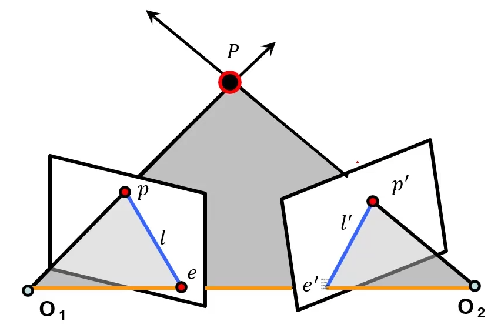
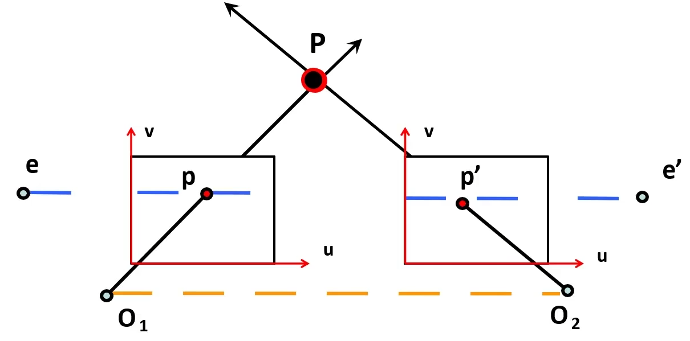
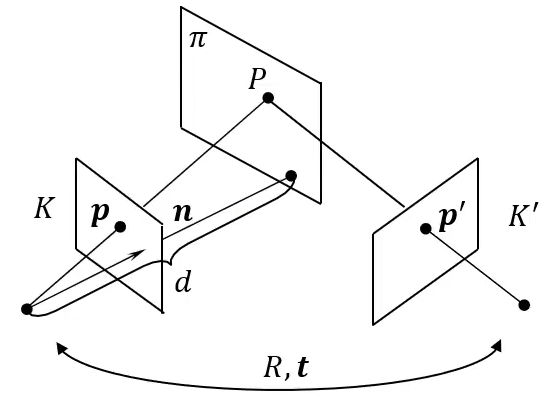

学习极几何的一些笔记
## 极几何
$\textbf{三角化}$，已知两幅图片中对应真实世界中点$P$的两个像素坐标$p$和$p^{'}$，两个相机的内
参$K$和$K^{'}$以及两个相机之间的位姿变换矩阵$\mathbf{R}$和$\mathbf{T}$，求解$P$的三维坐
标。即寻找$P$满足
$$
    \left\{\begin{array}{l}p=MP=K[I\quad 0]P \\ p^{'}=M^{'}P=K^{'}[R\quad T]P\end{array}\right.
$$
但现实是对于相机内参$K$和$K^{'}$、相机位姿旋转矩阵$R$、平移向量$T$往往不知道，仅清楚两张图片
之间的对应点$p$和$p^{'}$。

于是在多视图几何中存在以下几个关键问题

* 摄像几何：从一张或者多张图像中求解摄像机的内外参数
* 场景几何：通过两张至多张图片寻找3D场景坐标
* 对应关系：已知一个图像中的$p$点，如何在另一个图像中找到对应的$p^{'}$点

如图：

* 极平面：过点$P$，$O_{1}$与$O_{2}$的平面
* 基线：$O_{1}$与$O_{2}$的连线
* 极线：极平面与成像平面的交线
* 极点：基线与成像平面的交点

极几何的特例：平行视图(常见双目立体、VR)：

* 两个图像平面平行
* 基线平行于图像平面，极点$e$和$e^{'}$位于无穷远处
* 极线平行于图像坐标系的$u$轴

### 本质矩阵
对于规范化相机，图像$I$上点$p$像素坐标为$(u,v)$，图像$I^{'}$上的点$p^{'}$坐标为$(u^{'},v^{'})$，
$K=K^{'}=\left[\begin{array}{ccc}1&0&0\\0&1&0\\0&0&1\end{array}\right]$，因为为规
范化相机
所以点$p$在$O_{1}$坐标系下的\textbf{非齐次坐标}为$(u,v,1)$，同理空间点$p^{'}$在$O_{2}$
下的\textbf{非齐次坐标}为$(u^{'},v^{'},1)$
知道$O_{1}$到$O_{2}$的旋转矩阵$R$和平移向量$T$，于是有
$$
\begin{align} 
    &p^{'}\text{在}O_{1}\text{的坐标}=R^{T}p^{'}-R^{T}T \notag\\
    &O_{2}\text{在}O_{1}\text{的坐标}=-R^{T}T 
\end{align}
$$

于是可以求得一个垂直于极平面的向量
$$
\begin{align} 
    R^{T}T\times(R^{T}p^{'}-R^{T}T)=R^{T}T\times R^{T}p^{'}
\end{align}
$$
因为$p$点在极平面上，所以有
$$
\begin{align} 
    [R^{T}T\times R^{T}p^{'}]^{T}\cdot p=0
\end{align}
$$
将上面的式子推导可以得出
$$
\begin{align} 
    p^{'T}[T\times R]p=0 
\end{align}
$$
于是点$p$和点$p^{'}$存在一个极几何约束-----本质矩阵
$$
\begin{align} 
    &E=T\times R\Rightarrow E=\text{本质矩阵} \\
    &p^{'}Ep=0
\end{align}
$$
其中本质矩阵有以下性质：

* $p$对应的极线是$l^{'}(l^{'}=Ep)$
* $p^{'}$对应的极线是$l(l=E^{T}p^{'})$
* $Ee=0$与$e^{'T}E=0$
* $E$是奇异的(秩2)
* $E$是5个自由度(三个旋转+三个平移，$det(E)$去掉一个自由度)

### 基础矩阵
这个为正常透视相机下的点$p$与点$p^{'}$的对应关系，此时推导类比规范化相机下的推导，先将两张图
像上点的坐标转换为规范化相机下的坐标，有：
$$
\begin{align}
    \left\{\begin{array}{l}p_{c}=K^{-1}p\\p_{c}^{'}=K^{'-1}p^{'}\end{array}\right. 
\end{align}
$$
于是有：$p_{c}^{'T}Ep_{c}=(K^{'-1}p^{'})^{T}\cdot[T_{\times}]RK^{-1}p=p^{'T}K^{'-T}
[T_{\times}]RK^{-1}p=0$
即可求得基础矩阵
$$
\begin{align} 
    F=K^{'-T}[T_{\times}]RK^{-1}\rightarrow p^{'T}Fp=0
\end{align}
$$
同样它也有上述的几个性质，不同的是它有7个自由度，因为尺度无法确定。

$\textbf{常见的基础矩阵估计方法八点法，归一化八点法}$
### 单应性矩阵
空间平面在两个摄像机下的投影几何

如图单应性矩阵推导已知第一个摄像机的内参矩阵$K$，第二个内参矩阵$K^{'}$，第二个摄像机相对于第
一个摄像机的位置$(R,t)$，$n$为平面$\pi$在第一个摄像机坐标系下的单位法向量，$d$为坐标原点到
平面$\pi$的距离

平面$\pi$的方程为$n^{T}\tilde{P}=d$，$\tilde{P}$表示点$P$的欧式坐标，由此直接给出平面$\pi$的
单应性矩阵$H=K^{'}(R+tn_{d}^{T})K^{-1}$，其中，$n_{d}=\frac{n}{d}$

$\textbf{约束关系}$

基础矩阵建立点和极线的对应关系

单应矩阵建立点和点的对应
