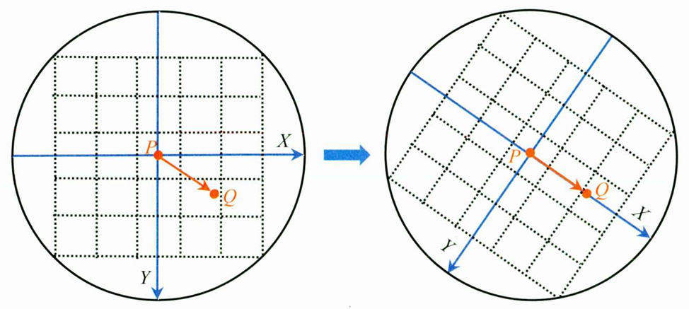

slam中涉及到的一些知识点，做个总结，尽量结合实际项目或代码，持续更新增加。。。

## 光流法跟踪特征点
以vins中的光流前端为例子。在slam前端用光流法的优点是计算效率高，适用于实时性要求较高的场景(
相较于特征点法而言)，当然现在有些特征点法速率也不错，但其精度和速率总是难以两全，虽然SIFT计算
复杂，但其精度、稳定性等仍然在层出不穷的传统特征点提取算法中保持优越。

光流法有较强的假设性：

- 亮度恒定，投影在图像中的同一点随着时间不会变化。
- 小运动，就是随着时间的变化不会引起位置的剧烈变化，这样灰度才能对位置求偏导。
- 空间一致，一个场景上邻近点投影到图像上也是邻近点，且邻近点速度一致，这是对于Lucas-Kanade
光流法特有的假设，因为光流法基本方程约束只有一个，而要求$x$，$y$方向上的速度有两个未知量，假
设了邻域运动一致，就可以联立多个方程。

虽然现在有些光流法通过金字塔或者亮度质心等来去除或者松弛这些约束，但这样一来和特征点法有何差异
呢，也是个计算效率和准确率的取舍问题。

**VINS中采用的是LK金字塔光流法**

### LK光流法
相机的不同帧图像是随时间变化的，那么在$t$时刻，位于$(x,y)$处的像素，它的灰度为$\mathbf{I}(x,y,t)$。
根据上面假设条件一有：
$$
    \mathbf{I}(x+dx,y+dy,t+dt) = \mathbf{I}(x,y,t)
$$
对左边进行泰勒展开，保留一阶项：
$$
    \mathbf{I}(x+dx,y+dy,t+dt)\approx\boldsymbol{I}\left(x,y,t\right)+
    \frac{\partial\boldsymbol{I}}{\partial x}\mathrm{d}x+
    \frac{\partial\boldsymbol{I}}{\partial y}\mathrm{d}y+
    \frac{\partial\boldsymbol{I}}{\partial t}\mathrm{d}t
$$
因为**假设了灰度不变**，于是下一时刻的灰度等于上一时刻的灰度，从而有：
$$
    \frac{\partial\boldsymbol{I}}{\partial x}\mathrm{d}x+
    \frac{\partial\boldsymbol{I}}{\partial y}\mathrm{d}y+
    \frac{\partial\boldsymbol{I}}{\partial t}\mathrm{d}t = 0
$$
$$
     \frac{\partial\boldsymbol{I}}{\partial x}\frac{\mathrm{d}x}{\mathrm{d}t}+
    \frac{\partial\boldsymbol{I}}{\partial y}\frac{\mathrm{d}y}{\mathrm{d}t}+
    = -\frac{\partial\boldsymbol{I}}{\partial t}
$$
其中$\frac{\partial\boldsymbol{I}}{\partial x}$为像素在x方向的梯度，而
$\frac{\partial\boldsymbol{I}}{\partial y}$为在y方向的梯度，记为$\mathbf{I}_{x}$，
$\mathbf{I}_y$。同时$\frac{\mathrm{d}x}{\mathrm{d}t}$
是像素在x轴上的运动速度，而$\frac{\mathrm{d}y}{\mathrm{d}t}$是在y轴上的速度，记为$u$，$v$。
写成矩阵形式有：
$$
\left.\left[\begin{array}{cc}I_x&I_y\end{array}\right.\right]\left[\begin{array}{c}u\\\\v\end{array}\right]=-\boldsymbol{I}_t
$$

这个方程中有两个未知数，因此至少需要两个方程才能解，根据前面的假设，认为在**邻域内像素和该像素
具有相同的运动状态**，可以构建$n^{2}$个方程：
$$
\left.\left[\begin{array}{cc}\boldsymbol{I}_x&\boldsymbol{I}_y\end{array}\right.\right]_k\left[\begin{array}{c}u\\\\v\end{array}\right]=-\boldsymbol{I}_{t k},\quad k=1,\ldots,n^2
$$

## 特征点法跟踪(以ORB为例)

### 什么是ORB特征点

特征点一般由关键点和描述子两部分组成。ORB特征点是在FAST特征点的基础上加入了方向信息，对应的在
描述子中加入了方向的描述。(Oriented FAST关键点和Streered BRIEF描述子)两部分。

ORB特征选取策略：
- 在图像中选取某个像素$p$，其灰度值为$I_{p}$。
- 设定一个阈值$T$，以$p$为圆心，半径为3个像素的16个像素点上比大小。
- 如果16个像素点上有连续$N$个灰度大于或小于$I_{p}+T$，则确定为关键点，在ORB-slam中$N=3$
- 实际中为了加速，通常选取第1、5、9、13个像素点的灰度值来比较，有大于等于三个像素点满足条件
则认为中心像素点为一个关键点。

为了保证特征点的尺度不变性和计算方向，引入了图像金字塔和灰度质心法。简要记一下灰度质心法，计算
关键点为圆心指定半径中园的灰度质心，圆心到质心方向即为关键点方向。

图像的矩定义为：
$$
m_{pq}=\sum_{x,y}x^py^qI(x,y),\quad p,q=\{0,1\}
$$
就是一定方向或者一定范围内灰度值和坐标的乘积。

那么分别在坐标轴$x$，$y$方向上的图像矩分别为：
$$
m_{10}=\sum_{x=-R}^R\sum_{y=-R}^RxI(x,y)\\
m_{01}=\sum_{x=-R}^R\sum_{y=-R}^RyI(x,y)
$$

对应圆形区域内所有像素的灰度值总和为：
$$
m_{00}=\sum_{x=-R}^R\sum_{y=-R}^RI(x,y)
$$

那么图像的质心为：
$$
C=(c_x,c_y)=\left(\frac{m_{10}}{m_{00}},\frac{m_{01}}{m_{00}}\right)
$$

同时，可以计算出关键点的旋转角度为：
$$
\theta=\arctan2\left(c_y,c_x\right)=\arctan2\left(m_{01},m_{10}\right)
$$

然后就可以将图像按照$\theta$旋转：

### 描述子 Steered BRIEF
BRIEF是一种二进制编码的描述子，在ORB-SLAM2中它是一个256bit的向量。以下是计算方法：

- 为减少噪声干扰，先对图像进行高斯滤波。
- 以关键点为中心，取一定大小的图像窗口$p$，在窗口内随机选取一对点，比较二者像素的大小，进行
如下二进制赋值。
$$
\tau(p;x,y):=\begin{cases}1&:p(x)<p(y)\\0&:p(x)\geqslant p(y)\end{cases}
$$
- 在窗口中随机选取$N$，(在ORB-slam2中是256)对随机点，重复上面的步骤，得到一个256维的二进制
描述子。

对于选点，在ORB-slam2中采用固定的选点模板，是一个256$\times$4个值组成的数组，每行的4个值表
示一对点的坐标。

而增加了旋转方向的Steered BRIEF描述子则是先将此区域旋转(或者通过下面的矩阵找到旋转前的点在
图像中的位置)。
$$
\begin{bmatrix}x'\\y'\end{bmatrix}=\begin{bmatrix}\cos\theta&-\sin\theta\\[0.3em]\sin\theta&\cos\theta\end{bmatrix}\begin{bmatrix}x\\[0.3em]y\end{bmatrix}
$$

### 特征点均匀化
- 根据总的图像金字塔层级和待提取的特征点总数，计算图像金字塔中每个层级需要提取的特征点数量。
- 划分格子(在ORB-slam2中固定尺寸为30像素$\times$30)
- 对每个格子提取角点，如果初始的FAST角点阈值没有检测到角点，则降低阈值，再提取一次，若还是没有
角点，则不在这个格子提取。
- 用四叉树均匀地选取角点。

### 特征点匹配
在特征点匹配中(单指帧与帧之间的匹配)，这里不同于光流法的直接跟踪，特征点的匹配需要去对应帧全图
寻找匹配点，很耗费计算资源，因此需要采取一定的策略加速匹配。在ORB-slam2中是在匹配点对应的匹配
帧的对应位置一定范围内进行匹配，并且为了加速，还将匹配区域划分为一个一个的网格，遍历网格寻找匹
配点。

为了减少误匹配，ORB-slam2中还采用了方向一致性检验，简而言之就是将源匹配点和目标匹配点的主方向
做差，然后统计这个差的直方图分布，选取排在前三的直方图格子，其余在外的就认为是误匹配点对。

### 词袋模型匹配
这个一般直接调用库，后面再细究。

## vins初始化过程中的陀螺仪偏置标定
对于窗口内连续两帧土$b_k$和$b_{k+1}$，通过先前的视觉sfm得到这两帧相对于滑窗内第一帧的旋
转$\mathbf{q}_{c_0 b_k}$和$\mathbf{q}_{c_{0} b_{k+1}}$。并且先前通过IMU预积分得到这两帧旋转的预积分$\hat{\gamma}_{\mathrm{b_k b_{k+1}}}$。这个时候就可以构建约束方程，最小化
代价函数：
$$
\tag{1-1}
\mathrm{argmin_{\delta b^s}\sum_{kinB}\left|2\left\lfloor q_{c_0 b_{k+1}}^{-1}\bigotimes q_{c_0 b_k}\bigotimes\gamma_{b_k b_{k+1}}\right\rfloor_{xyz}\right|^2}
$$
其中$\hat{\gamma}_{\mathrm{b_k b_{k+1}}}$是算上陀螺仪的偏置的预积分。
那么就有**加上偏置的预积分=没有偏置的imu预积分估计值+偏置**。表达式如下：
$$
\tag{1-2}
\gamma_{\mathrm{b_k b_{k+1}}}\approx\hat{\gamma}_{\mathrm{b_k b_{k+1}}}\bigotimes\left[\begin{array}{c}1\\\frac{1}{2}\mathrm{J_{b_g}^\gamma\delta b_g}\end{array}\right]
$$
最理想的情况下是对于式子(1-1)其代价为：
$$
\tag{1-3}
\left.\mathbf{q_{c_0 b_{k+1}}}\otimes\mathbf{q_{c_0 b_k}}\otimes\gamma_{b_k b_{k+1}}=\left[\begin{array}{c}1\\0\\0\\0\end{array}\right.\right]
$$
对式子(1-3)进行变换得到$\gamma_{\mathrm{b_k b_{k+1}}}$
$$
\tag{1-4}
\left.\gamma_{\mathrm{b_k b_{k+1}}}=\mathbf{q}_{\mathrm{c_0 b_k}}^{-1}\bigotimes\mathbf{q}_{\mathrm{c_0 b_{k+1}}}\bigotimes\left[\begin{array}{c}1\\0\\0\\0\end{array}\right.\right]
$$
然后将式子(1-2)带入(1-4)有，这个时候就引入了偏置的增量$\delta b_g$
$$
\tag{1-5}
\left.\hat{\gamma}_{\mathrm{b_k b_{k+1}}}\bigotimes\left[\begin{array}{c}1\\\frac12\mathrm{J_{b_g}^\gamma\delta b_g}\end{array}\right.\right]=\mathbf{q_{c_0 b_k}^{-1}}\bigotimes\mathbf{q_{c_0 b_{k+1}}}\bigotimes\left[\begin{array}{c}1\\0\end{array}\right]
$$
只考虑式子(1-5)的虚部，得到(vec表示取虚部)
$$
\tag{1-6}
\mathrm{J_{b_g}^\gamma~\delta b_g=2\left(\hat{\gamma}_{b_k b_{k+1}}^{-1}\bigotimes q_{c_0 b_k}^{-1}\bigotimes q_{c_0 b_{k+1}}\right)_{vec}}
$$
对于式子(1-6)要做的是求解出$\delta b_g$(偏置的增量)的大小，等式两边同乘$\mathrm{J_{bg}^{\gamma T}}$，如下。在使用cholesky分解求解矩阵，获得使目标函数达到最小的解时需要将系数矩阵变为正定。
$$
\tag{1-7}
\mathrm{J_{b_g}^{\gamma T}J_{b_g}^{\gamma}\delta b_g=2J_{b_g}^{\gamma T}~\left(\hat{\gamma}_{b_k b_{k+1}}^{-1}\bigotimes q_{c_0 b_k}^{-1}\bigotimes q_{c_0 b_{k+1}}\right)_{vec}}
$$
使用LDLT分解即可得到$\delta b_g$，这里只是求到了Bias的变化量，需要在滑窗内累加得到Bias的准确值。

## vins中的IMU预积分
首先给出imu的测量模型，包括加速度和角速度的测量值模型：
$$
\tag{1-1}
\begin{aligned}&\hat{\mathbf{a}}_{t}=\mathbf{a}_t+\mathbf{b}_{a_t}+\mathbf{R}_w^t\mathbf{g}^w+\mathbf{n}_a\\&\hat{\boldsymbol{\omega}}_{t}=\boldsymbol{\omega}_t+\mathbf{b}_{w_t}+\mathbf{n}_w.\end{aligned}
$$
其中$\mathbf{R}_w^t$表示将重力矢量$\mathbf{g}$从世界坐标系旋转到imu坐标系。$\mathbf{n}_a$和$\mathbf{n}_w$分别表示加速度计和陀螺仪的测量噪声，当然这里的偏置也被建模为高斯随机噪声。

给定两个图像帧$b_k$和$b_{k+1}$，通过加速度和角速度的测量值模型，可以将位置、速度、旋转这几个状态量的传播过程计算出来：
$$
\tag{1-2}
\begin{aligned}
&\mathbf{p}_{bk+1}^w =\mathbf{p}_{b_k}^w+\mathbf{v}_{b_k}^w\Delta t_k \\
&+\iint_{t\in[t_k,t_{k+1}]}\left(\mathbf{R}_t^w\left(\mathbf{\hat{a}}_t-\mathbf{b}_{a_t}-\mathbf{n}_a\right)-\mathbf{g}^w\right)dt^2 \\
&\mathbf{v}_{b_{k+1}}^w =\mathbf{v}_{b_{k}}^{w}+\int_{t\in[t_{k},t_{k+1}]}\left(\mathbf{R}_{t}^{w}(\hat{\mathbf{a}}_{t}-\mathbf{b}_{a_{t}}-\mathbf{n}_{a})-\mathbf{g}^{w}\right)dt \\
&\mathbf{q}_{b_{k+1}}^w =\mathbf{q}_{b_{k}}^{w}\otimes\int_{t\in[t_{k},t_{k+1}]}\frac{1}{2}\boldsymbol{\Omega}(\hat{\boldsymbol{\omega}}_{t}-\mathbf{b}_{w_{t}}-\mathbf{n}_{w})\mathbf{q}_{t}^{b_{k}}dt, 
\end{aligned}
$$
这里：
$$
\Omega(\omega)=\begin{bmatrix}-\lfloor\omega\rfloor_\times&\omega\\-\omega^T&0\end{bmatrix},\lfloor\omega\rfloor_\times=\begin{bmatrix}0&-\omega_z&\omega_y\\\omega_z&0&-\omega_x\\-\omega_y&\omega_x&0\end{bmatrix}
$$
这里可以简单理解为是一个关于角速度的运算(四元数右乘)。

$\Delta t_k$表示时间$t_k$， $t_{k+1}$的时间差。

为了避免重复积分，因此要采用预积分算法来避免。

首先将公式(1-2)中的参考坐标系从世界坐标系转换到**本地坐标系$b_k$**，可以减少涉及积分的变量，只用管和$\hat{\mathbf{a}}$、$\hat{\mathbf{\omega}}$有关的部分。在式子(1-2)两边做一个世界坐标系$w$到本地坐标系$b_k$的旋转变换：
$$
\tag{1-3}
\begin{aligned}
\mathbf{R}_w^{b_k}\mathbf{p}_{b_{k+1}}^w& =\mathbf{R}_w^{b_k}(\mathbf{p}_{b_k}^w+\mathbf{v}_{b_k}^w\Delta t_k-\frac12\mathbf{g}^w\Delta t_k^2)+\boldsymbol{\alpha}_{b_{k+1}}^{b_k} \\
\mathbf{R}_w^{b_k}\mathbf{v}_{b_{k+1}}^w& =\mathbf{R}_w^{b_k}(\mathbf{v}_{b_k}^w-\mathbf{g}^w\Delta t_k)+\boldsymbol{\beta}_{b_{k+1}}^{b_k} \\
\mathbf{q}_w^{b_k}\otimes\mathbf{q}_{b_{k+1}}^w &=\gamma_{b_{k+1}}^{b_k}, 
\end{aligned}
$$
其中：
$$
\tag{1-4}
\begin{gathered}
\alpha_{b_{k+1}}^{b_{k}} =\iint_{t\in[t_{k},t_{k+1}]}\mathbf{R}_{t}^{b_{k}}(\hat{\mathbf{a}}_{t}-\mathbf{b}_{a_{t}}-\mathbf{n}_{a})dt^{2} \\
\boldsymbol{\beta}_{bk+1}^{bk} =\int_{t\in[t_{k},t_{k+1}]}\mathbf{R}_{t}^{b_{k}}(\hat{\mathbf{a}}_{t}-\mathbf{b}_{a_{t}}-\mathbf{n}_{a})dt \\
\gamma_{bk+1}^{bk} =\int_{t\in[t_{k},t_{k+1}]}\frac12\boldsymbol{\Omega}(\hat{\boldsymbol{\omega}}_{t}-\mathbf{b}_{w_{t}}-\mathbf{n}_{w})\boldsymbol{\gamma}_{t}^{b_{k}}dt. 
\end{gathered}
$$
经过上面的坐标系转换，这时预积分只用计算式子(1-4)。式子(1-4)是连续形式，需要给出离散形式，如下式：
$$
\tag{1-5}
\begin{aligned}
&\hat{\boldsymbol{\alpha}}_{i+1}^{b_k} =\hat{\boldsymbol{\alpha}}_i^{b_k}+\hat{\boldsymbol{\beta}}_i^{b_k}\delta t+\frac12\mathbf{R}(\hat{\boldsymbol{\gamma}}_i^{b_k})(\hat{\mathbf{a}}_i-\mathbf{b}_{a_i})\delta t^2 \\
&\hat{\boldsymbol{\beta}}_{i+1}^b =\hat{\boldsymbol{\beta}}_i^{b_k}+\mathbf{R}(\hat{\boldsymbol{\gamma}}_i^{b_k})(\hat{\mathbf{a}}_i-\mathbf{b}_{a_i})\delta t \\
&\hat{\boldsymbol{\gamma}}_{i+1}^b =\hat{\gamma}_{i}^{b_{k}}\otimes\begin{bmatrix}1\\\frac{1}{2}(\hat{\omega}_{i}-\mathbf{b}_{w_{i}})\delta t\end{bmatrix} 
\end{aligned}
$$
$i$表示$[t_k,t_{k+1}]$时刻间的某一次imu测量，自然$\delta t$表示第$i$次测量和第$i+1$次测量之间的时间差。关于离散积分的具体实现vins中采用中值积分或者欧拉积分。

为了处理方差的传播，定义了一个关于旋转四元数的误差扰动模型**真值=测量值+误差(扰动模型)**。
$$
\tag{1-6}
\gamma_t^{b_k}\approx\hat{\gamma}_t^{b_k}\otimes\begin{bmatrix}1\\\frac12\delta\boldsymbol{\theta}_t^{b_k}\end{bmatrix}
$$
$\frac12\delta\boldsymbol{\theta}_t^{b_k}$​表示一个三维(四元数虚部)的小扰动。

**由此完成了IMU预积分测量值的推导，但是要将IMU预积分用到非线性优化中，需要建立线性高斯误差状态递推方程，由高斯系统的协方差推导方程的协方差矩阵，并求解对应的雅可比矩阵**。

由此可以给出在$t$时刻误差项的线性化递推方程：
$$
\tag{1-7}
\begin{bmatrix}\delta\dot{a}_\mathrm{t}^\mathrm{b_\mathrm{k}}\\\delta\dot{\rho}_\mathrm{t}^\mathrm{b_\mathrm{k}}\\\delta\dot{\theta}_\mathrm{t}^\mathrm{b_\mathrm{k}}\\\delta\dot{b}_\mathrm{a_\mathrm{t}}\\\delta\dot{b}_\mathrm{w_\mathrm{t}}\end{bmatrix}
= \begin{bmatrix}0&\mathrm{I}&0&0&0\\0&0&-\mathrm{R_t^{b_k}~[\hat{a}_t~-b_{a_t}~]_\times}&-\mathrm{R_t^{b_k}}&0\\0&0&-[\hat{w}_t~-b_{w_t}~]_\times&0&-\mathrm{I}\\0&0&0&0&0\\0&0&0&0&0\end{bmatrix}
\begin{bmatrix}\delta\alpha_{t}^\mathrm{b_k}\\\delta\beta_t^\mathrm{b_k}\\\delta\theta_t^\mathrm{b_k}\\\delta b_\mathrm{a_t}\\\delta b_\mathrm{w_t}\end{bmatrix}+
\begin{bmatrix}0&0&0&0\\-\mathrm{R_t^{b_k}}&0&0&0\\0&-\mathrm{I}&0&0\\0&0&\mathrm{I}&0\\0&0&0&\mathrm{I}\end{bmatrix}
\begin{bmatrix}\mathrm{n}_a \\ \mathrm{n}_{\omega} \\ \mathrm{n}_{b_a} \\ \mathrm{n}_{b_{\omega}}\end{bmatrix} \\ 
=\mathbf{F}_t\delta\mathbf{z}_t^{b_k}+\mathbf{G}_t\mathbf{n}_t
$$
其中$\mathbf{F}_t$是15x15，$\mathbf{G}_t$是15x12，$\delta\mathbf{z}_t^{b_k}$是15x1，$\mathbf{n}_t$是12x1。

对于式(1-7)的推导，一个一个的推导一下：
- 先对$\delta \dot{a}_t^{b_k}$，$\delta \dot{b}_{a_t}$，$\delta \dot{b}_{\omega_t}$这三个简单的推导一下，根据定义有：
$$
\delta\dot{a}_{\mathrm{t}}^{\mathrm{b}_{\mathrm{k}}} = \hat{\dot{a}}_{\mathrm{t}}^{\mathrm{b}_{\mathrm{k}}} - \dot{a}_{\mathrm{t}}^{\mathrm{b}_{\mathrm{k}}} = \hat{\beta}_{\mathrm{t}}^{\mathrm{b}_{\mathrm{k}}} - \beta_{\mathrm{t}}^{\mathrm{b}_{\mathrm{k}}} = \delta\beta_{\mathrm{t}}^{\mathrm{b}_{\mathrm{k}}}\\\delta\dot{\mathrm{b}}_{\mathrm{a}_{\mathrm{t}}} = \dot{\mathrm{b}}_{\mathrm{a}_{\mathrm{t}}} - 0=\mathrm{n}_{\mathrm{b}_{\mathrm{a}}}\\\delta\dot{\mathrm{b}}_{\mathrm{w}_{\mathrm{t}}} =\dot{\mathrm{b}}_{\mathrm{w}_{\mathrm{t}}} -0=\mathrm{n}_{\mathrm{b}_{\mathrm{w}}}
$$
为了更好理解推导过程，将式(1-4)推导的预积分誊抄一下：
$$
\begin{gathered}
\alpha_{b_{k+1}}^{b_{k}} =\iint_{t\in[t_{k},t_{k+1}]}\mathbf{R}_{t}^{b_{k}}(\hat{\mathbf{a}}_{t}-\mathbf{b}_{a_{t}}-\mathbf{n}_{a})dt^{2} \\
\boldsymbol{\beta}_{bk+1}^{bk} =\int_{t\in[t_{k},t_{k+1}]}\mathbf{R}_{t}^{b_{k}}(\hat{\mathbf{a}}_{t}-\mathbf{b}_{a_{t}}-\mathbf{n}_{a})dt \\
\gamma_{bk+1}^{bk} =\int_{t\in[t_{k},t_{k+1}]}\frac12\boldsymbol{\Omega}(\hat{\boldsymbol{\omega}}_{t}-\mathbf{b}_{w_{t}}-\mathbf{n}_{w})\boldsymbol{\gamma}_{t}^{b_{k}}dt. 
\end{gathered}
$$
对预积分的$\alpha_{b_{k+1}}^{b_{k}}$求微分有：
$$
\dot{\alpha}_{b_{k+1}}^{b_{k}}  =\int_{t\in[t_{k},t_{k+1}]}\mathbf{R}_{t}^{b_{k}}(\hat{\mathbf{a}}_{t}-\mathbf{b}_{a_{t}}-\mathbf{n}_{a})dt= \boldsymbol{\beta}_{bk+1}^{bk}
$$

由此就很好理解$\delta\dot{a}_{\mathrm{t}}^{\mathrm{b}_{\mathrm{k}}}$的推导了，对于$\delta \dot{b}_{a_t}$，$\delta \dot{b}_{\omega_t}$它们服从高斯分布，其微分很容易得到。
- 然后就是推导$\delta\dot{\beta}_{\mathbf{t}}^{\mathbf{b_{k}}}$。
$\dot{\beta}_{\mathrm{t}}^{\mathrm{b}_{\mathrm{k}}}$的理论值，即不考虑存在噪声$\mathrm{n}_a$和$\mathrm{n}_{b_a}$时为：$\mathrm{\dot{\beta}_t^{b_k}=R_t^{b_k}(\hat{a}_t-b_{a_t})}$。
实际测量值，即考虑噪声时为：
$$
\begin{gathered}
\hat{\dot{\boldsymbol{\beta}}}_{\mathbf{t}}^{b_k} \mathrm{=\hat{R}_t^{b_k}~(\hat{a}_t~-\hat{b}_{a_t}~-n_a)=R_t^{b_k}~exp([\delta\theta]_\times)(\hat{a}_t~-n_a~-b_{a_t}~-\delta b_{a_t})} \\
=\mathrm{R_t^{b_k}~(1+[\delta\theta]_\times)(\hat{a}_t-n_a-b_{a_t}~-\delta b_{a_t}~)} \\
=\mathrm{R_t^{b_k}~(\hat{a}_t~-n_a~-b_{a_t}~-\delta b_{a_t}~+[\delta\theta]_\times(\hat{a}_t~-b_{a_t}~))} \\
\mathrm{=R_{t}^{b_{k}}\left(\hat{a}_{t}-n_{a}-b_{a_{t}}-\delta b_{a_{t}}-[\hat{a}_{t}-b_{a_{t}}]_{\times}\delta\theta\right)} 
\end{gathered}
$$
则有：
$$
\delta\dot{\beta}_{\mathrm{t}}^{\mathrm{b_{k}}}=\hat{\dot{\beta}}_{\mathrm{t}}^{\mathrm{b_{k}}}-\dot{\beta}_{\mathrm{t}}^{\mathrm{b_{k}}}=-\mathrm{R}_{\mathrm{t}}^{\mathrm{b_{k}}}\left[\hat{a}_{\mathrm{t}}-\mathrm{b}_{\mathrm{a_{t}}}\right]_{\times}\delta\theta-\mathrm{R}_{\mathrm{t}}^{\mathrm{b_{k}}}\delta\mathrm{b}_{\mathrm{a_{t}}}-\mathrm{R}_{\mathrm{t}}^{\mathrm{b_{k}}}\mathrm{n}_{\mathrm{a}}
$$
- 接下来推导$|delta \dot{\theta}_t^{b_k}$，首先需要推导$\delta \dot{q}_t^{b_k}$
$\dot{q}_t^{b_k}$理论值，即不考虑噪声$\mathrm{n}_w$和$\mathrm{n}_{b_w}$ ：
$$
\mathrm{\dot{q}_t^{b_k}=\frac12\Omega(\hat{w}_t-b_{w_t})q_t^{b_k}=\frac12q_t^{b_k}\otimes\begin{bmatrix}(\hat{w}_t-b_{w_t})\\0\end{bmatrix}}
$$
$\dot{1}_t^{b_k}$的真实测量值为：
$$
% \label{2}
\begin{gathered}
\hat{\dot{q}}_{\mathrm{t}}^{\mathrm{b_{k}}}=\frac{1}{2}\hat{q}_{\mathrm{t}}^{\mathrm{b_{k}}}\otimes\begin{bmatrix}\hat{\mathrm{w}}_{\mathrm{t}}-\mathrm{b}_{\mathrm{w_{t}}}-\mathrm{n}_{\mathrm{w}}-\delta\mathrm{b}_{\mathrm{w_{t}}}\\0\end{bmatrix} \\
=\frac12\mathrm{q_t^{b_k}}\otimes\delta\mathrm{q_t^{b_k}}\otimes\left\lfloor\begin{array}{cc}\hat{\mathrm{w_t}}-\mathrm{b_{w_t}}-\mathrm{n_w}-\delta\mathrm{b_{w_t}}\\0\end{array}\right\rfloor 
\end{gathered}
$$
根据导数性质有：
$$
\mathrm{\hat{\dot{q}}_t^{b_k}=\dot{(q_t^{b_k}\otimes\delta q_t^{b_k})}=\dot{q}_t^{b_k}\otimes\delta q_t^{b_k}+q_t^{b_k}\otimes\delta \dot{q}_t^{b_k}=\frac{1}{2}q_t^{b_k}\otimes\begin{bmatrix}(\hat{w}_t-b_{w_t})\\0\end{bmatrix}\otimes\delta q_t^{b_k}+q_t^{b_k}\otimes\delta \dot{q}_t^{b_k}}
$$
第二个等式的括号表明的是对整体求导，第三个等式是`前导后不导，后导前不导`的导数性质，第四个等式就是将前面$\dot{q}_t^{b_k}$理论值代进去。

那么根据真实测量值的等式和导数性质求得的等式，就可以得到一个等式：
$$
\begin{gathered}
\frac12\mathrm{q_t^{b_k}}\otimes\delta\mathrm{q_t^{b_k}}\otimes\left\lfloor\begin{array}{cc}\hat{\mathrm{w_t}}-\mathrm{b_{w_t}}-\mathrm{n_w}-\delta\mathrm{b_{w_t}}\\0\end{array}\right\rfloor 
 = \frac{1}{2}q_t^{b_k}\otimes\begin{bmatrix}(\hat{w}_t-b_{w_t})\\0\end{bmatrix}\otimes\delta q_t^{b_k}+q_t^{b_k}\otimes\delta \dot{q}_t^{b_k} \\
2\delta\mathrm{\dot{q}_t^{b_k}}=\delta\mathrm{q_t^{b_k}}\otimes\begin{bmatrix}\hat{\mathrm{w_t}}-\mathrm{b_{w_t}}-\mathrm{n_w}-\delta\mathrm{b_{w_t}}\\0\end{bmatrix}-\begin{bmatrix}(\hat{\mathrm{w_t}}-\mathrm{b_{w_t}})\\0\end{bmatrix}\otimes\delta\mathrm{q_t^{b_k}} \\
\mathrm{2\delta \dot{q}_t^{b_k}~=\mathcal{R}(\begin{bmatrix}\hat{w}_t-b_{w_t}-n_w-\delta b_{w_t}\\0\end{bmatrix})\delta q_t^{b_k}~-\mathcal{L}(\begin{bmatrix}(\hat{w}_t-b_{w_t})\\0\end{bmatrix})\delta q_t^{b_k}} \\
2\delta\mathrm{\dot{q}_t^{b_k}}=\begin{bmatrix}\delta\dot{\theta}_t^{b_k}\\0\end{bmatrix}=\begin{bmatrix}-[2\hat{\mathrm{w_t}}-2\mathrm{b_{w_t}}-\mathrm{n_w}-\delta\mathrm{b_{w_t}}]_\times&-\mathrm{n_w}-\delta\mathrm{b_{w_t}}\\(\mathrm{n_w}+\delta\mathrm{b_{w_t}})^\mathrm{T}&0\end{bmatrix}\begin{bmatrix}\frac12\delta\theta_\mathrm{t}^\mathrm{b_k}\\1\end{bmatrix} \\
\delta\dot{\theta}_{\mathrm{t}}^{\mathbf{b}_{\mathrm{k}}}&=-[2\hat{\mathrm{w}}_{\mathrm{t}}-2\mathrm{b}_{\mathrm{w}_{\mathrm{t}}}-\mathrm{n}_{\mathrm{w}}-\delta\mathrm{b}_{\mathrm{w}_{\mathrm{t}}} ]_{\times}\frac{1}{2}\delta\theta_{\mathrm{t}}^{\mathrm{b}_{\mathrm{k}}}-\mathrm{n}_{\mathrm{w}}-\delta\mathrm{b}_{\mathrm{w}_{\mathrm{t}}}\\&\approx-[\hat{\mathrm{w}}_{\mathrm{t}}-\mathrm{b}_{\mathrm{w}_{\mathrm{t}}}]_{\times}\delta\theta_{\mathrm{t}}^{\mathrm{b}_{\mathrm{k}}}-\mathrm{n}_{\mathrm{w}}-\delta\mathrm{b}_{\mathrm{w}_{\mathrm{t}}}
\end{gathered}
$$
前面已经推导得到了：$\delta \dot{\mathbf{z}}_{t}^{b_k}=\mathbf{F}_t\delta\mathbf{z}_t^{b_k}+\mathbf{G}_t\mathbf{n}_t$

根据导数的定义有：
$$
\delta\dot{\mathrm{z}}_\mathrm{t}^\mathrm{b_k}=\lim_{\delta\mathrm{t}\to0}\frac{\delta\mathrm{z}_\mathrm{t+\delta\mathrm{t}}^\mathrm{b_k}-\delta\mathrm{z}_\mathrm{t}^\mathrm{b_k}}{\delta\mathrm{t}}
$$
那么两个式子结合就有：
$$
\mathrm{\delta z_{t+\delta t}^{b_{k}}=\delta z_{t}^{b_{k}}+\delta\dot{z}_{t}^{b_{k}}\delta t=\delta z_{t}^{b_{k}}+(F_{t}\delta z_{t}^{b_{k}}+G_{t}n_{t})\delta t=(I+F_{t}\delta t)\delta z_{t}^{b_{k}}+G_{t}\delta tn_{t}}
$$
令$\mathrm{F=(I+F_t\delta t),V=G_t\delta t}$，有：
$$
\mathrm{\delta z_{t+\delta t}^{b_k}=F\delta z_t^{b_k}~+V~n_t}
$$
**由此就可以得该非线性系统的线性递推方程**，那么就可以根据当前时刻的值，预测下一时刻的**协方差**：
$$
\mathrm{P_{t+\delta t}^{b_k}=(I+F_t\delta t)P_t^{b_k}~(I+F_t\delta t)^T+(G_t\delta t)Q(G_t\delta t)^T}
$$
其中初始化协防差$\mathbf{P_{b_{k}}^{b_{k}}}=0$，$Q$代表噪声项的对焦协方差矩阵：
$$
\mathrm{Q}^{12\times12}=\begin{bmatrix}\mathrm{\sigma}_\mathrm{a}^2&0&0&0\\0&\mathrm{\sigma}_\mathrm{w}^2&0&0\\0&0&\mathrm{\sigma}_\mathrm{b}^2&0\\0&0&0&\mathrm{\sigma}_\mathrm{b}^2\end{bmatrix}
$$
同时也可以根据递推方程得到对应的Jacobian迭代公式：
$$
\mathrm{J_{t+\delta t}=(I+F_t\delta t)J_t}
$$
其中初始 Jacobian为：$\mathrm{J_{b_k}}=\mathrm{I}$