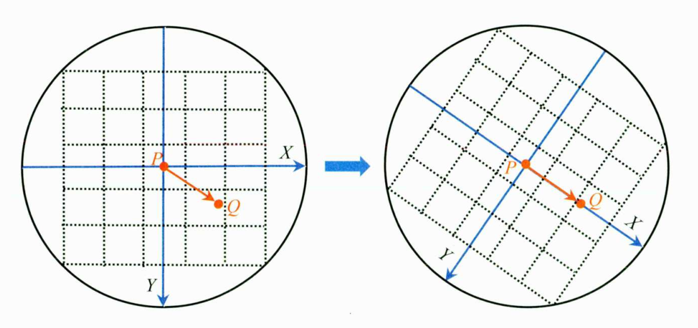
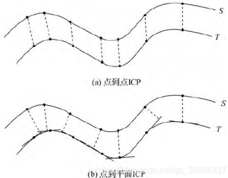

slam中涉及到的一些知识点，做个总结，尽量结合实际项目或代码，持续更新增加。。。

## 光流法跟踪特征点
以vins中的光流前端为例子。在slam前端用光流法的优点是计算效率高，适用于实时性要求较高的场景(
相较于特征点法而言)，当然现在有些特征点法速率也不错，但其精度和速率总是难以两全，虽然SIFT计算
复杂，但其精度、稳定性等仍然在层出不穷的传统特征点提取算法中保持优越。

光流法有较强的假设性：

- 亮度恒定，投影在图像中的同一点随着时间不会变化。
- 小运动，就是随着时间的变化不会引起位置的剧烈变化，这样灰度才能对位置求偏导。
- 空间一致，一个场景上邻近点投影到图像上也是邻近点，且邻近点速度一致，这是对于Lucas-Kanade
光流法特有的假设，因为光流法基本方程约束只有一个，而要求$x$，$y$方向上的速度有两个未知量，假
设了邻域运动一致，就可以联立多个方程。

虽然现在有些光流法通过金字塔或者亮度质心等来去除或者松弛这些约束，但这样一来和特征点法有何差异
呢，也是个计算效率和准确率的取舍问题。

**VINS中采用的是LK金字塔光流法**

### LK光流法
相机的不同帧图像是随时间变化的，那么在$t$时刻，位于$(x,y)$处的像素，它的灰度为$\mathbf{I}(x,y,t)$。
根据上面假设条件一有：
$$
    \mathbf{I}(x+dx,y+dy,t+dt) = \mathbf{I}(x,y,t)
$$
对左边进行泰勒展开，保留一阶项：
$$
    \mathbf{I}(x+dx,y+dy,t+dt)\approx\boldsymbol{I}\left(x,y,t\right)+
    \frac{\partial\boldsymbol{I}}{\partial x}\mathrm{d}x+
    \frac{\partial\boldsymbol{I}}{\partial y}\mathrm{d}y+
    \frac{\partial\boldsymbol{I}}{\partial t}\mathrm{d}t
$$
因为**假设了灰度不变**，于是下一时刻的灰度等于上一时刻的灰度，从而有：
$$
    \frac{\partial\boldsymbol{I}}{\partial x}\mathrm{d}x+
    \frac{\partial\boldsymbol{I}}{\partial y}\mathrm{d}y+
    \frac{\partial\boldsymbol{I}}{\partial t}\mathrm{d}t = 0
$$
$$
     \frac{\partial\boldsymbol{I}}{\partial x}\frac{\mathrm{d}x}{\mathrm{d}t}+
    \frac{\partial\boldsymbol{I}}{\partial y}\frac{\mathrm{d}y}{\mathrm{d}t}+
    = -\frac{\partial\boldsymbol{I}}{\partial t}
$$
其中$\frac{\partial\boldsymbol{I}}{\partial x}$为像素在x方向的梯度，而
$\frac{\partial\boldsymbol{I}}{\partial y}$为在y方向的梯度，记为$\mathbf{I}_{x}$，
$\mathbf{I}_y$。同时$\frac{\mathrm{d}x}{\mathrm{d}t}$
是像素在x轴上的运动速度，而$\frac{\mathrm{d}y}{\mathrm{d}t}$是在y轴上的速度，记为$u$，$v$。
写成矩阵形式有：
$$
\left.\left[\begin{array}{cc}I_x&I_y\end{array}\right.\right]\left[\begin{array}{c}u\\\\v\end{array}\right]=-\boldsymbol{I}_t
$$

这个方程中有两个未知数，因此至少需要两个方程才能解，根据前面的假设，认为在**邻域内像素和该像素
具有相同的运动状态**，可以构建$n^{2}$个方程：
$$
\left.\left[\begin{array}{cc}\boldsymbol{I}_x&\boldsymbol{I}_y\end{array}\right.\right]_k\left[\begin{array}{c}u\\\\v\end{array}\right]=-\boldsymbol{I}_{t k},\quad k=1,\ldots,n^2
$$

## 特征点法跟踪(以ORB为例)

### 什么是ORB特征点

特征点一般由关键点和描述子两部分组成。ORB特征点是在FAST特征点的基础上加入了方向信息，对应的在
描述子中加入了方向的描述。(Oriented FAST关键点和Streered BRIEF描述子)两部分。

ORB特征选取策略：

- 在图像中选取某个像素$p$，其灰度值为$I_{p}$。
- 设定一个阈值$T$，以$p$为圆心，半径为3个像素的16个像素点上比大小。
- 如果16个像素点上有连续$N$个灰度大于或小于$I_{p}+T$，则确定为关键点，在ORB-slam中$N=3$
- 实际中为了加速，通常选取第1、5、9、13个像素点的灰度值来比较，有大于等于三个像素点满足条件

则认为中心像素点为一个关键点。

为了保证特征点的尺度不变性和计算方向，引入了图像金字塔和灰度质心法。简要记一下灰度质心法，计算
关键点为圆心指定半径中园的灰度质心，圆心到质心方向即为关键点方向。

图像的矩定义为：
$$
m_{pq}=\sum_{x,y}x^py^qI(x,y),\quad p,q=\{0,1\}
$$
就是一定方向或者一定范围内灰度值和坐标的乘积。

那么分别在坐标轴$x$，$y$方向上的图像矩分别为：
$$
m_{10}=\sum_{x=-R}^R\sum_{y=-R}^RxI(x,y)\\
m_{01}=\sum_{x=-R}^R\sum_{y=-R}^RyI(x,y)
$$

对应圆形区域内所有像素的灰度值总和为：
$$
m_{00}=\sum_{x=-R}^R\sum_{y=-R}^RI(x,y)
$$

那么图像的质心为：
$$
C=(c_x,c_y)=\left(\frac{m_{10}}{m_{00}},\frac{m_{01}}{m_{00}}\right)
$$

同时，可以计算出关键点的旋转角度为：
$$
\theta=\arctan2\left(c_y,c_x\right)=\arctan2\left(m_{01},m_{10}\right)
$$

然后就可以将图像按照$\theta$旋转：

### 描述子 Steered BRIEF
BRIEF是一种二进制编码的描述子，在ORB-SLAM2中它是一个256bit的向量。以下是计算方法：

- 为减少噪声干扰，先对图像进行高斯滤波。
- 以关键点为中心，取一定大小的图像窗口$p$，在窗口内随机选取一对点，比较二者像素的大小，进行
如下二进制赋值。
$$
\tau(p;x,y):=\begin{cases}1&:p(x)<p(y)\\0&:p(x)\geqslant p(y)\end{cases}
$$
- 在窗口中随机选取$N$，(在ORB-slam2中是256)对随机点，重复上面的步骤，得到一个256维的二进制
描述子。

对于选点，在ORB-slam2中采用固定的选点模板，是一个256x4个值组成的数组，每行的4个值表
示一对点的坐标。

而增加了旋转方向的Steered BRIEF描述子则是先将此区域旋转(或者通过下面的矩阵找到旋转前的点在
图像中的位置)。
$$
\begin{bmatrix}x'\\y'\end{bmatrix}=\begin{bmatrix}\cos\theta&-\sin\theta\\[0.3em]\sin\theta&\cos\theta\end{bmatrix}\begin{bmatrix}x\\[0.3em]y\end{bmatrix}
$$

### 特征点均匀化

- 根据总的图像金字塔层级和待提取的特征点总数，计算图像金字塔中每个层级需要提取的特征点数量。
- 划分格子(在ORB-slam2中固定尺寸为30像素x30)
- 对每个格子提取角点，如果初始的FAST角点阈值没有检测到角点，则降低阈值，再提取一次，若还是没有
角点，则不在这个格子提取。
- 用四叉树均匀地选取角点。

### 特征点匹配
在特征点匹配中(单指帧与帧之间的匹配)，这里不同于光流法的直接跟踪，特征点的匹配需要去对应帧全图
寻找匹配点，很耗费计算资源，因此需要采取一定的策略加速匹配。在ORB-slam2中是在匹配点对应的匹配
帧的对应位置一定范围内进行匹配，并且为了加速，还将匹配区域划分为一个一个的网格，遍历网格寻找匹
配点。

为了减少误匹配，ORB-slam2中还采用了方向一致性检验，简而言之就是将源匹配点和目标匹配点的主方向
做差，然后统计这个差的直方图分布，选取排在前三的直方图格子，其余在外的就认为是误匹配点对。

### 词袋模型匹配
这个一般直接调用库，后面再细究。

## vins初始化过程中的陀螺仪偏置标定
对于窗口内连续两帧土$b_k$和$b_{k+1}$，通过先前的视觉sfm得到这两帧相对于滑窗内第一帧的旋
转$\mathbf{q}_{c_0 b_k}$和$\mathbf{q}_{c_{0} b_{k+1}}$。并且先前通过IMU预积分得到这两帧旋转的预积分$\hat{\gamma}_{\mathrm{b_k b_{k+1}}}$。这个时候就可以构建约束方程，最小化
代价函数：
$$
\tag{1-1}
\mathrm{argmin_{\delta b^s}\sum_{kinB}\left|2\left\lfloor q_{c_0 b_{k+1}}^{-1}\bigotimes q_{c_0 b_k}\bigotimes\gamma_{b_k b_{k+1}}\right\rfloor_{xyz}\right|^2}
$$
其中$\hat{\gamma}_{\mathrm{b_k b_{k+1}}}$是算上陀螺仪的偏置的预积分。
那么就有**加上偏置的预积分=没有偏置的imu预积分估计值+偏置**。表达式如下：
$$
\tag{1-2}
\gamma_{\mathrm{b_k b_{k+1}}}\approx\hat{\gamma}_{\mathrm{b_k b_{k+1}}}\bigotimes\left[\begin{array}{c}1\\\frac{1}{2}\mathrm{J_{b_g}^\gamma\delta b_g}\end{array}\right]
$$
最理想的情况下是对于式子(1-1)其代价为：
$$
\tag{1-3}
\left.\mathbf{q_{c_0 b_{k+1}}}\otimes\mathbf{q_{c_0 b_k}}\otimes\gamma_{b_k b_{k+1}}=\left[\begin{array}{c}1\\0\\0\\0\end{array}\right.\right]
$$
对式子(1-3)进行变换得到$\gamma_{\mathrm{b_k b_{k+1}}}$
$$
\tag{1-4}
\left.\gamma_{\mathrm{b_k b_{k+1}}}=\mathbf{q}_{\mathrm{c_0 b_k}}^{-1}\bigotimes\mathbf{q}_{\mathrm{c_0 b_{k+1}}}\bigotimes\left[\begin{array}{c}1\\0\\0\\0\end{array}\right.\right]
$$
然后将式子(1-2)带入(1-4)有，这个时候就引入了偏置的增量$\delta b_g$
$$
\tag{1-5}
\left.\hat{\gamma}_{\mathrm{b_k b_{k+1}}}\bigotimes\left[\begin{array}{c}1\\\frac12\mathrm{J_{b_g}^\gamma\delta b_g}\end{array}\right.\right]=\mathbf{q_{c_0 b_k}^{-1}}\bigotimes\mathbf{q_{c_0 b_{k+1}}}\bigotimes\left[\begin{array}{c}1\\0\end{array}\right]
$$
只考虑式子(1-5)的虚部，得到(vec表示取虚部)
$$
\tag{1-6}
\mathrm{J_{b_g}^\gamma~\delta b_g=2\left(\hat{\gamma}_{b_k b_{k+1}}^{-1}\bigotimes q_{c_0 b_k}^{-1}\bigotimes q_{c_0 b_{k+1}}\right)_{vec}}
$$
对于式子(1-6)要做的是求解出$\delta b_g$(偏置的增量)的大小，等式两边同乘$\mathrm{J_{bg}^{\gamma T}}$，如下。在使用cholesky分解求解矩阵，获得使目标函数达到最小的解时需要将系数矩阵变为正定。
$$
\tag{1-7}
\mathrm{J_{b_g}^{\gamma T}J_{b_g}^{\gamma}\delta b_g=2J_{b_g}^{\gamma T}~\left(\hat{\gamma}_{b_k b_{k+1}}^{-1}\bigotimes q_{c_0 b_k}^{-1}\bigotimes q_{c_0 b_{k+1}}\right)_{vec}}
$$
使用LDLT分解即可得到$\delta b_g$，这里只是求到了Bias的变化量，需要在滑窗内累加得到Bias的准确值。

## vins中的IMU预积分
首先给出imu的测量模型，包括加速度和角速度的测量值模型：
$$
\tag{1-1}
\begin{aligned}&\hat{\mathbf{a}}_{t}=\mathbf{a}_t+\mathbf{b}_{a_t}+\mathbf{R}_w^t\mathbf{g}^w+\mathbf{n}_a\\&\hat{\boldsymbol{\omega}}_{t}=\boldsymbol{\omega}_t+\mathbf{b}_{w_t}+\mathbf{n}_w.\end{aligned}
$$
其中$\mathbf{R}_w^t$表示将重力矢量$\mathbf{g}$从世界坐标系旋转到imu坐标系。$\mathbf{n}_a$和$\mathbf{n}_w$分别表示加速度计和陀螺仪的测量噪声，当然这里的偏置也被建模为高斯随机噪声。

给定两个图像帧$b_k$和$b_{k+1}$，通过加速度和角速度的测量值模型，可以将位置、速度、旋转这几个状态量的传播过程计算出来：
$$
\tag{1-2}
\begin{aligned}
&\mathbf{p}_{bk+1}^w =\mathbf{p}_{b_k}^w+\mathbf{v}_{b_k}^w\Delta t_k \\
&+\iint_{t\in[t_k,t_{k+1}]}\left(\mathbf{R}_t^w\left(\mathbf{\hat{a}}_t-\mathbf{b}_{a_t}-\mathbf{n}_a\right)-\mathbf{g}^w\right)dt^2 \\
&\mathbf{v}_{b_{k+1}}^w =\mathbf{v}_{b_{k}}^{w}+\int_{t\in[t_{k},t_{k+1}]}\left(\mathbf{R}_{t}^{w}(\hat{\mathbf{a}}_{t}-\mathbf{b}_{a_{t}}-\mathbf{n}_{a})-\mathbf{g}^{w}\right)dt \\
&\mathbf{q}_{b_{k+1}}^w =\mathbf{q}_{b_{k}}^{w}\otimes\int_{t\in[t_{k},t_{k+1}]}\frac{1}{2}\boldsymbol{\Omega}(\hat{\boldsymbol{\omega}}_{t}-\mathbf{b}_{w_{t}}-\mathbf{n}_{w})\mathbf{q}_{t}^{b_{k}}dt, 
\end{aligned}
$$
这里：
$$
\Omega(\omega)=\begin{bmatrix}-\lfloor\omega\rfloor_\times&\omega\\-\omega^T&0\end{bmatrix},\lfloor\omega\rfloor_\times=\begin{bmatrix}0&-\omega_z&\omega_y\\\omega_z&0&-\omega_x\\-\omega_y&\omega_x&0\end{bmatrix}
$$
这里可以简单理解为是一个关于角速度的运算(四元数右乘)。

$\Delta t_k$表示时间$t_k$， $t_{k+1}$的时间差。

为了避免重复积分，因此要采用预积分算法来避免。

首先将公式(1-2)中的参考坐标系从世界坐标系转换到**本地坐标系$b_k$**，可以减少涉及积分的变量，只用管和$\hat{\mathbf{a}}$、$\hat{\mathbf{\omega}}$有关的部分。在式子(1-2)两边做一个世界坐标系$w$到本地坐标系$b_k$的旋转变换：
$$
\tag{1-3}
\begin{aligned}
\mathbf{R}_w^{b_k}\mathbf{p}_{b_{k+1}}^w& =\mathbf{R}_w^{b_k}(\mathbf{p}_{b_k}^w+\mathbf{v}_{b_k}^w\Delta t_k-\frac12\mathbf{g}^w\Delta t_k^2)+\boldsymbol{\alpha}_{b_{k+1}}^{b_k} \\
\mathbf{R}_w^{b_k}\mathbf{v}_{b_{k+1}}^w& =\mathbf{R}_w^{b_k}(\mathbf{v}_{b_k}^w-\mathbf{g}^w\Delta t_k)+\boldsymbol{\beta}_{b_{k+1}}^{b_k} \\
\mathbf{q}_w^{b_k}\otimes\mathbf{q}_{b_{k+1}}^w &=\gamma_{b_{k+1}}^{b_k}, 
\end{aligned}
$$
其中：
$$
\tag{1-4}
\begin{gathered}
\alpha_{b_{k+1}}^{b_{k}} =\iint_{t\in[t_{k},t_{k+1}]}\mathbf{R}_{t}^{b_{k}}(\hat{\mathbf{a}}_{t}-\mathbf{b}_{a_{t}}-\mathbf{n}_{a})dt^{2} \\
\boldsymbol{\beta}_{bk+1}^{bk} =\int_{t\in[t_{k},t_{k+1}]}\mathbf{R}_{t}^{b_{k}}(\hat{\mathbf{a}}_{t}-\mathbf{b}_{a_{t}}-\mathbf{n}_{a})dt \\
\gamma_{bk+1}^{bk} =\int_{t\in[t_{k},t_{k+1}]}\frac12\boldsymbol{\Omega}(\hat{\boldsymbol{\omega}}_{t}-\mathbf{b}_{w_{t}}-\mathbf{n}_{w})\boldsymbol{\gamma}_{t}^{b_{k}}dt. 
\end{gathered}
$$
经过上面的坐标系转换，这时预积分只用计算式子(1-4)。式子(1-4)是连续形式，需要给出离散形式，如下式：
$$
\tag{1-5}
\begin{aligned}
&\hat{\boldsymbol{\alpha}}_{i+1}^{b_k} =\hat{\boldsymbol{\alpha}}_i^{b_k}+\hat{\boldsymbol{\beta}}_i^{b_k}\delta t+\frac12\mathbf{R}(\hat{\boldsymbol{\gamma}}_i^{b_k})(\hat{\mathbf{a}}_i-\mathbf{b}_{a_i})\delta t^2 \\
&\hat{\boldsymbol{\beta}}_{i+1}^b =\hat{\boldsymbol{\beta}}_i^{b_k}+\mathbf{R}(\hat{\boldsymbol{\gamma}}_i^{b_k})(\hat{\mathbf{a}}_i-\mathbf{b}_{a_i})\delta t \\
&\hat{\boldsymbol{\gamma}}_{i+1}^b =\hat{\gamma}_{i}^{b_{k}}\otimes\begin{bmatrix}1\\\frac{1}{2}(\hat{\omega}_{i}-\mathbf{b}_{w_{i}})\delta t\end{bmatrix} 
\end{aligned}
$$
$i$表示$[t_k,t_{k+1}]$时刻间的某一次imu测量，自然$\delta t$表示第$i$次测量和第$i+1$次测量之间的时间差。关于离散积分的具体实现vins中采用中值积分或者欧拉积分。

为了处理方差的传播，定义了一个关于旋转四元数的误差扰动模型**真值=测量值+误差(扰动模型)**。
$$
\tag{1-6}
\gamma_t^{b_k}\approx\hat{\gamma}_t^{b_k}\otimes\begin{bmatrix}1\\\frac12\delta\boldsymbol{\theta}_t^{b_k}\end{bmatrix}
$$
$\frac12\delta\boldsymbol{\theta}_t^{b_k}$​表示一个三维(四元数虚部)的小扰动。

**由此完成了IMU预积分测量值的推导，但是要将IMU预积分用到非线性优化中，需要建立线性高斯误差状态递推方程，由高斯系统的协方差推导方程的协方差矩阵，并求解对应的雅可比矩阵**。

由此可以给出在$t$时刻误差项的线性化递推方程：
$$
\tag{1-7}
\begin{bmatrix}\delta\dot{a}_\mathrm{t}^\mathrm{b_\mathrm{k}}\\\delta\dot{\rho}_\mathrm{t}^\mathrm{b_\mathrm{k}}\\\delta\dot{\theta}_\mathrm{t}^\mathrm{b_\mathrm{k}}\\\delta\dot{b}_\mathrm{a_\mathrm{t}}\\\delta\dot{b}_\mathrm{w_\mathrm{t}}\end{bmatrix}
= \begin{bmatrix}0&\mathrm{I}&0&0&0\\0&0&-\mathrm{R_t^{b_k}~[\hat{a}_t~-b_{a_t}~]_\times}&-\mathrm{R_t^{b_k}}&0\\0&0&-[\hat{w}_t~-b_{w_t}~]_\times&0&-\mathrm{I}\\0&0&0&0&0\\0&0&0&0&0\end{bmatrix}
\begin{bmatrix}\delta\alpha_{t}^\mathrm{b_k}\\\delta\beta_t^\mathrm{b_k}\\\delta\theta_t^\mathrm{b_k}\\\delta b_\mathrm{a_t}\\\delta b_\mathrm{w_t}\end{bmatrix}+
\begin{bmatrix}0&0&0&0\\-\mathrm{R_t^{b_k}}&0&0&0\\0&-\mathrm{I}&0&0\\0&0&\mathrm{I}&0\\0&0&0&\mathrm{I}\end{bmatrix}
\begin{bmatrix}\mathrm{n}_a \\ \mathrm{n}_{\omega} \\ \mathrm{n}_{b_a} \\ \mathrm{n}_{b_{\omega}}\end{bmatrix} \\ 
=\mathbf{F}_t\delta\mathbf{z}_t^{b_k}+\mathbf{G}_t\mathbf{n}_t
$$
其中$\mathbf{F}_t$是15x15，$\mathbf{G}_t$是15x12，$\delta\mathbf{z}_t^{b_k}$是15x1，$\mathbf{n}_t$是12x1。

对于式(1-7)的推导，一个一个的推导一下：
- 先对$\delta \dot{a}_t^{b_k}$，$\delta \dot{b}_{a_t}$，$\delta \dot{b}_{\omega_t}$这三个简单的推导一下，根据定义有：
$$
\delta\dot{a}_{\mathrm{t}}^{\mathrm{b}_{\mathrm{k}}} = \hat{\dot{a}}_{\mathrm{t}}^{\mathrm{b}_{\mathrm{k}}} - \dot{a}_{\mathrm{t}}^{\mathrm{b}_{\mathrm{k}}} = \hat{\beta}_{\mathrm{t}}^{\mathrm{b}_{\mathrm{k}}} - \beta_{\mathrm{t}}^{\mathrm{b}_{\mathrm{k}}} = \delta\beta_{\mathrm{t}}^{\mathrm{b}_{\mathrm{k}}}\\\delta\dot{\mathrm{b}}_{\mathrm{a}_{\mathrm{t}}} = \dot{\mathrm{b}}_{\mathrm{a}_{\mathrm{t}}} - 0=\mathrm{n}_{\mathrm{b}_{\mathrm{a}}}\\\delta\dot{\mathrm{b}}_{\mathrm{w}_{\mathrm{t}}} =\dot{\mathrm{b}}_{\mathrm{w}_{\mathrm{t}}} -0=\mathrm{n}_{\mathrm{b}_{\mathrm{w}}}
$$
为了更好理解推导过程，将式(1-4)推导的预积分誊抄一下：
$$
\begin{gathered}
\alpha_{b_{k+1}}^{b_{k}} =\iint_{t\in[t_{k},t_{k+1}]}\mathbf{R}_{t}^{b_{k}}(\hat{\mathbf{a}}_{t}-\mathbf{b}_{a_{t}}-\mathbf{n}_{a})dt^{2} \\
\boldsymbol{\beta}_{bk+1}^{bk} =\int_{t\in[t_{k},t_{k+1}]}\mathbf{R}_{t}^{b_{k}}(\hat{\mathbf{a}}_{t}-\mathbf{b}_{a_{t}}-\mathbf{n}_{a})dt \\
\gamma_{bk+1}^{bk} =\int_{t\in[t_{k},t_{k+1}]}\frac12\boldsymbol{\Omega}(\hat{\boldsymbol{\omega}}_{t}-\mathbf{b}_{w_{t}}-\mathbf{n}_{w})\boldsymbol{\gamma}_{t}^{b_{k}}dt. 
\end{gathered}
$$
对预积分的$\alpha_{b_{k+1}}^{b_{k}}$求微分有：
$$
\dot{\alpha}_{b_{k+1}}^{b_{k}}  =\int_{t\in[t_{k},t_{k+1}]}\mathbf{R}_{t}^{b_{k}}(\hat{\mathbf{a}}_{t}-\mathbf{b}_{a_{t}}-\mathbf{n}_{a})dt= \boldsymbol{\beta}_{bk+1}^{bk}
$$

由此就很好理解$\delta\dot{a}_{\mathrm{t}}^{\mathrm{b}_{\mathrm{k}}}$的推导了，对于$\delta \dot{b}_{a_t}$，$\delta \dot{b}_{\omega_t}$它们服从高斯分布，其微分很容易得到。

- 然后就是推导$\delta\dot{\beta}_{\mathbf{t}}^{\mathbf{b_{k}}}$。
$\dot{\beta}_{\mathrm{t}}^{\mathrm{b}_{\mathrm{k}}}$的理论值，即不考虑存在噪声$\mathrm{n}_a$和$\mathrm{n}_{b_a}$时为：$\mathrm{\dot{\beta}_t^{b_k}=R_t^{b_k}(\hat{a}_t-b_{a_t})}$。
实际测量值，即考虑噪声时为：
$$
\begin{gathered}
\hat{\dot{\boldsymbol{\beta}}}_{\mathbf{t}}^{b_k} \mathrm{=\hat{R}_t^{b_k}~(\hat{a}_t~-\hat{b}_{a_t}~-n_a)=R_t^{b_k}~exp([\delta\theta]_\times)(\hat{a}_t~-n_a~-b_{a_t}~-\delta b_{a_t})} \\
=\mathrm{R_t^{b_k}~(1+[\delta\theta]_\times)(\hat{a}_t-n_a-b_{a_t}~-\delta b_{a_t}~)} \\
=\mathrm{R_t^{b_k}~(\hat{a}_t~-n_a~-b_{a_t}~-\delta b_{a_t}~+[\delta\theta]_\times(\hat{a}_t~-b_{a_t}~))} \\
\mathrm{=R_{t}^{b_{k}}\left(\hat{a}_{t}-n_{a}-b_{a_{t}}-\delta b_{a_{t}}-[\hat{a}_{t}-b_{a_{t}}]_{\times}\delta\theta\right)} 
\end{gathered}
$$
则有：
$$
\delta\dot{\beta}_{\mathrm{t}}^{\mathrm{b_{k}}}=\hat{\dot{\beta}}_{\mathrm{t}}^{\mathrm{b_{k}}}-\dot{\beta}_{\mathrm{t}}^{\mathrm{b_{k}}}=-\mathrm{R}_{\mathrm{t}}^{\mathrm{b_{k}}}\left[\hat{a}_{\mathrm{t}}-\mathrm{b}_{\mathrm{a_{t}}}\right]_{\times}\delta\theta-\mathrm{R}_{\mathrm{t}}^{\mathrm{b_{k}}}\delta\mathrm{b}_{\mathrm{a_{t}}}-\mathrm{R}_{\mathrm{t}}^{\mathrm{b_{k}}}\mathrm{n}_{\mathrm{a}}
$$
- 接下来推导$|delta \dot{\theta}_t^{b_k}$，首先需要推导$\delta \dot{q}_t^{b_k}$
$\dot{q}_t^{b_k}$理论值，即不考虑噪声$\mathrm{n}_w$和$\mathrm{n}_{b_w}$ ：
$$
\mathrm{\dot{q}_t^{b_k}=\frac12\Omega(\hat{w}_t-b_{w_t})q_t^{b_k}=\frac12q_t^{b_k}\otimes\begin{bmatrix}(\hat{w}_t-b_{w_t})\\0\end{bmatrix}}
$$
$\dot{1}_t^{b_k}$的真实测量值为：
$$
% \label{2}
\begin{gathered}
\hat{\dot{q}}_{\mathrm{t}}^{\mathrm{b_{k}}}=\frac{1}{2}\hat{q}_{\mathrm{t}}^{\mathrm{b_{k}}}\otimes\begin{bmatrix}\hat{\mathrm{w}}_{\mathrm{t}}-\mathrm{b}_{\mathrm{w_{t}}}-\mathrm{n}_{\mathrm{w}}-\delta\mathrm{b}_{\mathrm{w_{t}}}\\0\end{bmatrix} \\
=\frac12\mathrm{q_t^{b_k}}\otimes\delta\mathrm{q_t^{b_k}}\otimes\left\lfloor\begin{array}{cc}\hat{\mathrm{w_t}}-\mathrm{b_{w_t}}-\mathrm{n_w}-\delta\mathrm{b_{w_t}}\\0\end{array}\right\rfloor 
\end{gathered}
$$
根据导数性质有：
$$
\mathrm{\hat{\dot{q}}_t^{b_k}=\dot{(q_t^{b_k}\otimes\delta q_t^{b_k})}=\dot{q}_t^{b_k}\otimes\delta q_t^{b_k}+q_t^{b_k}\otimes\delta \dot{q}_t^{b_k}=\frac{1}{2}q_t^{b_k}\otimes\begin{bmatrix}(\hat{w}_t-b_{w_t})\\0\end{bmatrix}\otimes\delta q_t^{b_k}+q_t^{b_k}\otimes\delta \dot{q}_t^{b_k}}
$$
第二个等式的括号表明的是对整体求导，第三个等式是`前导后不导，后导前不导`的导数性质，第四个等式就是将前面$\dot{q}_t^{b_k}$理论值代进去。

那么根据真实测量值的等式和导数性质求得的等式，就可以得到一个等式：
$$
\begin{gathered}
\frac12\mathrm{q_t^{b_k}}\otimes\delta\mathrm{q_t^{b_k}}\otimes\left\lfloor\begin{array}{cc}\hat{\mathrm{w_t}}-\mathrm{b_{w_t}}-\mathrm{n_w}-\delta\mathrm{b_{w_t}}\\0\end{array}\right\rfloor 
 = \frac{1}{2}q_t^{b_k}\otimes\begin{bmatrix}(\hat{w}_t-b_{w_t})\\0\end{bmatrix}\otimes\delta q_t^{b_k}+q_t^{b_k}\otimes\delta \dot{q}_t^{b_k} \\
2\delta\mathrm{\dot{q}_t^{b_k}}=\delta\mathrm{q_t^{b_k}}\otimes\begin{bmatrix}\hat{\mathrm{w_t}}-\mathrm{b_{w_t}}-\mathrm{n_w}-\delta\mathrm{b_{w_t}}\\0\end{bmatrix}-\begin{bmatrix}(\hat{\mathrm{w_t}}-\mathrm{b_{w_t}})\\0\end{bmatrix}\otimes\delta\mathrm{q_t^{b_k}} \\
\mathrm{2\delta \dot{q}_t^{b_k}~=\mathcal{R}(\begin{bmatrix}\hat{w}_t-b_{w_t}-n_w-\delta b_{w_t}\\0\end{bmatrix})\delta q_t^{b_k}~-\mathcal{L}(\begin{bmatrix}(\hat{w}_t-b_{w_t})\\0\end{bmatrix})\delta q_t^{b_k}} \\
2\delta\mathrm{\dot{q}_t^{b_k}}=\begin{bmatrix}\delta\dot{\theta}_t^{b_k}\\0\end{bmatrix}=\begin{bmatrix}-[2\hat{\mathrm{w_t}}-2\mathrm{b_{w_t}}-\mathrm{n_w}-\delta\mathrm{b_{w_t}}]_\times&-\mathrm{n_w}-\delta\mathrm{b_{w_t}}\\(\mathrm{n_w}+\delta\mathrm{b_{w_t}})^\mathrm{T}&0\end{bmatrix}\begin{bmatrix}\frac12\delta\theta_\mathrm{t}^\mathrm{b_k}\\1\end{bmatrix} \\
\delta\dot{\theta}_{\mathrm{t}}^{\mathbf{b}_{\mathrm{k}}}=-[2\hat{\mathrm{w}}_{\mathrm{t}}-2\mathrm{b}_{\mathrm{w}_{\mathrm{t}}}-\mathrm{n}_{\mathrm{w}}-\delta\mathrm{b}_{\mathrm{w}_{\mathrm{t}}} ]_{\times}\frac{1}{2}\delta\theta_{\mathrm{t}}^{\mathrm{b}_{\mathrm{k}}}-\mathrm{n}_{\mathrm{w}}-\delta\mathrm{b}_{\mathrm{w}_{\mathrm{t}}}\\
\approx-[\hat{\mathrm{w}}_{\mathrm{t}}-\mathrm{b}_{\mathrm{w}_{\mathrm{t}}}]_{\times}\delta\theta_{\mathrm{t}}^{\mathrm{b}_{\mathrm{k}}}-\mathrm{n}_{\mathrm{w}}-\delta\mathrm{b}_{\mathrm{w}_{\mathrm{t}}}
\end{gathered}
$$
前面已经推导得到了：$\delta \dot{\mathbf{z}}_{t}^{b_k}=\mathbf{F}_t\delta\mathbf{z}_t^{b_k}+\mathbf{G}_t\mathbf{n}_t$

根据导数的定义有：
$$
\delta\dot{\mathrm{z}}_\mathrm{t}^\mathrm{b_k}=\lim_{\delta\mathrm{t}\to0}\frac{\delta\mathrm{z}_\mathrm{t+\delta\mathrm{t}}^\mathrm{b_k}-\delta\mathrm{z}_\mathrm{t}^\mathrm{b_k}}{\delta\mathrm{t}}
$$
那么两个式子结合就有：
$$
\mathrm{\delta z_{t+\delta t}^{b_{k}}=\delta z_{t}^{b_{k}}+\delta\dot{z}_{t}^{b_{k}}\delta t=\delta z_{t}^{b_{k}}+(F_{t}\delta z_{t}^{b_{k}}+G_{t}n_{t})\delta t=(I+F_{t}\delta t)\delta z_{t}^{b_{k}}+G_{t}\delta tn_{t}}
$$
令$\mathrm{F=(I+F_t\delta t),V=G_t\delta t}$，有：
$$
\mathrm{\delta z_{t+\delta t}^{b_k}=F\delta z_t^{b_k}~+V~n_t}
$$
**由此就可以得该非线性系统的线性递推方程**，那么就可以根据当前时刻的值，预测下一时刻的**协方差**：
$$
\mathrm{P_{t+\delta t}^{b_k}=(I+F_t\delta t)P_t^{b_k}~(I+F_t\delta t)^T+(G_t\delta t)Q(G_t\delta t)^T}
$$
其中初始化协防差$\mathbf{P_{b_{k}}^{b_{k}}}=0$，$Q$代表噪声项的对焦协方差矩阵：
$$
\mathrm{Q}^{12\times12}=\begin{bmatrix}\mathrm{\sigma}_\mathrm{a}^2&0&0&0\\0&\mathrm{\sigma}_\mathrm{w}^2&0&0\\0&0&\mathrm{\sigma}_\mathrm{b}^2&0\\0&0&0&\mathrm{\sigma}_\mathrm{b}^2\end{bmatrix}
$$
同时也可以根据递推方程得到对应的Jacobian迭代公式：
$$
\mathrm{J_{t+\delta t}=(I+F_t\delta t)J_t}
$$
其中初始 Jacobian为：$\mathrm{J_{b_k}}=\mathrm{I}$

## 李群和李代数
三维旋转矩阵构成了**特殊正交群$SO(3)$**，而变换矩阵构成了**特殊欧式群SE(3)**：
$$
\tag{特殊正交群}
SO(3)=\{\boldsymbol{R}\in\mathbb{R}^{3\times3}|\boldsymbol{R}\boldsymbol{R}^T=
\boldsymbol{I},det(\boldsymbol{R})=1\}
$$
$$
\tag{特殊欧式群}
\left.SE(3)=\left\{\boldsymbol{T}=\left[\begin{array}{cc}\boldsymbol{R}&\boldsymbol{t}\\
\\\boldsymbol{0}^T&1\end{array}\right.\right]\in\mathbb{R}^{4\times4}|\boldsymbol{R}\in SO(3),\boldsymbol{t}\in\mathbb{R}^3\right\}
$$
对于群的概念不过多赘述，它是一种集合加上一种运算的代数结构，并且满足封闭性、结合律、幺元、逆这
四个条件，而李群是具有连续(光滑)性质的群。

每个李群都有相对应的李代数，因为李群这种代数作为优化变量在做运算时候会引入额外的约束，使得优化
没有那么方便(如旋转矩阵本身是正交且行列式为1，在整个优化过程中不仅要考虑优化结果，还要保持旋转
矩阵本身的性质)。因此引入李代数来接触这类约束。

引出李代数：

对于任意的旋转矩阵$\mathbf{R}$，它满足$\mathbf{R}\mathbf{R}^{T}=\mathbf{I}$，其实
$\mathbf{R}$它可以表示为一个相机的选装变化，会随时间的变化而变化(感觉像将一个离散的旋转矩阵
定义为一个连续的时间函数，用于连续域推导)。

那么有：$\mathbf{R}(t)\mathbf{R}(t)^{T}=\mathbf{I}$。

对等式两边求导有：$\dot{\boldsymbol{R}}(t)\boldsymbol{R}(t)^T+\boldsymbol{R}(t)\dot{\boldsymbol{R}}(t)^T=0$

整理一下有：$\dot{\boldsymbol{R}}(t)\boldsymbol{R}(t)^T=-\left(\dot{\boldsymbol{R}}(t)\boldsymbol{R}(t)^T\right)^T$

那么可以看出$\dot{\boldsymbol{R}}(t)\boldsymbol{R}(t)^T$这个整体是一个反对称矩阵，引入
符号$\wedge$，将一个向量变成反对称矩阵，如下：
$$
\boldsymbol{a}^{\wedge}=\boldsymbol{A}=\left[\begin{array}{ccc}0&-a_3&a_2\\\\a_3&0&-a_1\\\\-a_2&a_1&0\end{array}\right],\quad\boldsymbol{A}^{\vee}=\boldsymbol{a}
$$
于是对于前面的$\dot{\boldsymbol{R}}(t)\boldsymbol{R}(t)^T$可以找到一个三维向量
$\phi(t)\in\mathbb{R}^3$与之对应有：
$$
\dot{\boldsymbol{R}}(t)\boldsymbol{R}(t)^T=\boldsymbol{\phi}(t)^\wedge 
$$
再在等式两边右乘$\boldsymbol{R}(t)$，因为$\boldsymbol{R}$为正交矩阵，于是有：
$$
\dot{\boldsymbol{R}}(t)=\boldsymbol{\phi}(t)^{\wedge}\boldsymbol{R}(t)=\left[\begin{array}{ccc}0&-\phi_3&\phi_2\\\phi_3&0&-\phi_1\\-\phi_2&\phi_1&0\end{array}\right]\boldsymbol{R}(t)
$$
**可以看到，每对旋转矩阵求一次导数，只需要左乘一个$\boldsymbol{\phi}(t)^{\wedge}$**，但是
$\boldsymbol{\phi}(t)^{\wedge}$这是一个关于时间的函数，为了方便计算和讨论，先将
$\boldsymbol{R}(t)$在0附近进行一阶泰勒展开，并且$t_0=0$，设定$\boldsymbol{R}(0)=\boldsymbol{I}$：
$$
\begin{aligned}\boldsymbol{R}\left(t\right)&\approx\boldsymbol{R}\left(t_0\right)+\dot{\boldsymbol{R}}\left(t_0\right)\left(t-t_0\right)\\&=\boldsymbol{I}+\boldsymbol{\phi}(t_0)^{\wedge}\left(t\right).\end{aligned}
$$
由此看到$\phi$反映了$\boldsymbol{R}$的导数性质。

假设在$t_0$附近，设$\phi$保持为常数$\phi(t_0)=\phi_{0}$，那么根据前面的式子有：
$$
\dot{\boldsymbol{R}}(t)=\boldsymbol{\phi}(t_0)^\wedge\boldsymbol{R}(t)=
\boldsymbol{\phi}_0^\wedge\boldsymbol{R}(t)
$$
上面的式子是一个关于$\boldsymbol{R}$的微分方程，而且知道初始值$\boldsymbol{R}(0)=
\boldsymbol{I}$，于是根据微积分的解法有：
$$
\boldsymbol{R}(t)=\exp{(\boldsymbol{\phi}_0^{\wedge}t)}
$$

对于李代数$\mathfrak{so}(3)$和$\mathfrak{se}(3)$的定义有：
$$
\tag{特殊正交群的李代数}
\mathfrak{so}(3)=\left\{\phi\in\mathbb{R}^3,\boldsymbol{\Phi}=\phi^\wedge\in\mathbb{R}^{3\times3}\right\}
$$
$$
\tag{特殊欧式群的李代数}
\left.\mathfrak{sc}(3)=\left\{\boldsymbol{\xi}=\left[\begin{array}{c}\rho\\\phi\end{array}\right.\right]\in\mathbb{R}^6,\boldsymbol{\rho}\in\mathbb{R}^3,\boldsymbol{\phi}\in\mathfrak{so}\left(3\right),\boldsymbol{\xi}^\wedge=\left[\begin{array}{cc}\phi^\wedge&\boldsymbol{\rho}\\\mathbf{0}^T&0\end{array}\right]\in\mathbb{R}^{4\times4}\right\}
$$
每个$\boldsymbol{\xi}$是一个六维向量，前三维$\boldsymbol{\rho}$为平移，后三维为旋转。

**关于$SO(3),SE(3),\mathfrak{so}(3),\mathfrak{se}(3)$之间的指数对数对应关系**，不详细赘
述，直接给出结论：

## 卡尔曼滤波
卡尔曼滤波建立在线性代数和隐马尔可夫模型(当前状态量之和前一时刻状态量有关)上。

**状态方程**：
$$\tag{状态方程}x_k=F_kx_{k-1}+B_ku_k+w_k$$
其中：

- $F_k$是作用在$x_{k-1}$上的状态变换模型(作用在状态量上的)
- $B_k$是作用在控制器上的输入控制模型(u_k表示k时刻的输入)
- $w_k$是过程噪声，并假设符合均值为零，协方差矩阵为$Q_k$的多元正态分布。$w_k{\sim}N(0,Q_k)$

其中$cov\{w(k)\}=Q(k)$表示协方差矩阵

**观测方程**：
$$
\tag{观测方程}
z_k=H_kx_k+v_k
$$
其中$H_k$是观测模型，它把真实状态空间映射到观测空间，$v_k$是观测噪声，其均值为零，协方差矩阵
$\boldsymbol{R}_k$服从正态分布$v_k{\sim}N(0,R_k)$

初始状态以及每一时刻的噪声${x_0,w_1,\cdots,w_k,v_1,\cdots,v_k}$都认为是独立的。

### 算法逻辑
卡尔曼滤波是一种迭代的估计，利用上一时刻状态的估计值和当前状态的观测值就可以计算出当前状态的
估计值，因此不需要记录观测或者估计的历史值。

卡尔曼滤波分为**预测**和**更新**两个部分。预测是指利用上一时刻的状态估计，对当前时刻状态做出
估计。在更新阶段用当前状态观测值优化在预测阶段得到的预测值。

则预测和更新的过程如下：
$$
\tag{预测和更新}
\hat{X}_{k-1|k-1}\xrightarrow{Prediction}\hat{X}_{k|k-1}\xrightarrow{Correction}\hat{X}_{k|k}
$$
$\hat{X}_{k-1|k-1}$表示在时刻$k-1$的状态估计，$\hat{X}_{k|k-1}$表示已知$k-1$的状态估
计，对$k$时刻的预测，$hat{X}_{k|k}$表示更新后$k$时刻的状态估计值。$\hat{P}_{k|k}$为后验
估计误差协方差矩阵，度量估计值的精确程度。

- 预测$\hat{X}_{k-1|k-1}\xrightarrow{Prediction}\hat{X}_{k|k-1}$

预测步骤中，根据上一时刻的状态和输入的控制量，预测当前时刻的状态。这是一个估计值，没有考虑当前
时刻的观测值。估计值的误差协方差矩阵是通过上一时刻的误差协方差矩阵和系统噪声协方差矩阵的到。
$$
\tag{预测}
\begin{cases}\hat{x}_{k|k-1}=F_k\hat{x}_{k-1}+B_ku_k\\
P_{k|k-1}=F_kP_{k-1|k-1}F_k^T+Q_k\end{cases}
$$

- 更新$\hat{X}_{k|k-1}\xrightarrow{Correction}\hat{X}_{k|k}$

更新步骤是根据当前时刻的观测值和预测值，计算出当前时刻的状态估计量。状态估计值的误差协方差矩阵
是通过预测步骤得到的误差协方差矩阵，观测噪声协方差矩阵和卡尔曼增益计算得到的。
$$
\begin{cases}K_k=P_{k|k-1}H_k^T(H_kP_{k|k-1}H_k^T+R_k)^{-1}\\
\hat{x}_{k|k}=\hat{x}_{k|k-1}+K_k(z_k-H_k\hat{x}_{k|k-1})\\
P_{k|k}=(I-K_kH_k)P_{k|k-1}\end{cases}
$$

**上面预测和更新的总共五个方程为卡尔曼滤波的核心公式**

为了使更新步骤的公式看起来更加简洁，首先计算下面三个量：
$$
\begin{cases}\hat{y}_k=z_k-H_k\hat{x}_{k|k-1}\quad(\text{测量残差})\\
S_k=H_kP_{k|k}H_k^T+R_k\quad(\text{测量残差协方差})\\
K_k=P_{k|k-1}H_k^TS_k^{-1}\quad(\text{最优卡尔曼增益})\end{cases}
$$
那么$\hat{x}_{k|k}$和$P_{k|k}$就可以改写为：
$$
\left.\left\{\begin{array}{ll}\hat{x}_{k|k}=\hat{x}_{k|k-1}+K_k\hat{y}_k&\text{(更新的状态估计)}\\
P_{k|k}=(I-K_kH_k)P_{k|k-1}&\text{(更新的协方差估计)}\end{array}\right.\right.
$$
对于上述公式的计算仅在最有卡尔曼增益的时候有效。

### 公式推导

- 状态估计误差
$$
\tilde{x}_{k|k-1}=x_k-\hat{x}_{k|k-1}
$$
其中$\hat{x}_{k|k-1}$表示在k-1时刻对$x_k$的估计值。状态估计方程为：
$$
\tag{状态估计方程}
\hat{x}_{k|k-1}=F_k\hat{x}_{k-1}+B_ku_k
$$

- 观测估计误差
$$
\tilde{e}_k=z_k-\hat{z}_{k|k-1}
$$
观测估计方程
$$
\hat{z}_{k|k-1}=H_k\hat{x}_{k|k-1}
$$

那么根据上述方程可以定义两个重要的误差协方差矩阵(用于判别估计的精准性)：

- 状态误差协方差矩阵
$$
\mathbf{P}_{k|k-1}=cov\{\tilde{x}_{k|k-1}\}
$$

- 观测误差协方差矩阵
$$
\mathbf{S}_K=cov\{\tilde{e}_k\}
$$

**卡尔曼滤波的目的是得到一个基于误差能够不断修正的迭代估计表达式**，其具体形式应该如下：
$$
\hat{x}_{k|k}=\hat{x}_{k|k-1}+K_k\tilde{e}_k
$$
即误差对预测值进行修正，这里的$K_k$就是卡尔曼增益

**对于状态误差协方差矩阵和观测误差协方差矩阵的推导后面再添加**

## 扩展卡尔曼滤波
### 状态转移方程和观测方程
$$
\tag{状态方程}
x_k=f(x_{k-1},u_k)+w_k
$$
$$
\tag{观测方程}
z_k=h(x_k)+v_k
$$
可以看到扩展卡尔曼滤波的预测方程和观测方程不再是线性的，需要采用线性近似手段来处理(泰勒展开)
### 预测和更新
不再推导了，直接给出结论
$$
\begin{aligned}
\mathrm{\hat{x}_k=f(x_{k-1},u_k)}\quad\text{状态预测}\\
\mathrm{P_k=F_k P_{k-1}F_k^T+Q_k} \quad\text{协方差预测}\\ 
\mathrm{K^{\prime}=P_{k}H_{k}^{T}\left(H_{k}P_{k}H_{k}^{T}+R_{k}\right)^{-1}} \quad\text{计算卡尔曼增益}\\
\hat{\mathrm{x}}_\mathrm{k}^{\prime}=\hat{\mathrm{x}}_\mathrm{k}+
\mathrm{K}^{\prime}(\vec{\mathrm{z}_\mathrm{k}} -\mathrm{h}(\hat{\mathrm{x}}_\mathrm{k} )) \quad\text{更新状态估计}\\
\mathrm{P_{k}^{\prime}=P_{k}-K^{\prime}H_{k}P_{k}} \quad\text{更新协方差估计}
\end{aligned}
$$
**参数与超参数**
- 参数：包括状态转移矩阵$\mathbf{F}_k$、测量矩阵$\mathbf{H}_k$、过程噪声协方差矩阵$Q_k$
和测量噪声协方差矩阵$R_k$
- 超参数：初始状态估计$\hat{x}_0$和初始协方差矩阵$P_0$

**后面再补充具体线性化和雅可比推导**

## 误差状态卡尔曼滤波
ESKF中通常将原状态变量称为**名义变量**，ESKF中的状态变量为**误差状态变量**，两者之和为真值。

这里以$SO(3)$上的的ESKF为例，因此在真值状态变量引入旋转矩阵($SO(3)$)，这里参考的是高博的文
章，也以imu系统为例。

假设ESKF的真值状态为$\boldsymbol{x}_t=[\boldsymbol{p}_t,\boldsymbol{v}_t,
\boldsymbol{R}_t,\boldsymbol{b}_{at},\boldsymbol{b}_{gt},\boldsymbol{g}_t]^\mathrm{T}$。
这个状态随时间改变而改变，可以记为$\boldsymbol{x}(t)_t$，这里下标$t$表示真值的意思。在连续
时间上，记imu的测量值为$\tilde{\omega}$，$\tilde{a}$，那么就可以写出**状态变量导数相对于
观测值**之间的关系式：
$$
\tag{状态量导数和观测量之间的关系}
\begin{aligned}
&\dot{\boldsymbol{p}}_{t}&& =\boldsymbol{v}_{t} \\
&\dot{\boldsymbol{v}}_{t}&& =\boldsymbol{R}_t(\tilde{\boldsymbol{a}}-\boldsymbol{b}_{at}-\boldsymbol{\eta}_a)+\boldsymbol{g} \\
&\dot{\boldsymbol{R}}_t&& =\boldsymbol{R}_t\left(\tilde{\boldsymbol{\omega}}-\boldsymbol{b}_{gt}-\boldsymbol{\eta}_g\right)^\wedge  \\
&\dot{\boldsymbol{b}}_{gt}&& =\boldsymbol{\eta}_{bg} \\
&\dot{\boldsymbol{b}}_{at}&& =\boldsymbol{\eta}_{ba} \\
&\dot{\boldsymbol{g}}&& =0 
\end{aligned}
$$
**这里在状态变量中包含了重力变量，就可以把IMU的初始位姿设为单位矩阵$\boldsymbol{R}=\boldsymbol{I}$，
而把重力方向作为IMU当前姿态相比于水平面的一个度量**。
### ESKF的状态方程
上面知道了真值状态量的状态方程，下面就推导误差状态量的状态方程，首先定义误差状态量为：
$$
\begin{aligned}
&\boldsymbol{p}_{t} =\boldsymbol{p}+\delta\boldsymbol{p} \\
&\boldsymbol{v}_{t} =\boldsymbol{v}+\delta\boldsymbol{v} \\
&\boldsymbol{R}_{t} =\boldsymbol{R}\delta\boldsymbol{R}\quad\text{或 }\boldsymbol{q}_t=\boldsymbol{q}\delta\boldsymbol{q} \\
&\boldsymbol{b}_{gt} =\boldsymbol{b}_g+\delta\boldsymbol{b}_g \\
&\boldsymbol{b}_{at} =\boldsymbol{b}_a+\delta\boldsymbol{b}_a \\
&\boldsymbol{g}_{t} =\boldsymbol{g}+\delta\boldsymbol{g} 
\end{aligned}
$$
大概总结为**真值变量=名义状态变量+误差状态量**，名义状态量的运动学方程和真值变量的运动学方程
一样，只是不用考虑噪声。

现在来推导误差状态量对时间的导数(模仿前面的真值状态量的导数)。

对于误差变量的平移、零偏和重力公式，都很容易直接求出相对于时间的导数表达式：
$$
\begin{aligned}
&\delta\dot{\boldsymbol{p}} =\delta \boldsymbol{v} \\
&\delta\dot{\boldsymbol{b}}_{g} =\boldsymbol{\eta}_{g} \\
&\delta\dot{\boldsymbol{b}}_{a} =\boldsymbol{\eta}_{a} \\
&\delta \boldsymbol{\dot{g}} =0 
\end{aligned}
$$
而速度和旋转因为和$\delta \boldsymbol{R}$有关，所以需要利用李群李代数的知识单独推导：
- **误差状态量的旋转项**
对旋转式两侧求时间的导数有：
$$
\begin{gathered}
\boldsymbol{\dot{R}_t} =\boldsymbol{\dot{R}}\mathrm{Exp}(\delta\boldsymbol{\theta})+\boldsymbol{R}\dot{\mathrm{Exp}(\delta\boldsymbol{\theta})} \\
=\boldsymbol{R}_t(\tilde{\boldsymbol{\omega}}-\boldsymbol{b}_{gt}-\boldsymbol{\eta}_g)^\wedge 
\end{gathered}
$$
这里对$(\tilde{\boldsymbol{\omega}}-\boldsymbol{b}_{gt}-\boldsymbol{\eta}_g)^\wedge$
求导等于对一小角度旋转向量$\delta\theta$的指数映射求导，用到了李代数里面的知识点。

该式子中的$\dot{\mathrm{Exp}(\delta\boldsymbol{\theta})}$满足：
$$\dot{\mathrm{Exp}
(\delta\boldsymbol{\theta})}=\mathrm{Exp}(\delta\boldsymbol{\theta})
\delta\dot{\boldsymbol{\theta}}^\wedge$$
这里我理解为和前面的李代数求导知识点一样。

因此第一个式子可以写为：
$$
\boldsymbol{\dot{R}}\mathrm{Exp}(\delta\boldsymbol{\theta})+
\boldsymbol{R}\dot{\mathrm{Exp}(\delta\boldsymbol{\theta})}=
\boldsymbol{R}(\tilde{\boldsymbol{\omega}}-\boldsymbol{b}_{g})^{\wedge}\mathrm{Exp}(\delta\boldsymbol{\theta})+\boldsymbol{R}\mathrm{Exp}(\delta\boldsymbol{\theta})\delta\dot{\boldsymbol{\theta}}^{\wedge}
$$
而第二个式子可以写为：
$$
\boldsymbol{R}_t(\tilde{\boldsymbol{\omega}}-\boldsymbol{b}_{gt}-\boldsymbol{\eta}_g)^\wedge=
\operatorname{Exp}(\delta\boldsymbol{\theta})(\tilde{\boldsymbol{\omega}}-\boldsymbol{b}_{gt}-\boldsymbol{\eta}_{g})^{\wedge} - (\tilde{\boldsymbol{\omega}}-\boldsymbol{b}_g)^{\wedge}\mathrm{Exp}(\delta\boldsymbol{\theta})
$$
整理这两个式子，将$\delta\dot{\boldsymbol{\theta}}$移到一边，约到两边的$\boldsymbol{R}$，
整理类似项，有：
$$
\mathrm{Exp}(\delta\boldsymbol{\theta})\delta\dot{\boldsymbol{\theta}}^{\wedge}=
\mathrm{Exp}(\delta\boldsymbol{\theta})(\tilde{\boldsymbol{\omega}}-\boldsymbol{b}_{gt}-\boldsymbol{\eta}_g)^\wedge - (\tilde{\boldsymbol{\omega}}-\boldsymbol{b}_{g})^{\wedge}\mathrm{Exp}(\delta\boldsymbol{\theta})
$$
因为$\mathrm{Exp}(\delta\boldsymbol{\theta})$本身是一个$SO(3)$矩阵，因此可以利用特殊
正交群的伴随性质：
$$
\phi^\wedge\boldsymbol{R}=\boldsymbol{R}(\boldsymbol{R}^\mathrm{T}\boldsymbol{\phi})^\wedge 
$$
来交换上面的$\mathrm{Exp}(\delta\boldsymbol{\theta})$，达到在等式两边消去它的目的。
$$
\begin{aligned}
\mathrm{Exp}(\delta\boldsymbol{\theta})\delta\dot{\boldsymbol{\theta}}^{\wedge}&=
\operatorname{Exp}(\delta\boldsymbol{\theta})(\tilde{\boldsymbol{\omega}}-
\boldsymbol{b}_{gt}-\boldsymbol{\eta}_g)^\wedge - 
\mathrm{Exp}(\delta\boldsymbol{\theta})(\mathrm{Exp}(-\delta\boldsymbol{\theta})
(\tilde{\boldsymbol{\omega}}-\boldsymbol{b}_g))^\wedge \\ &=
\operatorname{Exp}(\delta\boldsymbol{\theta})\left[(\tilde{\boldsymbol{\omega}}-\boldsymbol{b}_{gt}-\boldsymbol{\eta}_g)^\wedge-(\operatorname{Exp}(-\delta\boldsymbol{\theta})(\tilde{\boldsymbol{\omega}}-\boldsymbol{b}_g))^\wedge\right] \\ &\approx 
\mathrm{Exp}(\delta\boldsymbol{\theta})\left[(\tilde{\boldsymbol{\omega}}-\boldsymbol{b}_{gt}-\boldsymbol{\eta}_{g})^{\wedge}-\left((\boldsymbol{I}-\delta\boldsymbol{\theta}^{\wedge})(\tilde{\boldsymbol{\omega}}-\boldsymbol{b}_{g})\right)^{\wedge}\right] \\ &=
\mathrm{Exp}(\delta\boldsymbol{\theta})\left[\boldsymbol{b}_g-\boldsymbol{b}_{gt}-\boldsymbol{\eta}_g+\delta\boldsymbol{\theta}^\wedge\tilde{\boldsymbol{\omega}}-\delta\boldsymbol{\theta}^\wedge\boldsymbol{b}_g\right]^\wedge \\ 
&=\operatorname{Exp}(\delta\boldsymbol{\theta})\left[(-\tilde{\boldsymbol{\omega}}+\boldsymbol{b}_{g})^{\wedge}\delta\boldsymbol{\theta}-\delta\boldsymbol{b}_{g}-\boldsymbol{\eta}_{g}\right]^{\wedge}
\end{aligned}
$$
约掉等式左边的系数，可得：
$$
\delta\dot{\boldsymbol{\theta}}\approx-(\tilde{\boldsymbol{\omega}}-\boldsymbol{b}_g)^\wedge\delta\boldsymbol{\theta}-\delta\boldsymbol{b}_g-\boldsymbol{\eta}_g
$$

- **误差状态的速度项**
由前面已知速度真值的微分形式$\dot{\boldsymbol{v}}_{t}=\boldsymbol{R}_t
(\tilde{\boldsymbol{a}}-\boldsymbol{b}_{at}-\boldsymbol{\eta}_a)+\boldsymbol{g}_t$
与真值状态和误差状态的关系$\boldsymbol{v}_t=\boldsymbol{v}+\delta\boldsymbol{v}$。同
样的对速度的误差形式两端求导数，先对左侧，就是对$\dot{\boldsymbol{v}}_t$求导数，由前面的推
导已经有：
$$
\begin{aligned}
\dot{\boldsymbol{v}}_{t}&=\boldsymbol{R}_t(\tilde{\boldsymbol{a}}-
\boldsymbol{b}_{at}-\boldsymbol{\eta}_a)+\boldsymbol{g}_t \\ 
&=\boldsymbol{R}\mathrm{Exp}(\delta\boldsymbol{\theta})(\tilde{\boldsymbol{a}}-
\boldsymbol{b}_a-\delta\boldsymbol{b}_a-\boldsymbol{\eta}_a)+\boldsymbol{g}+\delta\boldsymbol{g} \\
&\approx\boldsymbol{R}(\boldsymbol{I}+\delta\boldsymbol{\theta}^\wedge)
(\tilde{\boldsymbol{a}}-\boldsymbol{b}_a-\delta\boldsymbol{b}_a-\boldsymbol{\eta}_a)+\boldsymbol{g}+\delta\boldsymbol{g} \\
&\approx\boldsymbol{R}\tilde{\boldsymbol{a}}-\boldsymbol{R}\boldsymbol{b}_a-
\boldsymbol{R}\delta\boldsymbol{b}_a-\boldsymbol{R}\boldsymbol{\eta}_a+
\boldsymbol{R}\delta\boldsymbol{\theta}^\wedge\boldsymbol{a}-
\boldsymbol{R}\delta\boldsymbol{\theta}^\wedge\boldsymbol{b}_a+\boldsymbol{g}+\delta\boldsymbol{g} \\ 
&=\boldsymbol{R}\tilde{\boldsymbol{a}}-\boldsymbol{R}\boldsymbol{b}_a-
\boldsymbol{R}\delta\boldsymbol{b}_a-\boldsymbol{R}\boldsymbol{\eta}_a-
\boldsymbol{R}\tilde{\boldsymbol{a}}^\wedge\delta\boldsymbol{\theta}+
\boldsymbol{R}\boldsymbol{b}_a^\wedge\delta\boldsymbol{\theta}+\boldsymbol{g}+\delta\boldsymbol{g}
\end{aligned}
$$
公式的第一行到第二行可以看到是将$\boldsymbol{R}_t$、$\boldsymbol{b}_{at}$、$\boldsymbol{g}_t$
转换为了名义状态量+误差状态量的形式。

第二行到第三行用了$\mathrm{Exp}{\delta\theta}\approx\boldsymbol{I}+\delta\boldsymbol{\theta}^\wedge$
这样一个一阶近似。

第三行到第四行忽略了$\delta\boldsymbol{\theta}^{\wedge}$与$\delta\boldsymbol{b}_a$、
$\boldsymbol{\eta}_a$相乘的二阶小量。

第四行到第五行则用了叉乘符号交换顺序后需要加负号的特性。

然后再对等式右边$\boldsymbol{v}+\delta\boldsymbol{v}$求导数有：
$$
\dot{\boldsymbol{v}}+\delta\dot{\boldsymbol{v}}=\boldsymbol{R}(\tilde{\boldsymbol{a}}-
\boldsymbol{b}_a)+\boldsymbol{g}+\delta\dot{\boldsymbol{v}}
$$
因为左右两边是相等的，因此可以得到：
$$
\delta\dot{\boldsymbol{v}}=-\boldsymbol{R}(\tilde{\boldsymbol{a}}-
\boldsymbol{b}_a)^\wedge\delta\boldsymbol{\theta}-\boldsymbol{R}\delta\boldsymbol{b}_a-
\boldsymbol{R}\boldsymbol{\eta}_a+\delta\boldsymbol{g}
$$
由此得到了误差状态量速度项的运动学模型，然后由于$\boldsymbol{\eta}_a$是一个零均值白噪声，它
乘上任意的旋转矩阵仍然是一个零均值白噪声，而且由于$\boldsymbol{R}^\mathrm{T}\boldsymbol{R}=\boldsymbol{I}$，
其协方差矩阵也不变，因此上式可以简化：
$$
\delta\dot{\boldsymbol{v}}=-\boldsymbol{R}(\tilde{\boldsymbol{a}}-
\boldsymbol{b}_a)^\wedge\delta\boldsymbol{\theta}-\boldsymbol{R}\delta\boldsymbol{b}_a-
\boldsymbol{\eta}_a+\delta\boldsymbol{g}
$$
**由此得到了误差变量的运动学方程**：
$$
\begin{aligned}
&\delta\dot{\boldsymbol{p}} =\delta\boldsymbol{v} \\
&\delta\dot{\boldsymbol{v}} =-\boldsymbol{R}(\tilde{\boldsymbol{a}}-\boldsymbol{b}_a)^\wedge\delta\boldsymbol{\theta}-\boldsymbol{R}\delta\boldsymbol{b}_a-\boldsymbol{\eta}_a+\delta\boldsymbol{g} \\
&\delta\dot{\boldsymbol{\theta}} =-(\tilde{\boldsymbol{\omega}}-\boldsymbol{b}_g)^\wedge\delta\boldsymbol{\theta}-\delta\boldsymbol{b}_g-\boldsymbol{\eta}_g \\
&\delta \boldsymbol{b}_{g} =\boldsymbol{\eta}_{bg} \\
&\delta\dot{\boldsymbol{b}}_{a} =\boldsymbol{\eta}_{ba} \\
&\delta\dot{g} =0 
\end{aligned}
$$

### 离散时间下的ESKF运动学方程
**名义状态变量的离散时间运动学方程为**：
$$
\begin{aligned}
\boldsymbol{p}(t+\Delta t)&=\boldsymbol{p}(t)+\boldsymbol{v}\Delta t+\frac12(\boldsymbol{R}
(\tilde{\boldsymbol{a}}-\boldsymbol{b}_a)) \Delta t^2+\frac12\boldsymbol{g}\Delta t^2 \\ 
\boldsymbol{v}(t+\Delta t)&=\boldsymbol{v}(t)+\boldsymbol{R}(\tilde{\boldsymbol{a}}-
\boldsymbol{b}_a)\Delta t+\boldsymbol{g}\Delta t \\ 
\boldsymbol{R}(t+\Delta t)&=\boldsymbol{R}(t)\mathrm{Exp}\left((\tilde{\boldsymbol{\omega}}-
\boldsymbol{b}_g)\Delta t\right) \\ 
\boldsymbol{b}_g(t+\Delta t)&=\boldsymbol{b}_g(t) \\ 
\boldsymbol{b}_a(t+\Delta t)&=\boldsymbol{b}_a(t) 
\end{aligned}
$$
而误差状态方程可以写为(不再推导了)：
$$
\begin{aligned}
\delta\boldsymbol{p}(t+\Delta t)&=\delta\boldsymbol{p}+\delta\boldsymbol{v}\Delta t \\
\delta\boldsymbol{v}(t+\Delta t)&=\delta\boldsymbol{v}+\left(-\boldsymbol{R}(\tilde{\boldsymbol{a}}- 
\boldsymbol{b}_a)^\wedge\delta\boldsymbol{\theta}-
\boldsymbol{R}\delta\boldsymbol{b}_a+\delta\boldsymbol{g}\right)\Delta t+\boldsymbol{\eta}_v \\ 
\delta\boldsymbol{\theta}(t+\Delta t)&=\mathrm{Exp}\left(-(\tilde{\boldsymbol{\omega}}-
\boldsymbol{b}_g)\Delta t\right)\delta\boldsymbol{\theta}-\delta\boldsymbol{b}_g\Delta t-
\boldsymbol{\eta}_\theta  \\ 
\delta\boldsymbol{b}_g(t+\Delta t)&=\delta\boldsymbol{b}_g+\boldsymbol{\eta}_g \\ 
\delta\boldsymbol{b}_a(t+\Delta t)&=\delta\boldsymbol{b}_a+\eta_a \\  
\delta\boldsymbol{g}(t+\Delta t)&=\delta\boldsymbol{g}
\end{aligned}
$$
$\textcolor{red}{由此得到了在ESKF中进行IMU递推的过程，相当于得到了卡尔曼滤波器的状态返程，
后续就要讨论卡尔曼滤波的预测、更新、ESKF中的重置步骤。这些后面在补充了}$

## 粒子滤波
引出：KF针对线性高斯系统，EKF用于求解非线性高斯系统。但是对于非线性非高斯系统是无法得到解析解
的，只能通过采样的方式(蒙特卡洛法)来近似求得所有概率的值，由此引出粒子滤波算法。

### 蒙特卡洛采样法
以抽样的方法去近似求得后验概率$P(z|x)$，大多时候关心的是这个后验概率的期望$\mathrm{E}_{z|x}[f(x)]$。
$$
\mathrm{E_{z|x}[f(z)]=\int f(z)P(z|x)dz\approx\frac1N\sum_{i=1}^Nf(z^i)}
$$
这里从$P(z|x)$中随机采样了$N$个样本，记作$z^{(1)}、\cdots、z^{(N)}$。

### 重要性采样基本原理
当$P(z|x)$很复杂，或者维度很高时，很难在$P(z|x)$中采样，这时候就需要引用重要性采样(importance 
sampling)来解决这个问题。在重要性采样中，引入一个简单的，易于采样的分布$q(z|x)$：
$$
\begin{aligned}
\mathrm{E_{z|x}\left[f(z)\right]=\int f(z)P(z|x)dz} \\
=\int\mathrm{f(z)\frac{p(z|x)}{q(z|x)}q(z|x)dz} \\
=\frac{1}{\mathrm{N}}\sum_{\mathrm{i=1}}^{\mathrm{N}}\mathrm{f(z^{(i)})}
\cdot\frac{\mathrm{p(z^{(i)}|x)}}{\mathrm{q(z^{(i)}|x)}}
\end{aligned}
$$
这里随机从$q(z|x)$中随机采样了$N$个样本，记作$z^{(1)}，\cdots，Z^{(N)}$。上式中$q(z|x)$
被称为提议分布(proposal distribution)，$\frac{\mathrm{p(z^{(i)}|x)}}{\mathrm{q(z^{(i)}|x)}}$
表示权重，写作$w^{i}$。

**但是在计算过程中，在每次迭代过程中都需要计算$N$个权重，很困难(这是因为$P(z_{t}^{(i)}|x_{1:t}))$
)不好求取，因此想到利用一个递推公式从前一时刻的权重得到当前时刻的权重。由此引出序列重要性采样。**

### 序列重要性采样
序列重要性采样主要是为了找到$w_{t}^{(i)}$和$w_{t-1}^{(i)}$之间的递推关系，为了简便，SIS
将关注点设在求概率$P(z_{1:t}|x_{1:t})$上，而不是$P(z_t:x_{1:t})$。于是：
$$
\mathrm{w_t^{(i)}\propto\frac{P(z_{1:t}|x_{1:t})}{q(z_{1:t}|x_{1:t})}}
$$
那么权重和上式右边成一定的线性关系，于是要找到等式右边的一个递推关系。

首先看分子：
$$
\begin{aligned}
\mathrm{P}\left(\mathrm{z}_{1:\mathrm{t}}|\mathrm{x}_{1:\mathrm{t}}\right)& =
\frac{\mathrm{P}\left(\mathrm{z}_{1:\mathrm{t}},\mathrm{x}_{1:\mathrm{t}}\right)}
{\mathrm{P}\left(\mathrm{x}_{1:\mathrm{t}}\right)} \\
&=\frac1{\mathrm{P}\left(\mathrm{x}_{1:\mathrm{t}}\right)}\mathrm{P}
\left(\mathrm{z}_{1:\mathrm{t}},\mathrm{x}_{1:\mathrm{t}}\right) \\ 
&=\frac1{\mathrm{P}\left(\mathrm{x}_{1:\mathrm{t}}\right)}
\mathrm{P}\left(\mathrm{x}_{\mathrm{t}}\left|\mathrm{z}_{1:\mathrm{t}},
\mathrm{x}_{1:\mathrm{t}-1}\right.\right)\mathrm{P}\left(\mathrm{z}_{1:\mathrm{t}},
\mathrm{x}_{1:\mathrm{t}-1}\right) \\ 
&=\frac1{\mathrm{P}\left(\mathrm{x}_{1:\mathrm{t}}\right)}\mathrm{P}
\left(\mathrm{x}_{\mathrm{t}}|\mathrm{z}_{\mathrm{t}}\right)\mathrm{P}
\left(\mathrm{z}_{1:\mathrm{t}},\mathrm{x}_{1:\mathrm{t}-1}\right) \\ 
&=\frac1{\mathrm{P}\left(\mathrm{x}_{1:\mathrm{t}}\right)}\mathrm{P}\left(\mathrm{x}_\mathrm{t}\left|\mathrm{z}_\mathrm{t}\right.\right)\mathrm{P}\left(\mathrm{z}_\mathrm{t}\left|\mathrm{z}_{1:\mathrm{t}-1},\mathrm{x}_{1:\mathrm{t}-1}\right)\mathrm{P}\left(\mathrm{z}_{1:\mathrm{t}-1},\mathrm{x}_{1:\mathrm{t}-1}\right)\right. \\ 
&=\frac{1}{\mathrm{P}\left(\mathrm{x}_{1:\mathrm{t}}\right)}\mathrm{P}\left(\mathrm{x}_{\mathrm{t}}\left|\mathrm{z}_{\mathrm{t}}\right.\right)\mathrm{P}\left(\mathrm{z}_{\mathrm{t}}\left|\mathrm{z}_{\mathrm{t}-1}\right.\right)\mathrm{P}\left(\mathrm{z}_{1:\mathrm{t}-1},\mathrm{x}_{1:\mathrm{t}-1}\right) \\
&=\frac1{\mathrm{P}\left(\mathrm{x}_{1:\mathrm{t}}\right)}\mathrm{P}\left(\mathrm{x}_{\mathrm{t}}\left|\mathrm{z}_{\mathrm{t}}\right.\right)\mathrm{P}\left(\mathrm{z}_{\mathrm{t}}\left|\mathrm{z}_{\mathrm{t}-1}\right.\right)\mathrm{P}\left(\mathrm{z}_{1:\mathrm{t}-1}\left|\mathrm{x}_{1:\mathrm{t}-1}\right.\right)\mathrm{P}\left(\mathrm{x}_{1:\mathrm{t}-1}\right) \\
&=\frac{\mathrm{P}\left(\mathrm{x}_{1:\mathrm{t}-1}\right)}{\mathrm{P}\left(\mathrm{x}_{1:\mathrm{t}}\right)}\mathrm{P}\left(\mathrm{x}_{\mathrm{t}}\left|\mathrm{z}_{\mathrm{t}}\right.\right)\mathrm{P}\left(\mathrm{z}_{\mathrm{t}}\left|\mathrm{z}_{\mathrm{t}-1}\right.\right)\mathrm{P}\left(\mathrm{z}_{1:\mathrm{t}-1}\left|\mathrm{x}_{1:\mathrm{t}-1}\right.\right)
\end{aligned}
$$
这里$P(x_{1:t-1})$和$P(x_{1:t})$为已知，视为常数，由此从上式可以看出一个递推结构。

同理分母作为提议分布，是自定的，其递推形式也是根据定义的分布来推导。由此权重递推问题得到简化。

### 重采样
但是这样会带来一个退化问题，在经过几次迭代以后，很多粒子的权重都变得很小，只有少数的权重比较大，
这样使得大量计算浪费在对估计后验概率分布几乎不起作用的粒子上，为此克服此问题最直接的方法是增加
粒子，但这样会造成计算的增加。因此一般采用一下两种途径：

- 选择合适的重要性概率密度函数(提议分布)
- 在序贯重要性采样后，用重采样的方法。

重采样的思路是：**既然权重小的粒子不起作用，那就不要了。但要保持粒子数目不变，就得用新的粒子来
取代它们。找到新粒子最简单的方法就是将权重大的粒子多复制几个，至于复制多少？根据权重大的粒子里
自身权重所占比例去分配，也就是权重最大的粒子复制最多**。

## 最小二乘问题的求解
### 什么是最小二乘问题
在slam中就是根据状态量值和测量值来构建一个误差函数，然后求解在误差最小时对状态量的最优估计。
比如下面这样一个误差函数：
$$
\arg\min_{\mathbf{q},\mathbf{p},\mathbf{f}}\sum_{i=1}^m\sum_{j=1}^n\left\|\pi\left(\mathbf{q}_{wc_i},\mathbf{p}_{wc_i},\mathbf{f}_j\right)-\mathbf{z}_{f_j}^{c_i}\right\|_{\Sigma_{ij}}
$$
其中，$\mathbf{q}_{wc_i},\mathbf{p}_{wc_i},\mathbf{f}_j$表示状态量(特征点的三维坐标和
相机位姿)，$\mathbf{z}$是测量值，$\pi()$是投影函数(可以理解为在当前状态对观测值的预测)。

然后最小二乘就是求解这样一个误差函数得到状态量$\mathbf{q}、\mathbf{p}、\mathbf{f}$的最优
估计。

### 最小二乘问题的求解
给定遮掩一个最小二乘问题求解的定义，找到一个$n$维的变量$\mathbf{x}^{*} \in \mathbb{R}^{n}$，
使得下面这个损失函数$F(x)$取局部最小值。
$$
F(\mathbf{x})=\frac12\sum_{i=1}^m\left(f_i(\mathbf{x})\right)^2
$$
其中$f_i$是残差函数，比如测量值和预测值之间的差，局部最小值在数学上表示为对任意的$||\mathbf{x}-
\mathbf{x}^{*}||< \delta$有$F(\mathbf{X}^{*}) \leq F(\mathbf{x})$

**损失函数的泰勒展开**：假设损失函数是可导且平滑的，因此二阶展开为：
$$
F(\mathbf{x}+\Delta\mathbf{x})=F(\mathbf{x})+\mathbf{J}\Delta\mathbf{x}+
\frac12\Delta\mathbf{x}^\top\mathbf{H}\Delta\mathbf{x}+O\left(\|\Delta\mathbf{x}\|^3\right)
$$
其中$\mathbf{J}$和$\mathbf{H}$分别是损失函数$F$对变量$\mathbf{x}$的一阶导和二阶导矩阵。

### 最小二乘问题的求解方法-迭代下降法
对于线性最小二乘(即损失函数为线性函数)，可以采用直接法求解。

思想就是找到一个下降方向使损失函数随$\mathbf{x}$的迭代逐渐减小，直到$\mathbf{x}$收敛到
$\mathbf{x}^{*}$：
$$
F(\mathbf{x}_{k+1})<F(\mathbf{x}_k)
$$
分为两步：

- 找到代表下降方向的单位向量$\mathbf{d}$。
- 确定下降步长$\alpha$

假设$\alpha$足够小，那么就可以对损失函数$F(\mathbf{x})$进行一阶泰勒展开：
$$
F(\mathbf{x}+\alpha\mathbf{d})\approx F(\mathbf{x})+\alpha\mathbf{J}\mathbf{d}
$$
**只需要寻找下降方向，满足**：
$$
\alpha\mathbf{J}\mathbf{d}<0
$$

### 最速下降法
从下降的方向的条件可知：$\mathbf{J}\mathbf{d}=||\mathbf{J}||\cos\theta$，$\theta$表示
**下降方向和梯度方向的夹角**。当$\theta=\pi$，有：
$$
\mathbf{d}=\frac{-\mathbf{J}^{T}}{||\mathbf{J}||}
$$
即**梯度的负方向**为最速下降方向，缺点是最优附近震荡，收敛慢。

### 牛顿法(适用于最优值附近)
在局部最优值$\mathbf{x}^{*}$附近，如果$\mathbf{x}+\Delta\mathbf{x}$是最优解，则有损失函数对
$\Delta\mathbf{x}$的导数为0。对前面那个损失函数的泰勒展开公式取一阶导有：
$$
\frac\partial{\partial\Delta\mathbf{x}}\left(F(\mathbf{x})+\mathbf{J}\Delta\mathbf{x}+
\frac12\Delta\mathbf{x}^\top\mathbf{H}\Delta\mathbf{x}\right)=\mathbf{J}^\top+
\mathbf{H}\Delta\mathbf{x}=\mathbf{0}
$$
得到$\Delta\mathbf{x}=-\mathbf{H}^{-1}\mathbf{J}^\top$。缺点是二阶导矩阵计算复杂。

### 牛顿法加阻尼项
简单来说就是在牛顿法对损失函数泰勒展开中增加了一个阻尼项，然后对这个增加了阻尼项的函数做最小化。

将损失函数的二阶泰勒展开记作：
$$
F(\mathbf{x}+\Delta\mathbf{x})\approx L(\Delta\mathbf{x})\equiv
F(\mathbf{x})+\mathbf{J}\Delta\mathbf{x}+\frac12\Delta\mathbf{x}^\top\mathbf{H}\Delta\mathbf{x}
$$
然后对下面的函数最小化
$$
\Delta\mathbf{x}\equiv\arg\min_{\Delta\mathbf{x}}\left\{
L(\Delta\mathbf{x})+\frac12\mu\Delta\mathbf{x}^\top\Delta\mathbf{x}\right\}
$$
其中$\mu\geq 0$是阻尼因子，等式加号后面叫做乘法项，对新的损失函数求一阶导并令其为0有：
$$
\begin{aligned}&\mathbf{L}^{\prime}(\Delta\mathbf{x})+\mu\Delta\mathbf{x}=\mathbf{0}\\
&\Rightarrow\left(\mathbf{H}+\mu\mathbf{I}\right)\Delta\mathbf{x}=-\mathbf{J}^\top\end{aligned}
$$

### 非线性最小二乘基础(为后续高斯牛顿法和LM法铺垫)
这里时残差函数$f(\mathbf{x})$为非线性函数，对其一阶泰勒展开：(前面是对损失函数进行泰勒展开)
$$
f(\mathbf{x}+\Delta\mathbf{x})\approx\ell(\Delta\mathbf{x})\equiv
\mathbf{f}(\mathbf{x})+\mathbf{J}\Delta\mathbf{x}
$$
**这里的$\mathbf{J}$相应的为残差函数$f$的雅可比矩阵**，代入损失函数有：
$$
\begin{aligned}
F(\mathbf{x}+\Delta\mathbf{x})\approx L(\Delta\mathbf{x})& \equiv\frac12\boldsymbol{\ell}(\Delta\mathbf{x})^\top\boldsymbol{\ell}(\Delta\mathbf{x}) \\
&=\frac12\mathbf{f}^\top\mathbf{f}+\Delta\mathbf{x}^\top\mathbf{J}^\top\mathbf{f}+
\frac12\Delta\mathbf{x}^\top\mathbf{J}^\top\mathbf{J}\Delta\mathbf{x} \\
&=F(\mathbf{x})+\Delta\mathbf{x}^\top\mathbf{J}^\top\mathbf{f}+
\frac12\Delta\mathbf{x}^\top\mathbf{J}^\top\mathbf{J}\Delta\mathbf{x}
\end{aligned}
$$
这样损失函数就近似为一个二次函数，并且如果雅可比是满秩的，则$\mathbf{J}^{T}\mathbf{J}$正定，
损失函数有最小值。

另外，容易得到
$$
\begin{aligned}
F^{'}(\mathbf{x})=(\mathbf{J}^{T}\mathbf{f})^{T} \\
F^{''}(\mathbf{x})\approx\mathbf{J}^{T}\mathbf{J}
\end{aligned}
$$

### 高斯牛顿法
高斯牛顿法就是求上面那个公式的一阶导为零的时候的解(从结果上看用信息矩阵来近似海森矩阵的牛顿法)。
$$
\begin{aligned}
&\left(F(\mathbf{x})+\Delta\mathbf{x}^\top\mathbf{J}^\top\mathbf{f}+
\frac12\Delta\mathbf{x}^\top\mathbf{J}^\top\mathbf{J}\Delta\mathbf{x}\right)^{\prime} \\
\Longrightarrow &\left(\mathbf{J}^\top\mathbf{J}\right)\Delta\mathbf{x}_{\mathrm{gn}}=-\mathbf{J}^\top\mathbf{f}
\end{aligned}
$$
**这个式子就是论文中经常看到的$\mathbf{H}\mathbf{x}_{\mathrm{gn}}=\mathbf{b}$，也被叫
做normal equation**

### Levenberg-Marquardt(LM)方法
就是在求解过程中加入了阻尼因子，如下：
$$
\left(\mathbf{J}^\top\mathbf{J}+\mu\mathbf{I}\right)\Delta\mathbf{x}_{\mathrm{lm}}=-\mathbf{J}^\top\mathbf{f}\quad\text{ with }\mu\geq0
$$
后面就是阻尼因子的选取和更新策略，如何选取和更新阻尼因子来控制最小二乘收敛。

- 阻尼因子的作用
$\textcolor{red}{后面再补充}$

## 滑动窗口
### 舒尔补

## 点云配准
### 4PCS算法(粗配准)
是一种类RANSAC算法的点云配准算法。

- 对于待匹配点云集合$\mathbf{P},\mathbf{Q}$，先从点云$\mathbf{P}$中选取三个点，再根据一
定原则选取另一个足够距离的点，组成共面四点基。
- 然后根据仿射不变从点集$\mathbf{Q}$中提取在一定距离$\theta$内可能与前面那个共面四点基相符
的4点集合$\mathbf{U}_1、\mathbf{U}_2、\cdots、$。
- 分别计算每个集合和共面基的刚性变换关系。
- 在$\mathbf{P}$中选取多组共面基，重复上述步骤
- 当测试一组刚性变换有足够多的对应点则完成匹配，并选择此组刚性变换为最佳变换。

### K-4PCS算法(粗配准)
比上面的4PCS算法多了降采样和关键点检测步骤。

- 利用体素滤波器对点云进行下采样，然后采用标准的3D harris或者3D DoG算法进行3D关键点检测。
- 这里就通过前面的4PCS算法进行匹配，不过就是选择关键点，而不是共面基。

### SAC-IA算法(粗配准)
输入：源点云$\mathbf{P}_s$和目标点云$\mathbf{P}_t$，配对数$s$，采样最小距离$d_{min}$

输出：$\mathbf{P}_s$到$\mathbf{P}_t$的最优变换$(\mathbf{R}、\mathbf{t})$

- 在$\mathbf{P}_s$中随机采样$s$个点，保证它们之间的最小距离大于$d_{min}$
- 对每一个采样点在$\mathbf{P}_t$通过K-D树最邻近搜索寻找一组FPFH特征相似的点，并从这些相似
点中任选一个点作为对应点
- 对上面步骤中每一批点对确定一个变换，并用如下公式度量变换的质量(其中$\mathbf{e}_i$为变换后
第i组对应点之间的误差)，返回最小误差$D(\mathbf{e}_i)$对应的变换
$$
\left.\mathrm{D(e_i)=\begin{cases} \frac{1}{2} e_i^2&\quad||e_i||\leq t_e\\ \frac{1}{2} t_e(2||e_i||-t_e)&\quad||e_i||>t_e\end{cases}}\right.
$$

### 将对象模板与点云对齐(粗配准)
简而言之即用一个模板点云，在目标中进行匹配，例如用一个人脸的深度点云图来匹配目标点云中人脸的
位置和方向。

### 点到点的ICP算法(精配准)
输入：两帧原始点云，变换的初始估计，迭代停止的标准

输出：变换矩阵，变换后的修正点云

ICP算法步骤：
- 对点集$\mathbf{A}$中每一个点$P_{ai}$施加一个初始变换$\mathbf{T}_0$，得到$P_{ai^{\prime}}$
- 从点集$\mathbf{B}$中寻找距离点$P_{ai^{\prime}}$最近的点$P_{bi}$，形成对应的点对
- 求解最优变换$\Delta T$
- 根据前后两次的迭代误差及迭代次数等条件判断是否收敛，如果收敛，则输出最终用结果：$T=\Delta T
* T_0$，否则$T_0=\Delta T * T_0$

终止条件：1、最大迭代次数。2、搜索对应点对的最大距离。3、收敛标准，估计点云变化不再变化(当前变换和
上次变换的差值之和小于用户设定的阈值)。4、找到的解(误差平方和小于用户自定义的阈值)

### KD-ICP算法(精配准)
简单来说就是将点云构建为kd树结构，寻找目标点小于预定欧氏距离范围内的点，这里用kd树加速了最邻近
搜索，这样可以快速剔除配准错误的点，然后采用ICP进行精确匹配，加速了整个匹配过程。

**双向KD-ICP算法**：就是对两个点云都构建kd树，正向反向搜索确定一对一的匹配关系，不像KD-ICP
找到的是一对多的关系。
- 分别构建$\mathbf{P}、\mathbf{Q}$点云的KD-tree
- 在$\mathbf{Q}$内搜索$P_i$的最近点$Q_i$
- 在$\mathbf{P}$内搜索$Q_i$的最近点$P_i$，则说明$P_i$和$Q_i$具有一一对应关系的最近点 
- 在$\mathbf{P}$内搜索不到$Q_i$的最近点$P_i$，则继续寻找下一个点$Q_{i+1}$
- 遍历点云$\mathbf{P}$内各点

双向kd-tree虽然搜索时间是kd-tree的两倍，但算法的迭代时间得到了减少，特别适合数据量大的点云
模型。

### 3DSC+ICP融合配准算法(精配准)
就是先提取3DSC描述子进行粗匹配，然后根据粗匹配结果用ICP进行精确匹配

## 点到面的ICP算法
点到面ICP采用最小源点云中点到目标点云对应点所在平面的距离作为配准准则
$$
\mathrm{E(T)=min\frac{1}{N}\sum_{i=1}^N||(Tp_i-q_i)\cdot n_i||^2}
$$
$T$表示变换矩阵，$p_i$、$q_i$分别表示点云与目标点云中的对应点，$n_i$表示$q_i$对应点的法向量。
点到面ICP更能体现点云的空间结构，能更好地抵抗错误对应点对，收敛速度更快。

## IMU标定
低精度MEMS惯性器件的误差一般分为两类：系统性误差和随机误差。系统误差本质是能够找到规律的误差，
可以实时补偿掉，包括**常值偏移、比例因子、轴安装误差。随机误差一般指噪声，无法找到合适的
关系函数去描述噪声**，一般采用时间序列分析方法对零点偏移的数据进行误差建模分析，也可以用卡尔曼
滤波算法减小随机噪声的影响。

### 系统性误差
IMU系统误差主要包括三部分，**噪声(Bias and Noise)、尺度因子(Scale)、轴偏差**，考虑这些
偏差的测量模型可以表示为：
$$
a^B=T^aK^a\left(a^S+b^a+v^a\right)\\
w^B=T^gK^g\left(w^S+b^g+v^g\right)
$$
$B$表示正交的参考坐标系，$S$表示非正交的参考坐标系，$T$表示轴偏差的变换矩阵，$K$表示尺度因子，
$b、v$分别表示Bias和白噪声。

一般估计方法为对采集的数据用非线性优化的方法，估计出待求解参数。

### 随机误差-ALLAN方差校准
主要包括**量化噪声、角度随机游走、零偏不稳定性、角速度随机游走、速率斜坡和正弦分量**。

通过ALLAN方差得到一个ALLAN曲线，根据不用斜率段可以分析不同成分的噪声。**ALLAN方差可以看作通
过调节ALLAN方差滤波器带宽，对功率谱进行细致分隔，从而辨别出不同类型的随机过程误差。**

对量化噪声、角度随机游走、零偏不稳定性、速率随机游走、速率斜坡这五个噪声建模有：
$$
\begin{aligned}
\sigma_{total}^2(\tau)& =\sigma_Q^2\left(\tau\right)+\sigma_N^2\left(\tau\right)+\sigma_B^2\left(\tau\right)+
\sigma_K^2\left(\tau\right)+\sigma_R^2\left(\tau\right) \\
&=\frac{3Q^2}{\tau^2}+\frac{N^2}\tau+\frac{2B^2}\pi\ln2+\frac{K^2\tau}3+\frac{R^2\tau^2}2
\end{aligned}
$$
imu_utils工具中只求解了斜率为-1时候的白噪声和在斜率为零(在最小值附近)的零偏不确定性。

**如何计算ALLAN方差**：
- 在采集样本中设定采样周期$\tau_0$，以$\tau=2\tau_0$大小滑动窗口在样本序列选取k个窗口片段，
计算每个窗口内的平均值$\mu_k$
- 以$\tau=3\tau_0,4\tau_0,\cdots,m\tau_0$重复上面操作，在每个$\tau$值都计算k个均值

- 对同一大小窗口$\tau$下相邻两个窗口片段均值求差值，然后对所有差值求均方差
$$
\sigma^{2}(\tau)=\frac{1}{2K}\sum_{k=1}^{K}(\mu_{k+1,\tau}-\mu_{k,\tau})^{2}
$$
- 依次求出所有$\tau$值下的方差$\sigma^{2}(\tau)$，并绘制曲线

## 相机内参标定
一般简单概括为一下四个步骤：
- 从图像中提取标定板角点，根据不同标定板类型有不同的角点提取方法
- 对于一个非线性优化方法，需要有个不错的初值。对于主点坐标$c_x、c_y$可以简单初始化为图像尺寸
的一半。焦距：真实世界平行直线经过成像投影后不再平行，因此对于标定板上每一行的点都可拟合一个圆，
所有平行线都可以拟合一个圆，这些圆两个交点的距离除以$\pi$就是焦距初始值
- 把标定板作为固定参考系，因为标定板尺寸已知，所以角点在这个坐标系下真实3D坐标已知，知道对应
3D-2D关系，即可求出每一帧相机位姿，这个位姿后续也会优化
- 通过相机投影模型，即可得到标定板角点在图像上的预测投影位置，通过优化每一帧相机位姿和相机内参
来让所有重投影误差最小

**对于带畸变参数的标定，一般先构建畸变参数的非线性优化，求解畸变参数，再求解相机内参，然后再
融合同时优化畸变参数和相机内参。**

### 畸变矫正
**径向畸变**：镜头的折射引起的畸变，主要包含桶形畸变和枕形畸变。这个畸变程度和像素点距中心的
距离$r$有关，一般用$r$的泰勒级数描述畸变程度，采用三阶就够了。

**切向畸变**：相机镜头和图像传感器平面由于安装误差导致不平行引入的畸变。

于是引入参数$k_1,k_2,k_3,p_1,p_2$进行畸变模型建模有：
$$
\begin{aligned}&r^{2}=X^{2}+Y^{2}\\
&X_{\mathrm{distort}}=X\cdot(1+k_{1}r^{2}+k_{2}r^{4}+k_{3}r^{6})+2p_{1}XY+p_{2}\cdot(r^{2}+2X^{2})\\
&Y_{\mathrm{distort}}=Y\cdot(1+k_{1}r^{2}+k_{2}r^{4}+k_{3}r^{6})+2p_{2}XY+p_{1}\cdot(r^{2}+2Y^{2})\\
&U=\frac{f_{x}}{Z}\cdot X_{\mathrm{distort}}+c_{x}\\
&V=\frac{f_{y}}{Z}\cdot Y_{\mathrm{distort}}+c_{y}\end{aligned}
$$

